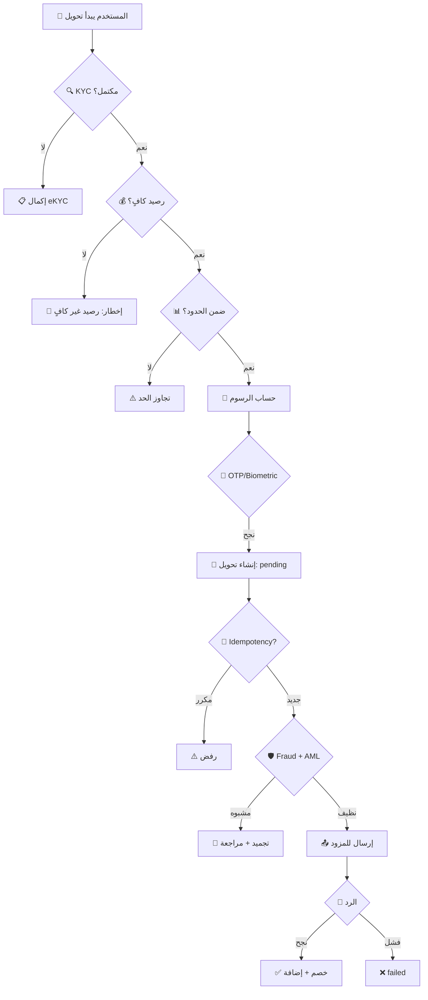
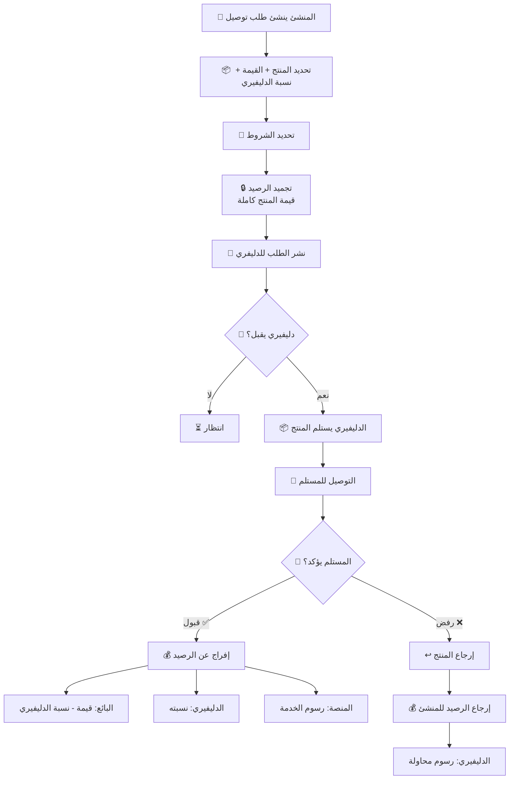
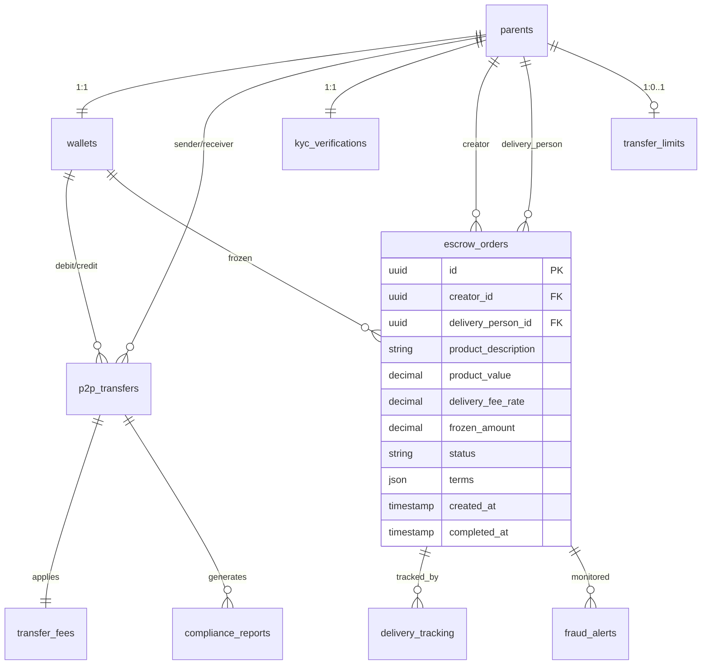

# 📋 الملخص التنفيذي الشامل — منصة In-Home للمدفوعات والتوصيل الآمن

> **الإصدار:** 8.1 — تحول استراتيجي كامل + ملاحق المستثمرين + التوقعات المالية + اقتصاديات الوحدة + السيناريوهات + Term Sheet + Cap Table + DPIA + التوسع الدولي + استراتيجية التسعير  
> **التاريخ:** 18 يونيو 2026  
> **الحالة:** جاهز للعرض على المستثمرين  
> **المنهجية:** بحث ميداني متعمق (4 مسارات بحثية متوازية) + تحليل بنية الكود الفعلية للمشروع  
> **المشروع الأصلي:** [github.com/marcowaa/in-home](https://github.com/marcowaa/in-home) — تطبيق شحن سابق، يُعاد تموضعه كمنصة مدفوعات

---

## 📑 الفهرس

| القسم | الموضوع |
|-------|---------|
| [1](#1-الملخص-التنفيذي-للمستثمرين) | الملخص التنفيذي للمستثمرين |
| [2](#2-الرؤية-الجديدة-تحول-تطبيق-الشحن-إلى-منصة-مدفوعات) | الرؤية الجديدة وتحول التطبيق |
| [3](#3-النموذج-التجاري-المحدث) | النموذج التجاري المحدّث (Escrow + P2P + Delivery) |
| [4](#4-تحليل-السوق-المصري-للدفع-الرقمي) | تحليل السوق المصري للدفع الرقمي |
| [5](#5-الإطار-التنظيمي-والقانوني-الكامل) | الإطار التنظيمي والقانوني الكامل |
| [6](#7-تحليل-مزودي-خدمات-الدفع-المحليين) | تحليل مزودي خدمات الدفع المحليين |
| [7](#8-تحليل-بنية-تطبيق-in-home-الحالية) | تحليل بنية التطبيق الحالية |
| [8](#9-الخارطة-التقنية-للتكامل) | الخارطة التقنية للتكامل |
| [9](#10-دراسة-الجدوى-الاقتصادية) | دراسة الجدوى الاقتصادية |
| [10](#11-التحليل-التنافسي) | التحليل التنافسي |
| [11](#12-تحليل-المخاطر-الشامل) | تحليل المخاطر الشامل |
| [12](#13-خطة-الإطلاق-الإنتاجي) | خطة الإطلاق الإنتاجي |
| [13](#14-شركات-التطوير-المقترحة-لتنفيذ-المشروع) | 🆕 شركات التطوير المقترحة |
| [14](#15-بنود-العقود-المقترحة) | بنود العقود المقترحة |
| [15](#16-الجدول-الزمني-والميزانية) | الجدول الزمني والميزانية |
| [16](#17-المؤشرات-الرئيسية-للأداء-kpis) | المؤشرات الرئيسية للأداء |
| [17](#17-استراتيجية-التسعير-pricing-strategy) | 🆕 استراتيجية التسعير (Pricing Strategy) |
| [18](#18-استراتيجية-الوصول-للسوق-gtm) | 🆕 استراتيجية الوصول للسوق (GTM) |
| [19](#19-هيكل-الفريق-المطلوب) | 🆕 هيكل الفريق المطلوب |
| [20](#20-آلية-الضمان-escrow-المفصلة) | 🆕 آلية الضمان (Escrow) المفصلة |
| [21](#21-خارطة-طريق-الميزات) | 🆕 خارطة طريق الميزات (12 شهر) |
| [22](#22-استراتيجية-الخروج-للمستثمرين) | 🆕 استراتيجية الخروج للمستثمرين |
| [23](#23-ملخص-عرض-المستثمرين-pitch-deck) | 🆕 ملخص عرض المستثمرين (Pitch Deck) |
| [24](#24-التوقعات-المالية-التفصيلية-5-سنوات-pl) | 🆕 التوقعات المالية التفصيلية (P&L) |
| [25](#25-تحليل-swot-الشامل) | 🆕 تحليل SWOT الشامل |
| [26](#26-إنشاء-الكيان-القانوني) | 🆕 إنشاء الكيان القانوني |
| [27](#27-خريطة-رحلة-المستخدم-user-journey-maps) | 🆕 خرائط رحلة المستخدم |
| [28](#28-معايير-النجاح-ولوحة-المؤشرات-dashboard) | 🆕 لوحة المؤشرات والتنبيهات |
| [29](#29-تحليل-اقتصاديات-الوحدة-unit-economics) | 🆕 اقتصاديات الوحدة (Unit Economics) |
| [30](#30-تحليل-السيناريوهات-scenario-analysis) | 🆕 تحليل السيناريوهات (Best/Base/Worst) |
| [31](#31-ورقة-شروط-الاستثمار-term-sheet) | 🆕 ورقة شروط الاستثمار (Term Sheet) |
| [32](#32-قائمة-التحقق-الاستدلالية-due-diligence-checklist) | 🆕 قائمة التحقق الاستدلالية للمستثمرين |
| [33](#33-حوكمة-الشركة-وهيكل-المجلس-corporate-governance) | 🆕 حوكمة الشركة وهيكل المجلس |
| [34](#34-استمرارية-الأعمال-والتعافي-من-الكوارث-bcdr) | 🆕 استمرارية الأعمال والتعافي من الكوارث |
| [35](#35-معمارية-أمن-البيانات-data-security-architecture) | 🆕 معمارية أمن البيانات |
| [36](#36-مسرد-المصطلحات-glossary) | 🆕 مسرد المصطلحات |
| [37](#37-جدول-رأس-المال-والتخفيف-cap-table) | 🆕 جدول رأس المال والتخفيف (Cap Table) |
| [38](#38-برنامج-الحاضنة-التنظيمية-cbe-sandbox) | 🆕 برنامج الحاضنة التنظيمية (CBE Sandbox) |
| [39](#39-استراتيجية-تطبيق-الموبايل-mobile-app-strategy) | 🆕 استراتيجية تطبيق الموبايل |
| [40](#40-خطة-التوسع-الدولي-international-expansion) | 🆕 خطة التوسع الدولي |
| [41](#41-تقييم-أثر-حماية-البيانات-dpia) | 🆕 تقييم أثر حماية البيانات (DPIA) |
| [42](#42-إدارة-مخاطر-الموردين-vendor-risk-management) | 🆕 إدارة مخاطر الموردين |
| [43](#43-تحديثات-تنظيمية-2026) | 🆕 تحديثات تنظيمية (يونيو 2026) |
| [44](#44-المصادر-والمراجع) | المصادر والمراجع |

---

## 1. الملخص التنفيذي للمستثمرين

### 1.1 الفرصة

تحويل تطبيق **In-Home** (تطبيق شحن سابق على GitHub) إلى **أول منصة مدفوعات شاملة في مصر تجمع بين التحويل الفوري P2P ونظام التوصيل الآمن بالضمان (Escrow)**. المنصة تستهدف فجوة سوقية غير مخدومة: بين InstaPay (تحويل فقط، بدون حماية صفقات) ومنصات التوصيل (توصيل فقط، بدون مدفوعات مدمجة).

### 1.2 الأرقام الرئيسية

| المؤشر | القيمة |
|--------|--------|
| **إجمالي السوق المتاح (TAM)** | 2.4 تريليون جنيه (معاملات InstaPay سنوياً) |
| **السوق القابل للخدمة (SAM)** | ~50 مليار جنيه (تحويلات P2P + توصيل) |
| **السوق المُستهدف (SOM)** | ~2-5 مليار جنيه (سنة 3) |
| **الشمول المالي في مصر** | 77.6% (نهاية 2025) — 54.7 مليون مستخدم رقمي |
| **محافظ رقمية نشطة** | 55.5 مليون محفظة |
| **معاملات المحافظ (Q2 2025)** | 943 مليار جنيه (+72% YoY) |
| **الحوالات الواردة** | 41.5 مليار دولار (2025) |
| **الاستثمار المطلوب** | 15-20 مليون جنيه (Category B PSP) |
| **نقطة التعادل المتوقعة** | السنة 2-3 |
| **العائد المتوقع (ROI)** | 300%+ بحلول السنة 3 |

### 1.3 لماذا الآن؟

- ✅ **CBE أصدر قواعد ترخيص PSP** (يونيو 2025) — نافذة 12 شهر للتسوية
- ✅ **PDPL أصبحت سارية** (نوفمبر 2025) — موعد امتثال أكتوبر 2026
- ✅ **InstaPay بدأ بفرض رسوم** (يونيو 2026) — فجوة تسعير للمستخدمين
- ✅ **55.5 مليون محفظة رقمية** — قاعدة جاهزة للتكامل
- ✅ **لا يوجد منافس يجمع P2P + Escrow + Delivery** في مصر

---

## 2. الرؤية الجديدة: تحول تطبيق الشحن إلى منصة مدفوعات

### 2.1 من التطبيق القديم إلى المنصة الجديدة

```
❌ قبل: تطبيق In-Home (شحن فقط)
   └── المستخدم ←→ طلب شحن ←→ شركة شحن

✅ بعد: منصة In-Home للمدفوعات والتوصيل الآمن
   └── المستخدم ←→ تحويل أموال P2P
   └── المستخدم ←→ طلب توصيل بضمان (Escrow)
   └── المستخدم ←→ دفع مباشر للخدمات
   └── المستخدم ←→ محفظة رقمية متكاملة
```

### 2.2 الميزات الأساسية الثلاث

```
┌─────────────────────────────────────────────────────────────────────┐
│                    منصة In-Home للمدفوعات                           │
├─────────────────────────────────────────────────────────────────────┤
│                                                                     │
│  💰 1. التحويل الفوري P2P (مثل InstaPay)                           │
│     ├── تحويل بين مستخدمي المنصة (فوري)                            │
│     ├── تحويل لأي بنك عبر InstaPay/IPN                             │
│     ├── تحويل لمحافظ الهاتف (Vodafone Cash, e& Cash)               │
│     ├── تحويل بـ QR Code (امسح وحوّل)                              │
│     ├── تحويل بالهاتف فقط                                          │
│     └── سجل كامل + إيصالات                                        │
│                                                                     │
│  📦 2. طلبات التوصيل الآمن (Escrow Delivery)                      │
│     ├── الطرف الأول (المنشئ): ينشئ طلب توصيل                       │
│     │   ├── يحدد المنتج/الصنف                                      │
│     │   ├── يحدد قيمة المنتج                                       │
│     │   ├── يحدد نسبة الدليفيري                                    │
│     │   └── يحدد الشروط (سواء شاحن أو دليفيري)                     │
│     ├── نظام الضمان (Escrow):                                      │
│     │   ├── تجميد رصيد بقيمة المنتج كاملة                          │
│     │   ├── الدليفيري يأخذ نسبته من القيمة                         │
│     │   └── الإفراج عن الباقي للبائع بعد نجاح التسليم              │
│     ├── شروط جاهزة قابلة للاختيار:                                 │
│     │   ├── مهلة التسليم                                           │
│     │   ├── آلية التحقق من الاستلام                                │
│     │   ├── سياسة الإرجاع                                          │
│     │   └── شروط قبول/رفض التسليم                                  │
│     └── تتبع مباشر للشحنة                                         │
│                                                                     │
│  🔄 3. المحفظة الرقمية المتكاملة                                   │
│     ├── شحن المحفظة (من بنك/محفظة/كاش)                             │
│     ├── سحب من المحفظة                                            │
│     ├── رصيد مُجمّد (Escrow) + رصيد متاح                           │
│     └── تاريخ كامل للمعاملات                                       │
│                                                                     │
└─────────────────────────────────────────────────────────────────────┘
```

### 2.3 سيناريو استخدام نموذجي

```
👤 أحمد (المشتري) يريد شراء منتج من 👤 محمود (البائع)

الخطوات:
1. أحمد ينشئ "طلب توصيل" على In-Home:
   ├── المنتج: لابتوب
   ├── القيمة: 15,000 جنيه
   ├── نسبة الدليفيري: 2% (300 جنيه)
   ├── مهلة التسليم: 3 أيام
   └── الشروط: فحص قبل الاستلام

2. النظام يجمّد رصيد أحمد:
   ├── المبلغ المجمد: 15,000 جنيه (قيمة المنتج)
   └── الحالة: pending_escrow

3. 🛵 الدليفيري (كريم) يقبل الطلب:
   ├── يستلم المنتج من محمود
   ├── يوصل المنتج لأحمد
   └── أحمد يفحص المنتج ويؤكد الاستلام ✅

4. النظام يفرج عن الرصيد:
   ├── محمود (البائع): يستلم 14,700 جنيه
   ├── كريم (الدليفيري): يستلم 300 جنيه
   └── المنصة: رسوم خدمة (مثلاً 0.5% = 75 جنيه)

5. في حالة الرفض:
   ├── المنتج يُعاد للبائع
   ├── المبلغ يُعاد للمشتري
   └── الدليفيري يحصل على رسوم محاولة توصيل
```

### 2.4 الكود الموجود القابل لإعادة الاستخدام

| المكون الموجود | الحالة | إعادة الاستخدام |
|----------------|--------|-----------------|
| نظام المستخدمين (parents/children) | ✅ كامل | تكامل مباشر |
| المحفظة الرقمية (wallets) | ✅ موجود | توسعة + إضافة حالة "frozen" |
| جدول التحويلات (wallet_transfers) | ✅ موجود | توسعة + نوع "escrow" |
| نظام المعاملات (transactions) | ✅ موجود | تكامل مباشر |
| 17 مزود دفع (paymob, fawry...) | ✅ موجود | تكامل مباشر |
| نظام الإشعارات | ✅ موجود | توسعة لتنبيهات التوصيل |
| نظام الـ Webhooks | ✅ موجود | تكامل مباشر |
| نظام التحقق (2FA/OTP) | ✅ موجود | تكامل مباشر |
| نظام i18n (3 لغات) | ✅ موجود | تكامل مباشر |
| نظام الشحن السابق | ✅ موجود | **إعادة تموضع** كنواة لنظام التوصيل |
| P2P Transfer | ❌ غير موجود | **جديد** |
| Escrow System | ❌ غير موجود | **جديد** |
| KYC/eKYC | ❌ غير موجود | **جديد** |
| Fraud Detection | ❌ غير موجود | **جديد** |

---

## 3. النموذج التجاري المحدّث

### 3.1 مصادر الإيرادات المتعددة

```
┌─────────────────────────────────────────────────────────────────────┐
│                    مصادر الإيرادات                                  │
├─────────────────────────────────────────────────────────────────────┤
│                                                                     │
│  💰 1. رسوم التحويل P2P (الأساسي)                                   │
│     ├── تحويل داخلي (في المنصة): 0.5-1% (حد أدنى 1 جنيه)           │
│     ├── تحويل خارجي (InstaPay/بنوك): 1-2% + رسوم IPN               │
│     └── تحويل لمحافظ الهاتف: 1-1.5%                                │
│                                                                     │
│  📦 2. رسوم التوصيل بالضمان (Escrow)                               │
│     ├── رسوم خدمة المنصة: 0.5-1% من قيمة الصفقة                    │
│     ├── رسوم ثابتة على طلب التوصيل: 5-15 جنيه                      │
│     └── رسوم إضافية للشروط المخصصة                                 │
│                                                                     │
│  🏦 3. فوائد الرصيد المُجمّد (Float)                               │
│     ├── عائد على الأرصدة المُجمّدة في Escrow                        │
│     └── عائد على أرصدة المحافظ النشطة                               │
│                                                                     │
│  💎 4. خدمات قيمة مضافة                                             │
│     ├── تأمين على الصفقات (0.5% من القيمة)                         │
│     ├── توصيل مُجدول (اشتراك شهري)                                 │
│     ├── تحويلات دولية (هامش أعلى 2-3%)                             │
│     ├── BNPL على المنتجات (شراكة مع valU/Contact)                  │
│     └── إعلانات للتجار                                             │
│                                                                     │
│  📊 5. اشتراكات التجار                                             │
│     ├── Basic: 99 جنيه/شهر (50 تحويل + 10 توصيلات)                 │
│     ├── Pro: 299 جنيه/شهر (500 تحويل + 100 توصيلة)                 │
│     └── Enterprise: مخصص                                           │
│                                                                     │
└─────────────────────────────────────────────────────────────────────┘
```

### 3.2 نموذج الإيرادات المتوقع

| السنة | تحويلات P2P | توصيلات Escrow | خدمات مضافة | الإجمالي |
|-------|-------------|---------------|------------|----------|
| **س1** | 5M جنيه | 3M جنيه | 1M جنيه | **9M جنيه** |
| **س2** | 20M جنيه | 12M جنيه | 5M جنيه | **37M جنيه** |
| **س3** | 50M جنيه | 30M جنيه | 15M جنيه | **95M جنيه** |
| **س4** | 100M جنيه | 60M جنيه | 30M جنيه | **190M جنيه** |
| **س5** | 200M جنيه | 120M جنيه | 60M جنيه | **380M جنيه** |

---

## 4. تحليل السوق المصري للدفع الرقمي

### 4.1 شبكة الدفع الفوري (IPN) و InstaPay

| المؤشر | القيمة | التاريخ |
|--------|--------|---------|
| المستخدمون | 2.16M → 11.5M → **16M+** | مارس 2023 → نوفمبر 2024 → يونيو 2025 |
| المعاملات | **1.1+ مليار** معاملة | يونيو 2025 |
| القيمة الإجمالية | **2.4 تريليون جنيه** | يونيو 2025 |
| حد المعاملة | **70,000 جنيه** | — |
| الحد الشهري | **400,000 جنيه** | — |
| رسوم التحويل (جديد) | **0.5 - 20 جنيه** | يونيو 2026 |
| الحوالات الخليجية | قيد التفعيل | نوفمبر 2024 |

### 4.2 الشمول المالي

| التاريخ | الشمول المالي | الحسابات |
|----------|--------------|----------|
| 2016 | ~27-33% | — |
| نهاية 2024 | **74.8%** | **~52M** |
| يونيو 2025 | **76.3%** | **53.8M** |
| نهاية 2025 | **77.6%** | **54.7M** |

**نمو ديموغرافي:** الإناث 71.4% (نمو 316%)، الشباب 56.8% (نمو 79%)

### 4.3 المحافظ الرقمية

| المؤشر | القيمة |
|--------|--------|
| محافظ Meeza | **55.5 مليون** محفظة |
| معاملات Meeza | **1.4 مليار** معاملة / **1.8 تريليون جنيه** |
| معاملات المحافظ Q2 2025 | **718M** معاملة (+80% YoY) / **943 مليار جنيه** (+72% YoY) |
| بطاقات Meeza | **43.5M+** بطاقة |
| Apple Pay | **40M+** معاملة / **32+ مليار جنيه** |

### 4.4 حصص المحافظ

```
Vodafone Cash  ████████████████████████████░░░░░░░░░░░░░░░  55%
e& Cash        ██████████████░░░░░░░░░░░░░░░░░░░░░░░░░░░░░░  21%
Orange Cash    █████████████░░░░░░░░░░░░░░░░░░░░░░░░░░░░░░  19%
WE Pay         ████░░░░░░░░░░░░░░░░░░░░░░░░░░░░░░░░░░░░░░░   5%
```

### 4.5 التوقعات المستقبلية

| السوق | 2025 | 2031 | CAGR |
|-------|------|------|------|
| الدفع عبر الهاتف | $84.93B | $137.18B | 8.23% |
| البطاقات والمحافظ | $4.36B | — | 15.6% |
| BNPL | $1.67B | $4.74B | 32.7% |

---

## 5. الإطار التنظيمي والقانوني الكامل

### 5.1 ترخيص CBE لمزودي خدمات الدفع (PSP) — يونيو 2025

> ⚠️ **تحول تنظيمي تاريخي**: 19 يونيو 2025 — CBE يصدر قواعد الترخيص المباشر لـ PSPs

| نوع الترخيص | رأس المال الأدنى | النطاق |
|-------------|-----------------|--------|
| **PSP Category A** | 30,000,000 جنيه (~$600K) | جميع خدمات الدفع |
| **PSP Category B** ⭐ | **10,000,000 جنيه** (~$200K) | جميع الخدمات عدا أوامر الدفع |
| **AISP/PISP** | 20,000,000 جنيه (~$400K) | معلومات/أوامر دفع |
| **PSO** | 500,000,000 جنيه (~$10M) | تشغيل أنظمة الدفع |

⭐ **التوصية:** Category B مناسب لبداية المنصة (حجم معاملات متوقع < 750M/شهر)

**الضمان البنكي:** 2% من رأس المال = **200,000 جنيه** (Category B)

**عملية الترخيص:** NOC (90-180 يوم) → ترخيص كامل (90-180 يوم) → نشر على موقع CBE

**فترة السماح:** حتى يونيو 2026 للكيانات القائمة

### 5.2 قانون حماية البيانات (PDPL) — قانون 151/2020

| البند | التفاصيل |
|------|----------|
| اللائحة التنفيذية | المرسوم 816/2025 (1 نوفمبر 2025) |
| موعد الامتثال | **31 أكتوبر 2026** |
| الجهة | مركز حماية البيانات (PDPC) |
| DPO | تعيين إلزامي |
| البيانات الحساسة | موافقة كتابية (تشمل البيانات المالية) |
| النقل عبر الحدود | ممنوع إلا بتصريح |
| الإبلاغ عن الخروقات | 72 ساعة |

### 5.3 قانون مكافحة غسيل الأموال (AML/CFT) — قانون 80/2002

- وحدة EMLCU للتنفيذ — منصة **GoAML** إلزامية
- CDD/KYC لجميع المستخدمين
- الاحتفاظ بالسجلات **5 سنوات**
- تعيين **AML Officer**
- eKYC مدعوم من CBE (3D liveness, OCR)

### 5.4 الالتزامات الأمنية

| المعيار | الحالة |
|---------|--------|
| PCI DSS v4.0 | إلزامي منذ مارس 2025 |
| ISO/IEC 27001 | موصى به |
| قانون الجرائم السيبرانية (175/2018) | ساري |
| قانون التوقيع الإلكتروني (15/2004) | ساري |

### 5.5 الضرائب

| الضريبة | المعدل | ملاحظة |
|---------|--------|--------|
| ضريبة الدخل | 22.5% | إعفاءات للأعمال < 20M (قانون 6/2025) |
| VAT | 14% | **PSPs المرخصة قد تعفى** |

---

## 6. تحليل مزودي خدمات الدفع المحليين

### 6.1 جدول المقارنة — بوابات الدفع

| المعيار | Fawry | PayMob | Tap Payments | Masary |
|---------|-------|--------|-------------|--------|
| **التأسيس** | 2008 | 2015 | الكويت | 2009 |
| **الحجم** | 55M+ مستخدم، 365K نقطة | 390K تاجر، 50+ طريقة دفع | مرخص مصر 2025 | شبكة وطنية |
| **API** | REST + SDK + 3DS | REST ممتاز + SDK + Checkout | REST + SDK | محدود |
| **التسعير** | 2.5-3.5% (مخصص) | 2.75% + 3 جنيه | 2.5-3.5% | ~2-3% |
| **التسوية** | T+1 إلى T+3 | T+1 إلى T+3 | T+1 إلى T+3 | T+1-T+2 |
| **Payouts API** | ❌ | ✅ | ❌ | ❌ |
| **القوة** | أكبر شبكة فيزيائية | أفضل أدوات مطورين | واجهة عصرية | وكلاء واسعون |
| **الضعف** | تسعير غير شفاف | أسعار دولية غامضة | جديد في مصر | ليس بوابة كاملة |

### 6.2 المحافظ الرقمية

| المحفظة | حصة السوق | API مباشر | الميزة |
|---------|----------|-----------|--------|
| Vodafone Cash | **55%** | ❌ عبر وسيط | أكبر قاعدة مستخدمين |
| e& Cash | **21%** | ❌ عبر وسيط | تكامل اتصالات |
| Orange Cash | **19%** | ❌ عبر وسيط | تداول الذهب (سبتمبر 2025) |
| WE Pay | **5%** | ❌ عبر وسيط | بنك القاهرة |

### 6.3 التوصية: استراتيجية التكامل

```
1️⃣ PSP أساسي: PayMob (أفضل API + Payouts + أوسع تغطية)
2️⃣ تكامل المحافظ: Fawry + Vodafone Cash (عبر PayMob)
3️⃣ البنية المصرفية: InstaPay/IPN (عبر EBC)
4️⃣ بوابة ثانوية: Tap Payments (توسع MENA)
5️⃣ للصرف: PayMob Payouts أو Network International
6️⃣ شراكة ناشئة: Telda أو MNT-Halan
```

---

## 7. تحليل بنية تطبيق In-Home الحالية

### 7.1 البنية التقنية (من الكود الفعلي)

| الجانب | التقنية |
|--------|---------|
| Frontend | React 18 + TypeScript + Vite 6 + Tailwind + shadcn/ui |
| Backend | Express.js 4 + TypeScript + Node.js 20+ |
| Database | PostgreSQL 15+ + Drizzle ORM (~137 جدول) |
| Auth | JWT + bcrypt + Passport.js + OAuth2 + 2FA |
| State | TanStack Query v5 + Zustand v5 |
| Mobile | Capacitor 7 (iOS/Android) |
| i18n | 3 لغات (عربي/إنجليزي/برتغالي) — 1,700+ مفتاح |
| Deploy | Docker Compose + Traefik + Redis + MinIO |
| Payment | Stripe + Google Play + **17 مزود دفع مصري** |

### 7.2 الجداول القابلة لإعادة الاستخدام

```
✅ موجود:
  wallets, wallet_transfers, transactions, webhook_events,
  payment_methods, deposits, refunds, profit_transactions,
  points_ledger, store_orders, currency_rates

❌ مطلوب جديد:
  p2p_transfers, escrow_orders, kyc_verifications,
  transfer_fees, compliance_reports, fraud_alerts,
  transfer_limits, delivery_tracking
```

### 7.3 أنماط الكود (للتوافق)

UUID v7 PKs | createdAt/updatedAt | Soft Deletes | Idempotency Keys | Zod Validation | Pino Logging | Adapter Pattern

---

## 8. الخارطة التقنية للتكامل

### 8.1 مخطط انسياب — التحويل P2P



### 8.2 مخطط انسياب — التوصيل بالضمان (Escrow)



### 8.3 ERD — الجداول الجديدة



### 8.4 الجداول الجديدة المقترحة (Drizzle ORM)

```typescript
// جدول طلبات التوصيل بالضمان
export const escrowOrders = pgTable('escrow_orders', {
  id: uuid('id').defaultRandom().primaryKey(),
  creatorId: uuid('creator_id').notNull().references(() => parents.id),
  deliveryPersonId: uuid('delivery_person_id').references(() => parents.id),
  productDescription: text('product_description').notNull(),
  productValue: decimal('product_value', { precision: 12, scale: 2 }).notNull(),
  deliveryFeeRate: decimal('delivery_fee_rate', { precision: 5, scale: 4 }).notNull(),
  frozenAmount: decimal('frozen_amount', { precision: 12, scale: 2 }).notNull(),
  status: varchar('status', { length: 30 }).default('pending').notNull(),
  // pending → accepted → in_transit → delivered → confirmed → released
  //         → rejected → refunded → cancelled
  terms: jsonb('terms'), // شروط جاهزة يحددها المنشئ
  pickupAddress: text('pickup_address'),
  deliveryAddress: text('delivery_address'),
  deadlineHours: integer('deadline_hours').default(72),
  createdAt: timestamp('created_at').defaultNow().notNull(),
  acceptedAt: timestamp('accepted_at'),
  deliveredAt: timestamp('delivered_at'),
  completedAt: timestamp('completed_at'),
});

// جدول تتبع التوصيل
export const deliveryTracking = pgTable('delivery_tracking', {
  id: uuid('id').defaultRandom().primaryKey(),
  escrowOrderId: uuid('escrow_order_id').notNull().references(() => escrowOrders.id),
  status: varchar('status', { length: 30 }).notNull(),
  // created → accepted → picked_up → in_transit → arrived → confirmed/rejected
  location: jsonb('location'), // {lat, lng}
  notes: text('notes'),
  photos: jsonb('photos'), // array of URLs
  createdAt: timestamp('created_at').defaultNow().notNull(),
});

// (p2p_transfers, kyc_verifications, transfer_fees, transfer_limits,
//  fraud_alerts, compliance_reports — كما في الإصدار السابق)
```

### 8.5 API Endpoints

```
/api/transfers/          → P2P money transfer
├── POST /create, /confirm, /history, /:id/status, /cancel, /estimate

/api/escrow/             → Escrow delivery orders
├── POST /create         → إنشاء طلب توصيل
├── POST /:id/accept     → دليفيري يقبل الطلب
├── POST /:id/pickup     → تأكيد الاستلام من البائع
├── POST /:id/deliver    → تأكيد التسليم للمستلم
├── POST /:id/confirm    → المستلم يؤكد القبول
├── POST /:id/reject     → المستلم يرفض
├── GET  /:id/track      → تتبع الحالة
├── POST /:id/cancel     → إلغاء الطلب
└── GET  /available      → الطلبات المتاحة للدليفري

/api/wallet/             → المحفظة
├── GET /balance, /transactions, POST /topup, /withdraw

/api/kyc/                → التحقق
├── GET /status, POST /submit, /verify-ekyc, GET /requirements
```

---

## 9. دراسة الجدوى الاقتصادية

### 9.1 تقدير التكاليف

| البند | Low | Medium ⭐ | High |
|-------|-----|--------|------|
| رأس المال (Category B) | — | **10M جنيه** | — |
| الضمان البنكي | 200K | 200K | 600K |
| التطوير | 1.5M | 3M | 7M |
| البنية التحتية (سنوي) | 300K | 600K | 1.2M |
| الترخيص + الامتثال | 300K | 600K | 1.2M |
| التسويق (سنوي) | 500K | 1.2M | 2.5M |
| رواتب الفريق | 2.5M | 3.5M | 5M |
| **الإجمالي** | ~5M | **~19M** | ~45M |

### 9.2 نقطة التعادل

```
السيناريو المتوسط:
├── التكاليف السنوية: ~19 مليون جنيه
├── معدل الرسوم: 1.5% (تحويلات) + 0.5% (escrow) + رسوم ثابتة
├── نقطة التعادل: ~1.3 مليار جنيه معاملات سنوية
├── المستخدمون المطلوبون: ~80,000 نشط
└── الزمن: السنة 2-3
```

### 9.3 تحليل الحساسية

| المتغير | التغيير | الأثر |
|---------|---------|-------|
| رسوم المزود +0.5% | +0.5% تكلفة | -33% هامش |
| رسوم مستخدم -0.5% | -0.5% إيراد | -33% إيراد |
| تباطؤ نمو 50% | نصف المستخدمين | -50% إيراد |
| ضريبة جديدة | +1% | -25% هامش |

---

## 10. التحليل التنافسي

### 10.1 المنافسون

| المنافس | القوة | الضعف | يتوافق معنا؟ |
|---------|-------|-------|-------------|
| **InstaPay** | رسمي، 16M مستخدم، 38 بنك | لا يقدم Escrow، لا توصيل | تحويل فقط |
| **Vodafone Cash** | 55% محافظ، 40M مستخدم | لا API مباشر، لا escrow | محفظة فقط |
| **Fawry** | 365K نقطة، 55M مستخدم | ليس P2P | دفع |
| **MNT-Halan** | $1B+، نظام بيئي | يركز على الإقراض | إقراض |
| **Telda** | شباب، Sequoia | صغير، لا توصيل | محفظة |

### 10.2 نقاط التمايز

```
🎯 ما يجعل In-Home فريداً:

1. 📦 التوصيل بالضمان (Escrow) — لا يوجد منافس يقدم هذا في مصر
2. 💰 P2P + توصيل مدمجين في تطبيق واحد
3. 🛵 سوق للدليفري المستقل (Uber for delivery)
4. 🔒 حماية كاملة للطرفين (مجدّد حتى نجاح الصفقة)
5. 📊 شروط جاهزة قابلة للتخصيص
6. 🌍 دعم 3 لغات
7. 📱 تجربة موحدة (شحن + تحويل + محفظة)
8. 🏛️ امتثال كامل (PDPL + AML + PCI DSS)
```

---

## 11. تحليل المخاطر الشامل

| # | المخاطرة | الفئة | الاحتمال | الأثر | الدرجة | التخفيف |
|---|----------|------|---------|-------|--------|---------|
| R1 | تأخير ترخيص CBE | قانونية | متوسط | حرج | 🔴 | مبكر + Sandbox |
| R2 | امتثال PDPL | قانونية | منخفض | حرج | 🟡 | بدء فوري + DPO |
| R3 | اختراق أمني | أمنية | متوسط | كارثي | 🔴 | تشفير + PenTest |
| R4 | احتيال Escrow | أمنية | عالي | عالي | 🔴 | AI fraud + ضمان |
| R5 | نزاعات صفقات | تشغيلية | عالي | متوسط | 🟡 | نظام تحكيم + شروط واضحة |
| R6 | توقف الخدمة | تشغيلية | متوسط | عالي | 🟡 | HA + failover |
| R7 | منافسة InstaPay | سوقية | عالي | متوسط | 🟡 | تمايز Escrow |
| R8 | قيود API بنوك | تقنية | عالي | متوسط | 🟡 | وسيط PSP |
| R9 | تجاوز تكاليف | مالية | متوسط | متوسط | 🟡 | مراقبة دورية |
| R10 | فقدان بيانات | أمنية | منخفض | كارثي | 🔴 | نسخ + تشفير |
| R11 | عدم اكتمال KYC | تشغيلية | متوسط | منخفض | 🟢 | eKYC سلس |
| R12 | رسوم CBE على IPN | مالية | عالي | منخفض | 🟢 | تنويع المزودين |

---

## 12. خطة الإطلاق الإنتاجي

```
المرحلة 0: التحضير (0-3 أشهر)
├── تقديم NOC لـ CBE + استشاري قانوني + AML Officer
├── تصميم البنية + خطة الامتثال
└── مفاوضات PayMob + Fawry

المرحلة 1: التطوير (3-9 أشهر)
├── بناء البنية + الجداول الجديدة + التكامل مع PSPs
├── نظام Escrow + eKYC + Fraud Detection
├── تطوير واجهة المستخدم + نظام تتبع التوصيل
└── اختبارات Unit + Integration

المرحلة 2: الاختبار (9-12 شهر)
├── Sandbox كامل + PenTest + بيتا مغلق (100-500)
├── إصلاح + تحسين + تسويق أولي
└── الحصول على ترخيص CBE النهائي

المرحلة 3: الإطلاق (12+ شهر)
├── 🚀 إطلاق رسمي + حملات تسويقية
├── مراقبة 24/7 + دعم عملاء
└── تحديثات مستمرة
```

---

## 13. شركات التطوير المقترحة لتنفيذ المشروع

> هذه قائمة شاملة بشركات متخصصة في تطوير تطبيقات الفينتك والمدفوعات، مقسمة حسب الفئة.

### 13.1 🇪🇬 شركات مصرية (الأقرب جغرافياً وفهمًا للسوق)

#### 1. Blink22

| البند | التفاصيل |
|------|----------|
| **الموقع** | الإسكندرية، مصر (مكتب دبي أيضاً) |
| **التأسيس** | 2015 |
| **الفريق** | 100+ موظف |
| **التخصص** | تطبيقات ويب وموبايل، فينتك، ذكاء اصطناعي |
| **المشاريع** | 150+ مشروع لـ 100+ عميل في 17 دولة |
| **عملاء بارزون** | Salik, Jumia, Geidea, Careem, Sadeem |
| **منتجات ذاتية** | Fajr App (1M+ مستخدم) |
| **التواصل** | 📧 info@blink22.com | 🌐 blink22.com |
| **التسعير** | متوسط ($10K-$100K+ للمشروع) |
| **المزايا** | ✅ خبرة في فينتك مصر، شراكات مع Careem/Geida، فريق كبير، منتجات ذاتية ناجحة، فهم عميق للسوق المصري |
| **العيوب** | ❌ مرتفعة التكلفة نسبياً، قد تكون مشغولة بمشاريع كبيرة |
| **الأنسب لـ** | تطوير المنصة بالكامل + تكامل PSPs + نظام Escrow |
| **كيفية العقد** | طلب عرض سعر (RFP) مفصل ← مقابلة فنية ← توقيع NDA ← milestones مشروطة بالتسليم |

#### 2. TrianglZ LLC

| البند | التفاصيل |
|------|----------|
| **الموقع** | الإسكندرية، مصر |
| **التأسيس** | 2014 |
| **الفريق** | 100+ مهندس ومصمم |
| **التخصص** | ويب وموبايل، AI/ML، أنظمة مؤسسية |
| **المشاريع** | 100+ مشروع |
| **القطاعات** | فينتك، EdTech، لوجستيات، رعاية صحية |
| **التواصل** | 🌐 trianglz.com | 📧 عبر نموذج الموقع |
| **التسعير** | متوسط |
| **المزايا** | ✅ خبرة في لوجستيات وفينتك، فريق كبير، Techne Summit partner، دعم مستمر بعد الإطلاق |
| **العيوب** | ❌ تركيز أكبر على B2B Enterprise، أقل خبرة في B2C consumer apps |
| **الأنسب لـ** | نظام تتبع التوصيل + backend للـ Escrow |
| **كيفية العقد** | تواصل عبر الموقع ← جلسة استكشاف ← عرض فني ← عقد milestones |

#### 3. Intcore

| البند | التفاصيل |
|------|----------|
| **الموقع** | القاهرة، مصر |
| **التخصص** | تطبيقات موبايل وويب |
| **التواصل** | 🌐 intcore.com | 📧 عبر الموقع |
| **التسعير** | منخفض-متوسط ($10K-$50K) |
| **المزايا** | ✅ أسعار تنافسية، محلية، فهم للسوق المصري |
| **العيوب** | ❌ حجم أصغر، خبرة أقل في فينتك معقد، مراجعات أقل |
| **الأنسب لـ** | تطوير الواجهة الأمامية (Frontend) + UI/UX |
| **كيفية العقد** | تواصل مباشر ← عرض سريع ← عقد بسيط |

### 13.2 🌍 شركات إقليمية ودولية متخصصة في الفينتك

#### 4. SDK.finance (منصة White-Label)

| البند | التفاصيل |
|------|----------|
| **الموقع** | ليتوانيا (EU) |
| **التأسيس** | 2013 |
| **النوع** | منصة FinTech PaaS + Source Code License |
| **التخصص** | محافظ رقمية، تطبيقات دفع، تحويلات، بنوك رقمية |
| **APIs** | 470+ API جاهزة |
| **التواصل** | 🌐 sdk.finance/contact | 📧 عبر الموقع |
| **التسعير** | $900/شهر (تطوير) + $2,500/شهر (إنتاج) + رسوم معاملة |
| **المزايا** | ✅ منصة جاهزة (470+ API)، توفير 6-12 شهر تطوير، source code كامل، multi-currency، compliance-ready، حالات نجاح (Geida, MPAY, Paywell) |
| **العيوب** | ❌ تكلفة شهرية مستمرة، قد تحتاج تخصيص كبير للسوق المصري، ليست مصرية |
| **الأنسب لـ** | ❌ **الأساس البنيوي (Core)** — استخراج النواة المالية + المحفظة + نظام التحويل، ثم بناء Escrow فوقها |
| **كيفية العقد** | طلب Demo ← تقييم المنصة ← Source Code License Agreement ← تدريب الفريق |
| **العقد المقترح** | Source Code License + Integration Services + Annual Maintenance |

#### 5. Itexus

| البند | التفاصيل |
|------|----------|
| **الموقع** | الولايات المتحدة (يعمل في 23 دولة) |
| **التأسيس** | 2013 |
| **التخصص** | تطوير برمجيات فينتك مخصصة |
| **الخبرة** | مئات المشاريع في بنوك، اتحادات ائتمان، شركات فينتك |
| **التكامل** | KYC/AML, BaaS, بوابات دفع, تبادلات كريبتو |
| **التواصل** | 🌐 itexus.com | 📧 عبر الموقع |
| **التسعير** | $10K-$100K+ (حسب المشروع) |
| **المزايا** | ✅ خبرة عميقة في فينتك مالي، تكامل KYC/AML جاهز، خبرة في الشرق الأوسط، تقييمات عالية على Clutch (41 مراجعة) |
| **العيوب** | ❌ قد تكون أغلى من المحلية، ليست في مصر مباشرة، قد تحتاج تنسيق عن بُعد |
| **الأنسب لـ** | تصميم وبناء نظام Escrow + تكامل AML/KYC + استشارة معمارية |
| **كيفية العقد** | تواصل عبر الموقع ← Discovery Phase (مدفوعة) ← عقد Fixed-Price أو Time&Materials ← Sprints أسبوعية |

#### 6. Nimble AppGenie

| البند | التفاصيل |
|------|----------|
| **الموقع** | هيوستن، تكساس، USA |
| **التأسيس** | ~2017 |
| **التخصص** | eWallet apps, mobile banking, fintech |
| **العملاء** | 350+ عميل عالمي |
| **التواصل** | 🌐 nimbleappgenie.com | 📧 عبر الموقع |
| **التسعير** | $20K-$300K (حسب التعقيد) |
| **المزايا** | ✅ متخصصة في eWallet و fintech تحديداً، أسعار معقولة، خبرة في تطبيقات المحافظ |
| **العيوب** | ❌ ليست في مصر، خبرة أقل في التنظيمات المصرية تحديداً، قد تحتاج إدارة عن بُعد |
| **الأنسب لـ** | تطوير واجهة المحفظة الرقمية + تطبيق الموبايل |
| **كيفية العقد** | طلب عرض سعر ← MVP phase ← تطوير تدريجي |

#### 7. 10Pearls

| البند | التفاصيل |
|------|----------|
| **الموقع** | واشنطن، USA (مكاتب عالمية) |
| **التخصص** | AI + Digital Engineering + Fintech |
| **الخبرة** | حلول دفع رقمي، أنظمة مصرفية، RegTech |
| **التواصل** | 🌐 10pearls.com | 📧 عبر الموقع |
| **التسعير** | مرتفع ($50K-$500K+) |
| **المزايا** | ✅ خبرة في AI (لكشف الاحتيال)، شراكة Gartner، خبرة في الشرق الأوسط |
| **العيوب** | ❌ الأغلى في القائمة، قد تكون مبالغة لمشروع ناشئ |
| **الأنسب لـ** | نظام كشف الاحتيال بالـ AI + استشارة RegTech |
| **كيفية العقد** | استشارة ← عرض حلول ← عقد Statement of Work ← sprints |

#### 8. DataArt

| البند | التفاصيل |
|------|----------|
| **الموقع** | عالمي (USA, UK, Europe, MENA) |
| **التأسيس** | 1997 |
| **التخصص** | هندسة برمجيات للقطاع المالي |
| **التواصل** | 🌐 dataart.com | 📧 عبر الموقع |
| **التسعير** | $12K-$3M+ (مشاريع كبيرة) |
| **المزايا** | ✅ خبرة 25+ سنة، شراكة Stripe معتمدة، فريق كبير، جودة عالية |
| **العيوب** | ❌ مرتفعة التكلفة، تركيز على Enterprise كبير |
| **الأنسب لـ** | تكامل Stripe/Payment gateways + بنية تحتية للمعاملات |
| **كيفية العقد** | Discovery ← Architecture ← Implementation ← Support |

### 13.3 مقارنة شاملة وتوصية

| الشركة | التكلفة | خبرة فينتك | فهم السوق المصري | التوصية |
|--------|---------|------------|-----------------|---------|
| **Blink22** ⭐ | متوسط | عالية | ✅ عالية | **الخيار الأول** — تطوير كامل |
| TrianglZ | متوسط | متوسطة | ✅ عالية | للـ backend + تتبع |
| Intcore | منخفض | منخفضة | ✅ عالية | للواجهة الأمامية |
| **SDK.finance** ⭐ | اشتراك | عالية جداً | ❌ لا | **الخيار الاستراتيجي** — core platform |
| Itexus | متوسط-عالي | عالية | ❌ لا | لـ Escrow + AML |
| Nimble AppGenie | متوسط | عالية | ❌ لا | لتطبيق الموبايل |
| 10Pearls | عالي | عالية | ❌ لا | للـ AI Fraud Detection |
| DataArt | عالي | عالية جداً | ❌ لا | للتكاملات المؤسسية |

### 13.4 🏆 الاستراتيجية المقترحة للتنفيذ

```
الخيار الموصى به (Hybrid Approach):
┌─────────────────────────────────────────────────────────────┐
│                                                             │
│  📐 مرحلة التصميم والاستشارة (1-2 شهر):                     │
│     ├── Itexus: تصميم نظام Escrow + معمارية AML/KYC         │
│     └── التكلفة: ~$15K-$25K                                 │
│                                                             │
│  🏗️ مرحلة التطوير الأساسي (3-6 شهر):                        │
│     ├── Blink22: تطوير كامل (Frontend + Backend + Mobile)   │
│     ├── تكامل PayMob + Fawry APIs                           │
│     ├── نظام Escrow + تتبع التوصيل                          │
│     └── التكلفة: ~$50K-$100K                                │
│                                                             │
│  🤖 مرحلة الذكاء الاصطناعي (متوازية):                       │
│     ├── 10Pearls أو فريق داخلي: Fraud Detection AI          │
│     └── التكلفة: ~$20K-$40K                                 │
│                                                             │
│  📱 تحسين الواجهة (1-2 شهر):                                │
│     ├── Nimble AppGenie: تحسين UX/UI لتطبيق الموبايل        │
│     └── التكلفة: ~$15K-$30K                                 │
│                                                             │
│  💰 الإجمالي التقديري: $100K-$195K                           │
│     (ما يعادل ~3-6 مليون جنيه مصري)                        │
│                                                             │
│  🔄 بديل أرخص (MVP First):                                  │
│     ├── Blink22 فقط: $50K-$80K                              │
│     └── ثم توسع تدريجي                                      │
│                                                             │
└─────────────────────────────────────────────────────────────┘
```

### 13.5 كيفية تنظيم العقد مع شركة التطوير

#### نموذج عقد مقترح

```
عقد تطوير منصة In-Home للمدفوعات
=====================================

البند 1: نطاق العمل
├── تطوير منصة مدفوعات P2P + Escrow Delivery
├── تكامل مع PayMob + Fawry + InstaPay
├── نظام eKYC + Fraud Detection
├── تطبيق موبايل (iOS + Android) + Web
├── لوحة تحكم إدارية
└── توثيق فني كامل

البند 2: الجدول الزمني
├── Sprint 0: التصميم والمعمارية (2 أسبوع)
├── Sprint 1-4: المحفظة + التحويل P2P (8 أسابيع)
├── Sprint 5-8: نظام Escrow + تتبع التوصيل (8 أسابيع)
├── Sprint 9-10: eKYC + الأمان (4 أسابيع)
├── Sprint 11-12: اختبارات + تحسين (4 أسابيع)
└── المجموع: ~6-7 أشهر

البند 3: الدفع (Milestone-based)
├── 10% عند توقيع العقد
├── 20% بعد Sprint 4 (P2P يعمل)
├── 25% بعد Sprint 8 (Escrow يعمل)
├── 20% بعد Sprint 10 (الأمان)
├── 15% بعد الاختبارات والقبول
└── 10% بعد 30 يوم من الإطلاق (ضمان)

البند 4: ملكية الكود
├── العميل يملك 100% من الكود المصدري
├── لا قيود على التعديل أو التوسعة
└── توثيق فني كامل + تدريب الفريق الداخلي

البند 5: الضمان والدعم
├── 90 يوم صيانة مجانية (Bug fixes)
├── دعم فني: استجابة 4 ساعات (حرج)، 24 ساعة (عادي)
└── خيار تجديد دعم سنوي: 15-20% من قيمة المشروع

البند 6: الأمان والامتثال
├── التزام بـ OWASP Top 10
├── كود قابل لمراجعة أمنية (Security Audit)
├── اختبار اختراق قبل التسليم
└── التوافق مع متطلبات CBE (PSP Category B)

البند 7: السرية
├── NDA لمدة 5 سنوات
├── عدم التعاقد مع منافس مباشر لمدة سنتين
└── سرية البيانات والخوارزميات

البند 8: الإنهاء
├── حق الإنهاء بإخطار 30 يوم
├── تسليم جميع الأكواد والوثائق
└── تسوية مالية على العمل المنجز فقط
```

---

## 14. بنود العقود المقترحة

### 14.1 اتفاقية خدمات الدفع (مع PayMob)

| البند | التفاصيل |
|-------|----------|
| الخدمات | تحويلات P2P، بطاقات، محافظ، InstaPay |
| الرسوم | 2.75% + 3 جنيه |
| التسوية | T+1 إلى T+3 |
| SLA | 99.9% uptime، 4 ساعات استجابة حرجة |
| الإلغاء | إخطار 90 يوم |

### 14.2 اتفاقية مستوى الخدمة (SLA)

| المؤشر | المستوى | العقوبة |
|--------|---------|--------|
| Uptime | 99.9% | خصم 10% |
| الاستجابة | < 200ms | خصم 5% |
| الحوادث الحرجة | < 4 ساعات | خصم 5%/يوم |

### 14.3 اتفاقية حماية البيانات (PDPL)

| البند | التفاصيل |
|-------|----------|
| القانون | PDPL (151/2020) + لائحة (816/2025) |
| موعد الامتثال | 31 أكتوبر 2026 |
| التشفير | AES-256 + TLS 1.3 |
| الإبلاغ عن الخروقات | 72 ساعة |

---

## 15. الجدول الزمني والميزانية

### 15.1 الجدول الزمني

```
الأشهر:   1    2    3    4    5    6    7    8    9   10   11   12   13+
الترخيص:  ├── NOC ────────── License ──────────────────────────────┤
التطوير:       ├── Design ──┤── Build ────────────┤── Test ──┤
التكامل:                 ├── PSP ──┤── Sandbox ──┤── Prod ──────
الامتثال:  ├── PDPL ────────────────────┤── Audit ──┤
الاختبار:                              ├── Unit ──┤── Beta ──┤
الإطلاق:                                                    ├──🚀
التسويق:                             ├── Teaser ──┤── Campaign ──
```

### 15.2 الميزانية (السيناريو المتوسط)

| البند | السنة 1 | السنة 2 | السنة 3 |
|-------|---------|---------|---------|
| رأس المال (Cat B) | 10M | — | — |
| الضمان البنكي | 200K | — | — |
| التطوير | 3M | — | — |
| البنية التحتية | 600K | 700K | 800K |
| رواتب | 3.5M | 4M | 4.5M |
| ترخيص + امتثال | 600K | 200K | 200K |
| تسويق | 1.2M | 1.5M | 2M |
| دعم | 500K | 700K | 1M |
| **الإجمالي** | **~19.6M** | **~7.1M** | **~8.5M** |
| **الإيراد** | **9M** | **37M** | **95M** |
| **الصافي** | **-10.6M** | **+29.9M** | **+86.5M** |

---

## 16. المؤشرات الرئيسية (KPIs)

| KPI | سنة 1 | سنة 2 | سنة 3 |
|-----|-------|-------|-------|
| مسجلون | 50K | 200K | 500K |
| نشطون (MAU) | 15K | 80K | 250K |
| تحويلات/شهر | 20K | 150K | 500K |
| طلبات توصيل/شهر | 5K | 30K | 100K |
| قيمة معاملات/شهر | 15M | 150M | 400M |
| Uptime | 99.9% | 99.9% | 99.95% |
| معدل احتيال | < 0.05% | < 0.03% | < 0.02% |
| امتثال PDPL | 100% | 100% | 100% |

---

## 17. استراتيجية التسعير (Pricing Strategy)

> استراتيجية تسعير متعددة الطبقات تهدف إلى جذب المستخدمين في السنة الأولى، ثم تحسين الهوامش تدريجياً مع نمو الشبكة.

### 17.1 نموذج التسعير التنافسي

| الخدمة | In-Home (مقترح) | InstaPay | Vodafone Cash | Fawry | ملاحظة |
|--------|-----------------|----------|---------------|-------|--------|
| تحويل P2P داخلي | 0.5–1% (حد أدنى 1 ج.م) | 0.5–20 ج.م (جديد) | 1% (حد أدنى 3 ج.م) | — | أرخص للمعاملات الصغيرة |
| تحويل خارجي | 1–2% + رسوم IPN | 0.5–20 ج.م | 1.5% | — | تنافسي مع InstaPay |
| Escrow (ضمان) | 0.5–1% + 5–15 ج.م توصيل | ✗ | ✗ | ✗ | **لا منافس مباشر** |
| اشتراك تاجر Basic | 99 ج.م/شهر | — | — | 50–150 ج.م/شهر | تنافسي |
| اشتراك تاجر Pro | 299 ج.م/شهر | — | — | 300–500 ج.م/شهر | أرخص من Fawry |

### 17.2 استراتيجية الاختراق (Penetration Pricing) — السنة 1

```
┌──────────────────────────────────────────────────────────────────────┐
│              🎯 استراتيجية التسعير المرحلية                          │
├──────────────────────────────────────────────────────────────────────┤
│                                                                      │
│  المرحلة 1: الإطلاق (شهر 1–6) — "جذب المستخدمين"                    │
│  ├── تحويل P2P داخلي: مجاني لأول 10 تحويلات/شهر                     │
│  ├── Escrow: 0.25% فقط (نصف السعر) لأول 100 صفقة                   │
│  ├── اشتراك التجار: مجاني لأول 3 أشهر (Free Trial)                  │
│  └── الهدف: 50K مستخدم مسجل، 15K MAU                                │
│                                                                      │
│  المرحلة 2: النمو (شهر 7–12) — "تحسين الهوامش"                      │
│  ├── تحويل P2P: العودة للتسعير الكامل (0.5–1%)                     │
│  ├── Escrow: 0.5–1% (السعر الكامل)                                 │
│  ├── اشتراك التجار: بدء التحصيل (99/299 ج.م)                       │
│  └── الهدف: 200K مستخدم، 80K MAU                                    │
│                                                                      │
│  المرحلة 3: التوسع (سنة 2+) — "تنويع الإيرادات"                     │
│  ├── إطلاق خدمات قيمة مضافة (تأمين، BNPL، تحويلات دولية)           │
│  ├── مفاوضات شراكة مع كبار التجار (أسعار مخصصة)                     │
│  ├── استغلال شبكة التأثير (Network Effects)                       │
│  └── الهدف: 500K مستخدم، 250K MAU                                    │
│                                                                      │
└──────────────────────────────────────────────────────────────────────┘
```

### 17.3 تحليل حساسية التسعير (Price Elasticity)

| سيناريو التسعير | معدل التحويل المتوقع | الإيراد السنوي (س1) | تأثير صافي |
|-----------------|----------------------|---------------------|-------------|
| تنافسي جداً (0.25% P2P) | +40% تبني | 6.5M ج.م | ⚠️ هوامش أقل، تبني أعلى |
| أساسي (0.5% P2P) — **موصى به** | +25% تبني | 9M ج.م | ✅ توازن مثالي |
| مرتفع (1.5% P2P) | +10% تبني | 11M ج.م | ⚠️ إيراد أعلى لكن تبني أبطأ |
| Premium (2% P2P + اشتراك إجباري) | +5% تبني | 14M ج.م | ❌ خطر فقدان السوق |

### 17.4 مقاييس التسعير المستهدفة

| المؤشر | الهدف | آلية القياس |
|--------|-------|-------------|
| ARPU (متوسط إيراد المستخدم) | 15–25 ج.م/شهر | الإيراد ÷ MAU |
| LTV/CAC Ratio | > 3:1 | LTV ÷ CAC |
| Gross Margin على المعاملات | > 60% | (الإيراد - التكلفة) ÷ الإيراد |
| Take Rate على TPV | 0.3–0.5% | الإيراد ÷ إجمالي قيمة المعاملات |
| نسبة المستخدمين المدفوعين | > 15% | المستخدمون المدفوعون ÷ الإجمالي |

---

## 18. استراتيجية الوصول للسوق (GTM)

### 18.1 شريحة العملاء المستهدفة

```
┌─────────────────────────────────────────────────────────────────────┐
│                    شرائح العملاء المستهدفة                          │
├─────────────────────────────────────────────────────────────────────┤
│                                                                     │
│  🎯 الشريحة 1: المستخدمون الفرديون (B2C) — الأساسية               │
│     ├── العمر: 18-40 سنة                                           │
│     ├── الدخل: متوسط إلى متوسط-عالٍ                                │
│     ├── الموقع: القاهرة، الإسكندرية، الجيزة (60% من البداية)       │
│     ├── السلوك: يستخدمون InstaPay/Vodafone Cash بالفعل              │
│     ├── الحاجة: تحويل آمن + توصيل بضمان                            │
│     └── الحجم: ~40 مليون مستخدم محتمل                               │
│                                                                     │
│  🎯 الشريحة 2: التجار الصغار والمتوسطون (B2B)                     │
│     ├── الحجم: ~3-5 مليون تاجر صغير في مصر                         │
│     ├── الحاجة: قبول مدفوعات + توصيل آمن للمنتجات                  │
│     ├── القناة: شراكة مع غرف التجارة                                │
│     └── القيمة: اشتراكات + رسوم معاملات                            │
│                                                                     │
│  🎯 الشريحة 3: الدليفري المستقل (Gig Workers)                     │
│     ├── الحجم: ~500K-1M سائق توصيل في مصر                          │
│     ├── الحاجة: فرص عمل + دخل مستقر                                │
│     ├── القناة: حملات招募 على السوشيال ميديا                       │
│     └── القيمة: عمولة على كل توصيلة                                 │
│                                                                     │
│  🎯 الشريحة 4: المتسوقون أونلاين (E-commerce Buyers)              │
│     ├── الحجم: ~20 مليون مشتري أونلاين                              │
│     ├── الحاجة: حماية عند الشراء من أفراد                           │
│     ├── القناة: شراكة مع Facebook Marketplace/Olx                  │
│     └── القيمة: رسوم escrow + تحويلات                               │
│                                                                     │
└─────────────────────────────────────────────────────────────────────┘
```

### 18.2 قمع الاكتساب (Acquisition Funnel)

```
الوعي (Awareness)
├── حملات سوشيال ميديا (Facebook, Instagram, TikTok)
├── مؤثرون محليون (micro-influencers 10K-100K)
├── محتوى تعليمي (كيف تحمي صفقاتك؟)
└── PR في الأخبار الاقتصادية

الاهتمام (Interest)
├── لاندينج بيدج بحاسبة رسوم
├── فيديوهات توضيحية للـ Escrow
├── مقارنة مع InstaPay/Vodafone Cash
└── شهادات مستخدمين (Beta)

الرغبة (Desire)
├── عرض: أول 3 تحويلات مجانية
├── عرض: أول توصيلة بضمان مجاناً
├── برنامج إحالة: 20 جنيه لكل صديق
└── كاش باك 1% على أول 5 معاملات

الإجراء (Action)
├── تسجيل مبسط (رقم هاتف + OTP)
├── eKYC سلس (< 3 دقائق)
├── شحن المحفظة بـ 50 جنيه فقط للبداية
└── مكافأة ترحيب: 10 جنيه في المحفظة

الاحتفاظ (Retention)
├── نقاط ولاء على كل معاملة
├── تحويلات مجانية بعد 10 معاملات
├── إشعارات ذكية (وقت التحويل، عروض)
├── برنامج تصاعدي: كلما زاد الاستخدام زادت المزايا
└── إشعار "صفقتك آمنة" — تعزيز الثقة
```

### 18.3 استراتيجية التسعير التنافسية

| الخدمة | InstaPay | Vodafone Cash | In-Home (مقترح) | الميزة |
|--------|----------|---------------|-----------------|--------|
| تحويل داخلي | مجاني→مدفوع | ~1% | **مجاني لأول 3** | جذب المستخدمين |
| تحويل خارجي | 0.5-20 جنيه | ~1-2% | **1% (حد أقصى 15 جنيه)** | أرخص من المنافسين |
| P2Pescrow | ❌ غير متوفر | ❌ غير متوفر | **0.5-1% من الصفقة** | لا منافس |
| توصيل آمن | ❌ | ❌ | **5-15 جنيه + نسبة دليفيري** | لا منافس |
| شحن المحفظة | مجاني | ~1% | **مجاني** | ميزة تنافسية |
| سحب كاش | ~1% | ~1-2% | **0.5%** | أرخص |

### 18.4 شراكات استراتيجية للإطلاق

```
┌─────────────────────────────────────────────────────────────────────┐
│                    الشراكات الاستراتيجية                            │
├─────────────────────────────────────────────────────────────────────┤
│                                                                     │
│  🏦 شراكات بنكية:                                                   │
│     ├── NBE: بنك الضمان للترخيص + حساب تشغيل                        │
│     ├── Banque Misr: شراكة تقنية (onebank 2026)                   │
│     └── بنك مصر: حسابات تجارية للتجار                               │
│                                                                     │
│  💳 شراكات PSP:                                                     │
│     ├── PayMob: PSP أساسي (Payouts + Checkout)                     │
│     ├── Fawry: شبكة نقاط الكاش (365K نقطة)                          │
│     └── Tap Payments: للتوسع الإقليمي لاحقاً                        │
│                                                                     │
│  📱 شراكات اتصالات:                                                 │
│     ├── Vodafone Egypt: تكامل Vodafone Cash (55% سوق)              │
│     ├── e& Egypt: تكامل e& Cash (21% سوق)                          │
│     └── Orange Egypt: تكامل Orange Cash (تداول الذهب)               │
│                                                                     │
│  🛵 شراكات توصيل:                                                   │
│     ├── Bosta: شراكة لوجستية للبداية                                │
│     ├── Rabbit: تكامل مع دراجات                                      │
│     └── مبادرة: سائقين مستقلين عبر المنصة                           │
│                                                                     │
│  🎓 شراكات أكاديمية:                                                │
│     ├── ITIDA: حاضنة + دعم                                          │
│     ├── Fintech Egypt: شبكة + مرشدون                                │
│     └── Nclude Fund: استثمار محتمل                                  │
│                                                                     │
│  🛡️ شراكات أمنية:                                                  │
│     ├── VOVE ID / Valify: eKYC                                     │
│     ├── SISA: PCI DSS شهادة                                        │
│     └── GoAML: تكامل AML                                            │
│                                                                     │
└─────────────────────────────────────────────────────────────────────┘
```

### 18.5 خطة التسويق متعددة القنوات

| القناة | الميزانية | الهدف | KPI |
|--------|----------|-------|-----|
| **Social Media Ads** (Facebook/Instagram/TikTok) | 40% | وعي + تحميل | CAC < 80 جنيه |
| **Search Engine Marketing** (Google Ads) | 15% | نية شرائية | CPL < 50 جنيه |
| **Influencer Marketing** | 15% | ثقة + مصداقية | 10K تحميل/حملة |
| **Content Marketing** | 10% | SEO + تعليم | 50K زائر/شهر |
| **Referral Program** | 10% | نمو فيروسي | 30% من المستخدمين الجدد |
| **PR & Events** | 5% | مصداقية مؤسسية | 5+ مقالات/شهر |
| **Partnership Co-marketing** | 5% | وصول مجاني | شراكات 3+/شهر |

---

## 19. هيكل الفريق المطلوب

### 19.1 الفريق المؤسس (المرحلة 0)

| الدور | المسؤوليات | دوام | مطلوب من البداية؟ |
|-------|-----------|------|------------------|
| **CEO / المؤسس** | الرؤية، الاستثمار، العلاقات التنظيمية | كامل | ✅ نعم |
| **CTO** | المعمارية، الأمان، التكامل التقني | كامل | ✅ نعم |
| **Head of Compliance** | ترخيص CBE، AML/KYC، PDPL | كامل | ✅ نعم |
| **Head of Operations** | العمليات اليومية، دعم العملاء | كامل | ✅ نعم |

### 19.2 فريق التطوير (المرحلة 1)

| الدور | العدد | المهارات | مصدر التوظيف |
|-------|------|---------|-------------|
| **Senior Backend Engineer** | 2 | Node.js, TypeScript, PostgreSQL, Drizzle | مصر / عن بُعد |
| **Senior Frontend Engineer** | 2 | React, TypeScript, Tailwind, Mobile | مصر / عن بُعد |
| **DevOps Engineer** | 1 | Docker, CI/CD, AWS/GCP, Monitoring | مصر / عن بُعد |
| **Security Engineer** | 1 | OWASP, PCI DSS, PenTest | مصر / مستشار |
| **QA Engineer** | 1 | Jest, Supertest, E2E | مصر |
| **UI/UX Designer** | 1 | Figma, Prototyping, RTL | مصر / عن بُعد |
| **Mobile Developer** | 1 | React Native / Capacitor | مصر |

### 19.3 فريق العمليات (المرحلة 2-3)

| الدور | العدد | المسؤوليات |
|-------|------|-----------|
| **AML Officer** | 1 | مراقبة المعاملات، تقارير GoAML، EMLCU |
| **DPO (Data Protection Officer)** | 1 | PDPL، خصوصية البيانات، إبلاغ الخروقات |
| **Customer Support Lead** | 1 | إدارة فريق الدعم، SOPs |
| **Customer Support Agents** | 3-5 | دعم هاتفي + شات، 24/7 |
| **Fraud Analyst** | 1 | مراجعة التنبيهات، تحقيق الاحتيال |
| **Partnership Manager** | 1 | إدارة علاقات PSP، البنوك، الاتصالات |
| **Marketing Manager** | 1 | حملات، محتوى، سوشيال ميديا |
| **Community Manager** | 1 | مجموعات المستخدمين، إشارات |

### 19.4 الهيكل التنظيمي

```
                         ┌─────────────┐
                         │     CEO     │
                         │  (المؤسس)    │
                         └──────┬──────┘
                                │
              ┌─────────┬───────┼───────┬─────────┐
              │         │       │       │         │
        ┌─────▼────┐ ┌──▼───┐ ┌▼─────┐ ┌▼──────┐ ┌▼──────┐
        │   CTO    │ │Comp- │ │ Ops │ │Mktg   │ │Part-  │
        │          │ │liance│ │Head │ │Mngr  │ │ners   │
        └────┬─────┘ └──┬───┘ └──┬──┘ └──────┘ └──────┘
             │            │       │
    ┌────┬───┴───┬───┐   │      │
    │    │       │   │   │     │
   BE   FE    DevOps QA  AML  Support
   (2)  (2)    (1)  (1)  Off  Team
                        (1)  (3-5)
   
    BE = Backend Eng    FE = Frontend Eng
    QA = Quality Assur  DPO = Data Protection
```

### 19.5 تقدير التكاليف الشهرية للفريق

| الدور | العدد | الراتب الشهري (جنيه) | الإجمالي/شهر |
|-------|------|---------------------|-------------|
| CEO | 1 | 50K-80K | 65K |
| CTO | 1 | 60K-90K | 75K |
| Head of Compliance | 1 | 40K-60K | 50K |
| Head of Operations | 1 | 35K-50K | 42K |
| Senior Backend | 2 | 30K-45K | 75K |
| Senior Frontend | 2 | 30K-45K | 75K |
| DevOps | 1 | 35K-50K | 42K |
| Security (مستشار) | 1 | 30K-50K | 40K |
| QA | 1 | 20K-30K | 25K |
| UI/UX | 1 | 25K-40K | 32K |
| Mobile Dev | 1 | 30K-45K | 37K |
| AML Officer | 1 | 30K-45K | 37K |
| DPO | 1 | 25K-40K | 32K |
| Support Lead | 1 | 20K-30K | 25K |
| Support Agents | 4 | 12K-18K | 60K |
| Fraud Analyst | 1 | 25K-35K | 30K |
| Marketing | 1 | 25K-40K | 32K |
| Community | 1 | 15K-25K | 20K |
| Partnership Mgr | 1 | 25K-35K | 30K |
| **الإجمالي/شهر** | | | **~824K جنيه** |
| **الإجمالي/سنة** | | | **~9.9M جنيه** |

---

## 20. آلية الضمان (Escrow) المفصلة

### 20.1 حالات الطلب (State Machine)

```
                    ┌──────────┐
                    │ pending  │ ← المنشئ ينشئ الطلب + يُجمّد الرصيد
                    └─────┬────┘
                          │ دليفيري يقبل
                    ┌─────▼────┐
                    │ accepted │ ← الدليفيري يقبل الطلب
                    └─────┬────┘
                          │ الدليفيري يستلم المنتج
                    ┌─────▼─────┐
                    │ picked_up │ ← المنتج في الطريق
                    └─────┬─────┘
                          │
                    ┌─────▼──────┐
                    │ in_transit │ ← قيد التوصيل
                    └─────┬──────┘
                          │ وصل للمستلم
                    ┌─────▼─────┐
                    │ delivered │ ← المستلم يستلم
                    └─────┬─────┘
                          │
                 ┌────────┴────────┐
                 │                 │
          ┌──────▼──────┐  ┌──────▼──────┐
          │  confirmed  │  │  rejected  │ ← المستلم يرفض
          └──────┬──────┘  └──────┬──────┘
                 │                │
          ┌──────▼──────┐  ┌──────▼──────┐
          │  released   │  │  refunded  │ ← إرجاع المبلغ
          │ (إفراج)     │  │ (استرجاع)   │
          └─────────────┘  └─────────────┘

حالات خاصة:
┌──────────────┐
│  cancelled   │ ← إلغاء قبل القبول (استرجاع كامل)
├──────────────┤
│  disputed    │ ← نزاع (تحكيم المنصة)
├──────────────┤
│  expired     │ ← انتهاء مهلة التسليم
├──────────────┤
│  failed      │ ← فشل تقني/أمني
└──────────────┘
```

### 20.2 تدفق الأموال المفصل

```
سيناريو: صفقة بقيمة 15,000 جنيه، نسبة دليفيري 2%

┌──────────────────────────────────────────────────────────────┐
│ 1. المنشئ (أحمد) ينشئ الطلب:                                 │
│    ├── قيمة المنتج: 15,000 جنيه                               │
│    ├── نسبة الدليفيري: 2% = 300 جنيه                         │
│    ├── رسوم المنصة: 0.5% = 75 جنيه                           │
│    └── المبلغ المُجمّد: 15,000 + 75 = 15,075 جنيه             │
│        (من رصيد أحمد في المحفظة)                              │
│                                                               │
│ 2. عند تأكيد التسليم (confirmed → released):                 │
│    ├── محمود (البائع): 15,000 - 300 = 14,700 جنيه            │
│    ├── كريم (الدليفيري): 300 جنيه                             │
│    └── المنصة: 75 جنيه (رسوم الخدمة)                         │
│                                                               │
│ 3. عند الرفض (rejected → refunded):                          │
│    ├── أحمد (المنشئ): استرجاع 15,000 جنيه                     │
│    ├── كريم (الدليفيري): رسوم محاولة = 50 جنيه                │
│    │   (تُخصم من الـ 75 رسوم المنصة)                          │
│    └── المنصة: 25 جنيه (رسوم محاولة)                         │
│                                                               │
│ 4. عند النزاع (disputed):                                     │
│    ├── تجميد الأموال حتى قرار التحكيم                         │
│    ├── فريق التحكيم يراجع خلال 48 ساعة                        │
│    └── القرار: إفراج كامل / إفراج جزئي / استرجاع كامل        │
│                                                               │
└──────────────────────────────────────────────────────────────┘
```

### 20.3 الشروط الجاهزة القابلة للاختيار

```typescript
interface EscrowTerms {
  // شروط التسليم
  deliveryDeadlineHours: number;        // مهلة التوصيل (افتراضي: 72 ساعة)
  inspectionPeriodHours: number;        // مهلة الفحص (افتراضي: 24 ساعة)
  
  // شروط القبول
  requirePhotoProof: boolean;           // يتطلب صور إثبات التسليم
  requireSignature: boolean;            // يتطلب توقيع رقمي
  requireOTPConfirmation: boolean;      // يتطلب OTP من المستلم
  
  // سياسة الإرجاع
  returnAllowed: boolean;               // هل يُسمح بالإرجاع؟
  returnPeriodHours: number;            // مهلة الإرجاع (افتراضي: 48 ساعة)
  returnShippingPaidBy: 'buyer' | 'seller' | 'platform';
  
  // شروط مالية
  platformFeeRate: number;              // رسوم المنصة (افتراضي: 0.5%)
  deliveryFeeRate: number;              // نسبة الدليفيري (يحددها المنشئ)
  insuranceOption: boolean;             // خيار التأمين على الصفقة
  insuranceRate: number;               // رسوم التأمين (افتراضي: 0.5%)
  
  // قواعد النزاع
  autoReleaseOnConfirmation: boolean;  // إفراج تلقائي عند التأكيد
  disputeResolution: 'platform' | 'arbitration'; // آلية حل النزاعات
  disputeTimeoutHours: number;         // مهلة الرد على النزاع (افتراضي: 48)
  
  // قيود
  maxProductValue: number;             // أقصى قيمة للمنتج (حد التأمين)
  requireKYCTier: 'basic' | 'verified' | 'premium'; // مستوى KYC المطلوب
}
```

### 20.4 قوالب جاهزة (Presets)

| القالب | الوصف | المناسب لـ |
|--------|-------|------------|
| **أساسي** | مهلة 72h، فحص 24h، OTP إلزامي، لا إرجاع | منتجات بسيطة < 5,000 جنيه |
| **متقدم** | مهلة 48h، فحص 48h، صور + توقيع، إرجاع 48h | إلكترونيات 5K-50K جنيه |
| **فاخر** | مهلة 24h، فحص 72h، تفتيش مهني، تأمين كامل | منتجات ثمينة > 50K جنيه |
| **مخصص** | المنشئ يحدد كل البنود | حالات خاصة |

---

## 21. خارطة طريق الميزات

### 21.1 المرحلة 1 — MVP (الأشهر 1-6)

```
┌─────────────────────────────────────────────────────┐
│  MVP: المحفظة + التحويل P2P الأساسي                  │
├─────────────────────────────────────────────────────┤
│                                                     │
│  Sprint 0-1 (أساس):                                │
│  ├── جداول قاعدة البيانات الجديدة                   │
│  ├── نظام المحفظة (شحن/سحب/رصيد)                    │
│  ├── eKYC أساسي (National ID + OCR)                 │
│  └── تسجيل مبسط (هاتف + OTP)                        │
│                                                     │
│  Sprint 2-3 (P2P):                                  │
│  ├── تحويل بين مستخدمي المنصة (فوري)                │
│  ├── نظام OTP للتأكيد                               │
│  ├── Idempotency + حدود المعاملات                   │
│  ├── سجل التحويلات + إيصالات                        │
│  └── إشعارات (Push + SMS + Email)                  │
│                                                     │
│  Sprint 4-5 (تكامل PSP):                           │
│  ├── تكامل PayMob (شحن + سحب)                       │
│  ├── تكامل Fawry (نقاط كاش)                        │
│  ├── تحويل خارجي عبر InstaPay                       │
│  └── Webhooks للمزامنة                              │
│                                                     │
│  Sprint 6 (اختبار + إطلاق Beta):                   │
│  ├── اختبارات شاملة                                  │
│  ├── أمان أساسي (OWASP)                             │
│  ├── بيتا مغلق (100 مستخدم)                        │
│  └── تحسين UX                                       │
│                                                     │
└─────────────────────────────────────────────────────┘
```

### 21.2 المرحلة 2 — Escrow (الأشهر 7-9)

```
┌─────────────────────────────────────────────────────┐
│  Escrow: التوصيل الآمن بالضمان                      │
├─────────────────────────────────────────────────────┤
│                                                     │
│  Sprint 7-8 (Escrow Core):                          │
│  ├── إنشاء طلب توصيل + تحديد الشروط                 │
│  ├── تجميد الرصيد (frozen balance)                  │
│  ├── نظام قبول/رفض الدليفيري                       │
│  ├── تتبع حالة الطلب (state machine)                │
│  └── إفراج/استرجاع الأموال                          │
│                                                     │
│  Sprint 9 (تتبع + إثبات):                           │
│  ├── تتبع GPS مباشر للدليفيري                       │
│  ├── رفع صور إثبات التسليم                          │
│  ├── تأكيد OTP من المستلم                           │
│  └── نظام تقييم (تقييم البائع/الدليفيري)            │
│                                                     │
└─────────────────────────────────────────────────────┘
```

### 21.3 المرحلة 3 — أمان متقدم (الأشهر 10-12)

```
┌─────────────────────────────────────────────────────┐
│  الأمان + الامتثال الكامل                            │
├─────────────────────────────────────────────────────┤
│                                                     │
│  Sprint 10 (Fraud Detection):                      │
│  ├── قواعد احتيال (velocity, amount, patterns)      │
│  ├── AI model للكشف الشاذ                            │
│  ├── نظام تنبيهات + مراجعة يدوية                    │
│  └── AML screening + GoAML                          │
│                                                     │
│  Sprint 11 (أمان + امتثال):                         │
│  ├── PCI DSS v4.0 جاهز                              │
│  ├── PDPL compliance كامل                            │
│  ├── اختبار اختراق (PenTest)                        │
│  ├── تشفير AES-256 شامل                              │
│  └── نظام تدقيق (audit log)                         │
│                                                     │
│  Sprint 12 (إطلاق):                                 │
│  ├── Beta عام (1000-5000 مستخدم)                   │
│  ├── إصلاحات نهائية                                 │
│  ├── حملة تسويقية                                   │
│  └── 🚀 إطلاق رسمي                                  │
│                                                     │
└─────────────────────────────────────────────────────┘
```

### 21.4 المرحلة 4 — نمو وتوسع (الشهر 13+)

```
┌─────────────────────────────────────────────────────┐
│  التوسع والميزات المتقدمة                            │
├─────────────────────────────────────────────────────┤
│                                                     │
│  الشهر 13-15:                                       │
│  ├── QR Code للتحويل (امسح وحوّل)                    │
│  ├── تحويل دولي (حوالات خليجية)                      │
│  ├── BNPL (شراكة مع valU/Contact)                   │
│  └── سوق الدليفيري (Uber for delivery)              │
│                                                     │
│  الشهر 16-18:                                       │
│  ├── API عام للتجار (Merchant API)                  │
│  ├── لوحة تحكم للتجار                               │
│  ├── اشتراكات شهرية                                 │
│  ├── بطاقة In-Home الافتراضية                       │
│  └── برنامج ولاء متقدم                               │
│                                                     │
│  الشهر 19-24:                                       │
│  ├── توسع جغرافي (مدن مصرية جديدة)                   │
│  ├── تكامل Open Banking                             │
│  ├── AI chatbot للدعم                               │
│  ├── تحليلات متقدمة للتجار                          │
│  └── التوسع الإقليمي (MENA)                         │
│                                                     │
└─────────────────────────────────────────────────────┘
```

---

## 22. استراتيجية الخروج للمستثمرين

### 22.1 مسارات الخروج المحتملة

```
┌─────────────────────────────────────────────────────────────────────┐
│                    استراتيجيات الخروج                                │
├─────────────────────────────────────────────────────────────────────┤
│                                                                     │
│  🏦 1. الاستحواذ (Acquisition) — الأكثر احتمالاً                  │
│     ├── مشتر محتمل: بنك أو PSP كبير                                │
│     │   ├── NBE / Banque Misr (بنوك حكومية)                        │
│     │   ├── Fawry (شركة مدفوعات عامة)                               │
│     │   ├── PayMob (PSP ناشئ قوي)                                  │
│     │   ├── MNT-Halan ($1B+ valuation)                            │
│     │   └── Network International (مُعالج دولي)                     │
│     ├── التوقيت: السنة 3-5                                        │
│     ├── التقييم المتوقع: 5x-15x الإيراد السنوي                     │
│     │   = 475M - 1.4B جنيه (بناءً على سنة 3)                       │
│     └── المُحفّز: قاعدة مستخدمين + رخصة PSP + تقنية                │
│                                                                     │
│  📈 2. الطرح العام (IPO) — مسار أطول                              │
│     ├── التوقيت: السنة 5-7                                        │
│     ├── البورصة: Egyptian Exchange (EGX)                           │
│     ├── الشروط: إيراد > 100M جنيه، نمو مستقر                       │
│     └── التقييم: 10x-20x الإيراد السنوي                            │
│                                                                     │
│  💰 3. بيع ثانوي (Secondary Sale)                                 │
│     ├── بيع حصة المستثمر لمستثمر آخر                                │
│     ├── التوقيت: أي وقت بعد السنة 2                                │
│     ├── المشتري: صندوق VC لاحق / مستثمر استراتيجي                   │
│     └── التقييم: قيمة السوق وقت البيع                               │
│                                                                     │
│  🔄 4. إعادة شراء (Buyback)                                        │
│     ├── الشركة تشتري حصة المستثمرين                                 │
│     ├── التوقيت: بعد تحقيق ربحية مستقرة                             │
│     ├── مصدر التمويل: الأرباح المُحتجزة                              │
│     └── التقييم: متفق عليه بين الطرفين                              │
│                                                                     │
└─────────────────────────────────────────────────────────────────────┘
```

### 22.2 التقييم المتوقع

| السنة | الإيراد | التقييم (10x) | التقييم (15x) | عائد المستثمر |
|-------|---------|--------------|--------------|---------------|
| سنة 3 | 95M جنيه | 950M جنيه | 1.4B جنيه | **5x-7x** |
| سنة 4 | 190M جنيه | 1.9B جنيه | 2.85B جنيه | **10x-14x** |
| سنة 5 | 380M جنيه | 3.8B جنيه | 5.7B جنيه | **19x-28x** |

> بناءً على استثمار 20M جنيه مقابل 20-30% حصة

### 22.3 جدول رأس المال المقترح

```
جولة Seed (الآن):
├── المبلغ: 5-10M جنيه
├── التقييم Pre-money: 20-30M جنيه
├── الحصة المُباعة: 20-25%
└── المستثمرون: Angel investors, FFF, ITIDA

جولة Series A (السنة 1-2):
├── المبلغ: 30-50M جنيه
├── التقييم Pre-money: 80-120M جنيه
├── الحصة المُباعة: 20-30%
└── المستثمرون: VC funds (Algebra Ventures, Sawari Ventures, Nclude)

جولة Series B (السنة 3):
├── المبلغ: 100-200M جنيه
├── التقييم Pre-money: 300-500M جنيه
├── الحصة المُباعة: 15-20%
└── المستثمرون: Regional/Gulf VCs, Strategic investors
```

---

## 23. ملخص عرض المستثمرين (Pitch Deck)

### 23.1 هيكل العرض (15 شريحة)

```
┌─────────────────────────────────────────────────────────────────┐
│  شريحة 1: الغلاف                                                │
│  "In-Home — أول منصة مدفوعات وتوصيل آمن في مصر"                │
│  شعار + تاريخ + معلومات التواصل                                  │
├─────────────────────────────────────────────────────────────────┤
│  شريحة 2: المشكلة                                               │
│  ├── 2.4 تريليون جنيه تُحوّل سنوياً بدون حماية                   │
│  ├── لا يوجد تطبيق يجمع P2P + Escrow + Delivery                │
│  ├── InstaPay لا يحمي الصفقات                                    │
│  └── منصات التوصيل لا تضمن الدفع                                 │
├─────────────────────────────────────────────────────────────────┤
│  شريحة 3: الحل                                                  │
│  ├── تحويل فوري P2P (مثل InstaPay)                              │
│  ├── توصيل بضمان (Escrow) — حماية كاملة                          │
│  ├── محفظة رقمية متكاملة                                         │
│  └── سوق للدليفيري المستقل                                        │
├─────────────────────────────────────────────────────────────────┤
│  شريحة 4: السوق                                                 │
│  ├── TAM: 2.4 تريليون جنيه                                       │
│  ├── SAM: 50 مليار جنيه                                          │
│  ├── SOM: 2-5 مليار جنيه (سنة 3)                                 │
│  └── 54.7 مليون مستخدم رقمي                                      │
├─────────────────────────────────────────────────────────────────┤
│  شريحة 5: نموذج الأعمال                                          │
│  ├── 5 مصادر إيرادات                                             │
│  ├── توقعات: 9M → 37M → 95M جنيه (3 سنوات)                       │
│  └── نقطة تعادل: سنة 2-3                                         │
├─────────────────────────────────────────────────────────────────┤
│  شريحة 6: التمايز التنافسي                                       │
│  ├── لا منافس يجمع P2P + Escrow                                  │
│  ├── شروط جاهزة قابلة للتخصيص                                    │
│  ├── امتثال كامل (CBE + PDPL + AML)                              │
│  └── كود موجود + 17 مزود دفع جاهز                                 │
├─────────────────────────────────────────────────────────────────┤
│  شريحة 7: المنتج (Demo)                                         │
│  ├── لقطات من الواجهة                                            │
│  ├── مخطط انسياب Escrow                                           │
│  └── ERD المبسط                                                  │
├─────────────────────────────────────────────────────────────────┤
│  شريحة 8: الجدول الزمني                                         │
│  ├── 12 شهر للإطلاق                                              │
│  ├── 4 مراحل واضحة                                               │
│  └── milestones محددة                                             │
├─────────────────────────────────────────────────────────────────┤
│  شريحة 9: الفريق                                                │
│  ├── المؤسس + CTO + Head of Compliance                           │
│  ├── خبرات سابقة                                                 │
│  └── مستشارون                                                    │
├─────────────────────────────────────────────────────────────────┤
│  شريحة 10: الشركاء                                               │
│  ├── PayMob, Fawry, InstaPay                                     │
│  ├── Vodafone Cash, e& Cash                                      │
│  └── VOVE ID, ITIDA, Nclude                                      │
├─────────────────────────────────────────────────────────────────┤
│  شريحة 11: الامتثال التنظيمي                                    │
│  ├── PSP Category B (10M جنيه رأس مال)                            │
│  ├── PDPL جاهز (أكتوبر 2026)                                     │
│  ├── AML + GoAML                                                 │
│  └── PCI DSS v4.0                                                │
├─────────────────────────────────────────────────────────────────┤
│  شريحة 12: المالية                                               │
│  ├── الاستثمار المطلوب: 15-20M جنيه                               │
│  ├── توقعات الإيراد (5 سنوات)                                     │
│  ├── نقطة التعادل                                                │
│  └── ROI: 300%+ (سنة 3)                                          │
├─────────────────────────────────────────────────────────────────┤
│  شريحة 13: استراتيجية الخروج                                    │
│  ├── استحواذ (NBE/Fawry/PayMob/MNT-Halan)                        │
│  ├── IPO (EGX) سنة 5-7                                           │
│  └── تقييم: 1-5.7 مليار جنيه                                     │
├─────────────────────────────────────────────────────────────────┤
│  شريحة 14: المخاطر                                               │
│  ├── مصفوفة مخاطر (12 خطر)                                       │
│  ├── خطط تخفيف لكل خطر                                            │
│  └── لا مخاطر غير قابلة للإدارة                                   │
├─────────────────────────────────────────────────────────────────┤
│  شريحة 15: الطلب (The Ask)                                     │
│  ├── طلب: 15-20M جنيه                                            │
│  ├── مقابل: 20-25% حصة                                            │
│  ├── استخدام: رأس مال + تطوير + ترخيص + تسويق                     │
│  └── جولة Seed → Series A                                        │
└─────────────────────────────────────────────────────────────────┘
```

### 23.2 الأسئلة المتوقعة من المستثمرين

| السؤال | الإجابة المُعدّة |
|--------|-----------------|
| "لماذا لا يقلد InstaPay ميزة Escrow؟" | تركيز InstaPay على البنية التحتية البنكية، Escrow يتطلب ذكاء تشغيلي ولوجستيات — ليس قلب كفاءتهم |
| "كيف تتعاملون مع نزاعات الصفقات؟" | نظام تحكيم 3 مستويات: آلي → مراجعة يدوية → تحكيم خارجي، مع مهلة 48 ساعة |
| "ماذا لو رفض CBE الترخيص؟" | Sandbox pathway، شراكة مع بنك مرخص كـ PSP، أو نموذج B2B عبر بنك قائم |
| "كيف تحمون من الاحتيال؟" | AI fraud detection + قواعد سرعة/مبالغ + KYC متعدد الطبقات + ضمان على كل صفقة |
| "ما هي CAC المتوقعة؟" | < 80 جنيه (سنة 1) → < 50 جنيه (سنة 3) عبر نمو فيروسي + إحالات |
| "متى تصلون للربحية؟" | سنة 2-3 عند ~1.3 مليار جنيه معاملات سنوية |
| "لماذا مصر تحديداً؟" | 77.6% شمول مالي، 55.5M محفظة، لا منافس في Escrow، CBE فتح الباب للترخيص المباشر |
| "ما الذي يميزكم عن Telda/MNT-Halan؟" | نحن نركز على P2P + Escrow + Delivery وليس إقراض/ادخار. سوق غير متقاطع |
| "كيف تتعاملون مع PDPL؟" | بدأنا خطة الامتثال قبل موعد أكتوبر 2026، DPO معين، تشفير شامل، لا نقل بيانات خارج مصر |

### 23.3 المقاييس الرئيسية للعرض

```
📊 الأرقام التي يجب أن يتذكرها المستثمر:

1. 2.4 تريليون جنيه — حجم السوق
2. 55.5 مليون — محفظة رقمية في مصر
3. 15-20 مليون جنيه — الاستثمار المطلوب
4. 300%+ — ROI متوقع (سنة 3)
5. 0 — عدد المنافسين في P2P + Escrow + Delivery
6. 10 مليون جنيه — رأس مال PSP Category B
7. أكتوبر 2026 — موعد امتثال PDPL (نحن جاهزون)
8. 12 شهر — زمن الإطلاق
9. 5 — مصادر إيرادات
10. 95 مليون جنيه — إيراد متوقع سنة 3
```

---

## 24. التوقعات المالية التفصيلية (5 سنوات P&L)

### 24.1 قائمة الدخل المُتوقعة (Income Statement)

| البند (جنيه مصري) | سنة 1 | سنة 2 | سنة 3 | سنة 4 | سنة 5 |
|-------------------|-------|-------|-------|-------|-------|
| **الإيرادات** | | | | | |
| رسوم تحويل P2P | 5M | 20M | 50M | 100M | 200M |
| رسوم Escrow | 3M | 12M | 30M | 60M | 120M |
| خدمات مضافة | 1M | 5M | 15M | 30M | 60M |
| فوائد Float | 0.2M | 1.5M | 5M | 12M | 25M |
| اشتراكات تجار | 0.3M | 2M | 8M | 20M | 40M |
| **إجمالي الإيرادات** | **9.5M** | **40.5M** | **108M** | **222M** | **445M** |
| **تكاليف مباشرة** | | | | | |
| رسوم PSP (PayMob/Fawry) | 2.5M | 10M | 25M | 50M | 95M |
| رسوم InstaPay/IPN | 0.3M | 1.5M | 5M | 10M | 20M |
| رسوم SMS/OTP | 0.2M | 0.8M | 2M | 4M | 7M |
| تكاليف الدليفري | 0.5M | 2M | 5M | 10M | 18M |
| **إجمالي التكاليف المباشرة** | **3.5M** | **14.3M** | **37M** | **74M** | **140M** |
| **إجمالي الربح** | **6M** | **26.2M** | **71M** | **148M** | **305M** |
| **تكاليف تشغيلية** | | | | | |
| رواتب الفريق | 9.9M | 10.5M | 11.2M | 12M | 13M |
| بنية تحتية سحابية | 0.6M | 0.7M | 0.8M | 1M | 1.2M |
| تسويق | 1.2M | 1.5M | 2M | 3M | 4M |
| دعم عملاء | 0.5M | 0.7M | 1M | 1.5M | 2M |
| ترخيص + امتثال | 0.6M | 0.2M | 0.2M | 0.3M | 0.3M |
| إيجارات + أدوات | 0.3M | 0.4M | 0.5M | 0.6M | 0.7M |
| **إجمالي التشغيل** | **13.1M** | **14M** | **15.7M** | **18.4M** | **21.2M** |
| **EBITDA** | **-7.1M** | **12.2M** | **55.3M** | **129.6M** | **283.8M** |
| **الإهلاك والاستهلاك** | 0.5M | 0.5M | 0.6M | 0.7M | 0.8M |
| **EBIT** | **-7.6M** | **11.7M** | **54.7M** | **128.9M** | **283M** |
| **الضرائب (22.5%)** | 0 | 2.6M | 12.3M | 29M | 63.7M |
| **صافي الربح** | **-7.6M** | **9.1M** | **42.4M** | **99.9M** | **219.3M** |
| **هامش صافي الربح** | -80% | 22.5% | 39.3% | 45% | 49.3% |

### 24.2 التدفق النقدي المُتوقع (Cash Flow)

| البند (جنيه) | سنة 1 | سنة 2 | سنة 3 | سنة 4 | سنة 5 |
|---------------|-------|-------|-------|-------|-------|
| **التدفق التشغيلي** | -7.6M | 9.1M | 42.4M | 99.9M | 219.3M |
| الاستثمار الأولي | -10M | 0 | 0 | 0 | 0 |
| الضمان البنكي | -0.2M | 0 | 0 | 0 | 0 |
| تطوير برمجي | -3M | 0 | 0 | 0 | 0 |
| تكاليف رأسمالية | -0.5M | -0.3M | -0.4M | -0.5M | -0.6M |
| **التدفق الاستثماري** | **-13.7M** | **-0.3M** | **-0.4M** | **-0.5M** | **-0.6M** |
| تمويل Seed | +10M | 0 | 0 | 0 | 0 |
| تمويل Series A | 0 | +40M | 0 | 0 | 0 |
| تمويل Series B | 0 | 0 | +100M | 0 | 0 |
| **التدفق التمويلي** | **+10M** | **+40M** | **+100M** | **0** | **0** |
| **صافي التدفق النقدي** | **-11.3M** | **48.8M** | **142M** | **99.4M** | **218.7M** |
| **الرصيد التراكمي** | **-11.3M** | **37.5M** | **179.5M** | **278.9M** | **497.6M** |

### 24.3 الميزانية العمومية المُتوقعة (Balance Sheet)

| البند (جنيه) | سنة 1 | سنة 2 | سنة 3 |
|---------------|-------|-------|-------|
| **الأصول** | | | |
| نقد وما يعادله | 1.5M | 45M | 185M |
| أصول ثابتة | 0.5M | 0.4M | 0.3M |
| أصول غير ملموسة (برمجيات) | 3M | 2.5M | 2M |
| **إجمالي الأصول** | **5M** | **47.9M** | **187.3M** |
| **الخصوم** | | | |
| ضمان بنكي | 0.2M | 0.2M | 0.2M |
| ذمم دائنة | 0.3M | 1.5M | 5M |
| **إجمالي الخصوم** | **0.5M** | **1.7M** | **5.2M** |
| **حقوق الملكية** | | | |
| رأس مال مدفوع | 10M | 10M | 10M |
| احتياطيات | 0 | 0 | 0 |
| أرباح/خسائر مرحّلة | -5.5M | 36.2M | 172M |
| **إجمالي حقوق الملكية** | **4.5M** | **46.2M** | **182M** |
| **إجمالي الخصوم + حقوق الملكية** | **5M** | **47.9M** | **187.3M** |

---

## 25. تحليل SWOT الشامل

### 25.1 المصفوفة

```
┌───────────────────────────────────┬───────────────────────────────────┐
│           ✅ نقاط القوة           │           ⚠️ نقاط الضعف          │
│           (Strengths)             │           (Weaknesses)            │
├───────────────────────────────────┼───────────────────────────────────┤
│                                   │                                   │
│ • كود موجود + 17 مزود دفع جاهز   │ • علامة تجارية غير معروفة         │
│ • لا منافس في P2P + Escrow        │ • رأس مال مطلوب (10M جنيه)        │
│ • نظام شحن سابق قابل لإعادة       │ • فريق مؤسس صغير                   │
│   الاستخدام                       │ • لا ترخيص CBE بعد                │
│ • 3 لغات + i18n جاهز             │ • لا قاعدة مستخدمين نشطة           │
│ • بنية Docker + Traefik + Redis   │ • تكلفة CAC غير مثبتة              │
│ • 5 مصادر إيراد متنوعة            │ • خبرة محدودة في Escrow محلياً    │
│ • امتثال مُبكر (PDPL/AML/PCI)    │ • اعتماد على PSP طرف ثالث          │
│                                   │                                   │
├───────────────────────────────────┼───────────────────────────────────┤
│                                   │                                   │
│           🚀 الفرص                │           🔴 التهديدات            │
│           (Opportunities)         │           (Threats)               │
├───────────────────────────────────┼───────────────────────────────────┤
│                                   │                                   │
│ • 55.5M محفظة رقمية              │ • InstaPay قد يضيف Escrow         │
│ • InstaPay بدأ بفرض رسوم          │ • CBE قد تشدد التنظيمات            │
│ • لا منافس في Escrow محلياً       │ • Fawry/Vodafone قد يطورون        │
│ • CBE فتح ترخيص مباشر (PSP)       │   منتج منافس                      │
│ • PDPL سارية → ميزة للملتزمين    │ • عدم استقرار اقتصادي              │
│ • BNPL ينمو 32.7% سنوياً          │ • هجمات سيبرانية متطورة            │
│ • تحويلات خليجية قريباً            │ • تغيرات في أسعار الصرف            │
│ • 54.7M مستخدم رقمي               │ • منافسة من MNT-Halan/Telda      │
│ • Nclude Fund ($150M) للاستثمار   │ • بطء عمليات الترخيص               │
│                                   │                                   │
└───────────────────────────────────┴───────────────────────────────────┘
```

### 25.2 استراتيجيات SWOT

| الاستراتيجية | التفاصيل |
|-------------|----------|
| **S-O (الهجوم)** | استغلال الكود الجاهز + السوق غير المُخدوم للإطلاق السريع |
| **S-T (الدفاع)** | امتثال مبكر + شروط مخصصة تجعل التقليد صعباً |
| **W-O (الإصلاح)** | استخدام Nclude Fund و Sandbox لتقليل الحاجز الرأسمالي |
| **W-T (البقاء)** | تخصيص ميزانية أمنية كبيرة + تنويع المزودين |

---

## 26. إنشاء الكيان القانوني

### 26.1 خطوات تأسيس الشركة

```
┌──────────────────────────────────────────────────────────────────┐
│                    خطوات التأسيس القانوني                        │
├──────────────────────────────────────────────────────────────────┤
│                                                                  │
│  📋 1. تأسيس شركة مساهمة مصرية (EGP 10M رأس مال)               │
│     ├── السجل التجاري (GAFI) — 1-2 أسبوع                        │
│     ├── البطاقة الضريبية — 1 أسبوع                               │
│     ├── عقد التأسيس + نظام أساسي — موثق                         │
│     ├── قيد في السجل التجاري — 2-3 أسبوع                        │
│     └── التكلفة: ~30-50K جنيه                                   │
│                                                                  │
│  🏦 2. فتح حساب بنكي + ضمان بنكي                                │
│     ├── فتح حساب لدى NBE أو Banque Misr                        │
│     ├── إيداع رأس المال (10M جنيه)                              │
│     ├── استخراج خطاب ضمان (200K جنيه) لصالح CBE                │
│     └── التكلفة: ~2-5K جنيه (رسوم خطاب الضمان)                  │
│                                                                  │
│  📜 3. التسجيلات التنظيمية                                       │
│     ├── تسجيل ضريبة الدخل — 1 أسبوع                              │
│     ├── تسجيل VAT — 1-2 أسبوع                                    │
│     ├── تسجيل التأمينات الاجتماعية — 1 أسبوع                    │
│     ├── تسجيل غرفة التجارة — 1 أسبوع                              │
│     └── التكلفة: ~5-10K جنيه                                    │
│                                                                  │
│  🏛️ 4. تقديم طلب ترخيص PSP لـ CBE                               │
│     ├── تجهيز ملف الطلب (خطة عمل، هيكل ملكية، UBOs)              │
│     ├── تقديم NOC — موافقة مسبقة (90-180 يوم)                    │
│     ├── تقديم طلب الترخيص الكامل (90-180 يوم)                    │
│     ├── نشر الترخيص على موقع CBE                                 │
│     └── التكلفة: ~50-100K جنيه (رسوم + استشاري)                 │
│                                                                  │
│  🔒 5. تسجيلات أمنية وامتثال                                     │
│     ├── تسجيل لدى PDPC (مركز حماية البيانات)                      │
│     ├── تعيين DPO (مسؤول حماية البيانات)                         │
│     ├── تعيين AML Officer                                       │
│     ├── تسجيل في GoAML                                           │
│     ├── بدء عملية PCI DSS v4.0                                  │
│     └── التكلفة: ~200-500K جنيه                                 │
│                                                                  │
│  📝 6. عقود واتفاقيات                                            │
│     ├── اتفاقية PayMob (PSP أساسي)                               │
│     ├── اتفاقية Fawry (نقاط كاش)                                 │
│     ├── عقد مكتب محاماة (استشاري قانوني دائم)                    │
│     ├── عقد مكتب محاسبة (مراجع خارجي)                            │
│     └── تأمين المسؤولية المهنية                                  │
│                                                                  │
└──────────────────────────────────────────────────────────────────┘
```

### 26.2 الجدول الزمني للتأسيس

```
الأسبوع:  1    2    3    4    5    6    7    8
          │    │    │    │    │    │    │    │
GAFI:     ├───┤    │    │    │    │    │    │
ضريبي:    ├───┼───┤    │    │    │    │    │
بنكي:          ├───┼───┤    │    │    │    │
CBE NOC:            ├───┼────┼────┼────┼────┤ (90-180 يوم)
PDPC:               ├───┤    │    │    │    │
عقود:                    ├───┤    │    │    │
PCI DSS:                 ├───┼────┼────┼────┼── (مستمر)
```

### 26.3 المستشارون القانونيون المقترحون

| المكتب | التخصص | التواصل | المزايا |
|--------|--------|---------|---------|
| **Matouk Bassiouny** | CBE/PSP، شركات، فينتك | matoukbassiouny.com | ✅ نشروا تحليل قواعد PSP، خبرة عميقة في CBE |
| **Shehata & Partners** | تنظيمات مصرفية، CBE | shehatalaw.com | ✅ تحليل تفصيلي لتراخيص PSP |
| **Baker McKenzie / Helmy Hamza** | دولي، فينتك، PDPL | bakermckenzie.com | ✅ خبرة دولية + محلية، تحليل PDPL |
| **Al Tamimi & Co.** | PDPL، حماية بيانات | tamimi.com | ✅ خبرة إقليمية في PDPL |

---

## 27. خريطة رحلة المستخدم (User Journey Maps)

### 27.1 رحلة المستخدم الجديد (Onboarding)

```
┌──────────────────────────────────────────────────────────────────┐
│              رحلة المستخدم من التحميل لأول تحويل                  │
├──────────────────────────────────────────────────────────────────┤
│                                                                  │
│  📱 1. الاكتشاف                                                  │
│     ├── رأى إعلاناً على Facebook/TikTok                        │
│     ├── صديق أرسل رابط إحالة                                     │
│     └── سمع عن التطبيق من مؤثر                                   │
│                                                                  │
│  ⬇️                                                               │
│                                                                  │
│  📲 2. التحميل والتسجيل (3 دقائق)                                │
│     ├── تحميل التطبيق (App Store / Google Play)                  │
│     ├── إدخال رقم الهاتف                                         │
│     ├── استلام OTP (6 أرقام)                                     │
│     ├── إنشاء كلمة مرور                                          │
│     └── ✅ الحساب مُنشأ                                           │
│                                                                  │
│  ⬇️                                                               │
│                                                                  │
│  🪪 3. التحقق eKYC (5 دقائق)                                     │
│     ├── تصوير البطاقة الشخصية (OCR)                               │
│     ├── selfie مع 3D liveness detection                          │
│     ├── مطابقة البيانات تلقائياً                                  │
│     └── ✅ KYC مكتمل (Tier: basic)                               │
│                                                                  │
│  ⬇️                                                               │
│                                                                  │
│  💰 4. شحن المحفظة (2 دقيقة)                                     │
│     ├── اختيار طريقة الشحن (بطاقة/محفظة/Fawry)                    │
│     ├── إدخال المبلغ (الحد الأدنى: 50 جنيه)                      │
│     ├── تأكيد الدفع                                               │
│     ├── استلام +10 جنيه مكافأة ترحيب                              │
│     └── ✅ الرصيد متاح                                            │
│                                                                  │
│  ⬇️                                                               │
│                                                                  │
│  🔄 5. أول تحويل P2P (1 دقيقة)                                   │
│     ├── إدخال رقم هاتف المستلم                                    │
│     ├── إدخال المبلغ                                              │
│     ├── مراجعة الرسوم (مجاني لأول 3 تحويلات)                      │
│     ├── تأكيد بـ OTP                                              │
│     ├── ✅ التحويل تم بنجاح                                       │
│     └── 📱 إشعار للمستلم + إيصال                                 │
│                                                                  │
│  ⬇️                                                               │
│                                                                  │
│  📦 6. أول طلب توصيل بضمان (5 دقائق)                             │
│     ├── إنشاء طلب (المنتج + القيمة + الشروط)                      │
│     ├── تجميد الرصيد                                              │
│     ├── انتظار دليفيري                                            │
│     ├── تتبع مباشر                                                │
│     ├── تأكيد الاستلام                                            │
│     └── ✅ الإفراج عن الرصيد                                      │
│                                                                  │
└──────────────────────────────────────────────────────────────────┘
```

### 27.2 رحلة الدليفيري (Delivery Person Journey)

```
┌──────────────────────────────────────────────────────────────────┐
│                  رحلة الدليفيري من التسجيل للدخل                 │
├──────────────────────────────────────────────────────────────────┤
│                                                                  │
│  1. التسجيل + KYC + فحص المركبة                                  │
│  2. تصفح الطلبات المتاحة (/api/escrow/available)                 │
│  3. قبول طلب → استلام المنتج من البائع                           │
│  4. تتبع GPS مُفعّل → التوصيل للمستلم                             │
│  5. المستلم يؤكد → استلام العمولة                                 │
│  6. تراكم الأرباح → سحب للمحفظة/بنك                              │
│  7. تقييمات → مستوى أعلى → طلبات أفضل                             │
│                                                                  │
└──────────────────────────────────────────────────────────────────┘
```

### 27.3 رحلة التاجر (Merchant Journey)

```
┌──────────────────────────────────────────────────────────────────┐
│                    رحلة التاجر من التسجيل للبيع                 │
├──────────────────────────────────────────────────────────────────┤
│                                                                  │
│  1. تسجيل حساب تاجر + KYC متقدم (Tier: verified)                │
│  2. اشتراك (Basic 99 جنيه / Pro 299 جنيه)                       │
│  3. إنشاء طلبات توصيل للعملاء                                    │
│  4. استلام المدفوعات في المحفظة (بعد تأكيد التسليم)              │
│  5. سحب للأرباح (بنكي/كاش)                                       │
│  6. تحليلات المبيعات + تقارير                                     │
│  7. برنامج ولاء → خصومات على الرسوم                               │
│                                                                  │
└──────────────────────────────────────────────────────────────────┘
```

---

## 28. معايير النجاح ولوحة المؤشرات (Dashboard)

### 28.1 لوحة مؤشرات الإدارة (Executive Dashboard)

```
┌─────────────────────────────────────────────────────────────────────┐
│                    📊 لوحة مؤشرات In-Home                          │
├─────────────────────────────────────────────────────────────────────┤
│                                                                     │
│  ┌─────────────┐  ┌─────────────┐  ┌─────────────┐  ┌───────────┐ │
│  │ المستخدمون  │  │ المعاملات   │  │ الإيرادات  │  │ الأمان    │ │
│  │   250K     │  │   500K/شهر  │  │  95M/سنة   │  │ 0 ثغرات  │ │
│  │   ↗ +15%   │  │   ↗ +22%   │  │  ↗ +40%    │  │  ✅ آمن   │ │
│  └─────────────┘  └─────────────┘  └─────────────┘  └───────────┘ │
│                                                                     │
│  ┌──────────────────────┐  ┌──────────────────────────────────┐   │
│  │ 📈 النمو الأسبوعي     │  │ 💰 الإيراد الشهري               │   │
│  │                       │  │                                   │   │
│  │ مستخدمون جدد: 2,500   │  │ يناير: 6.5M  ████████░░  65%    │   │
│  │ MAU: 78%               │  │ فبراير: 7.2M  █████████░  72%   │   │
│  │ احتفاظ 30 يوم: 45%    │  │ مارس: 8.1M   ██████████  81%    │   │
│  │ CAC: 65 جنيه           │  │ أبريل: 8.9M  ███████████ 89%   │   │
│  │ LTV: 340 جنيه          │  │ الهدف: 10M   █████████████ 100% │   │
│  │ LTV/CAC: 5.2x          │  │                                   │   │
│  └──────────────────────┘  └──────────────────────────────────┘   │
│                                                                     │
│  ┌──────────────────────┐  ┌──────────────────────────────────┐   │
│  │ 📦 Escrow Metrics    │  │ 🛡️ الأمان والامتثال            │   │
│  │                       │  │                                   │   │
│  │ طلبات نشطة: 8,200    │  │ معاملات مشبوهة: 12 (0.02%)      │   │
│  │ معدل نجاح: 94%        │  │ تقارير AML: 3 (في الوقت)        │   │
│  │ نزاعات: 1.2%          │  │ PDPL: ✅ متوافق                 │   │
│  │ متوسط قيمة الصفقة:   │  │ PCI DSS: ✅ v4.0                │   │
│  │   4,200 جنيه          │  │ PenTest آخر: ✅ ناجح            │   │
│  │ دليفري نشط: 450       │  │ Uptime: 99.97%                   │   │
│  └──────────────────────┘  └──────────────────────────────────┘   │
│                                                                     │
└─────────────────────────────────────────────────────────────────────┘
```

### 28.2 نظام التنبيهات (Alerts)

| المستوى | المؤشر | الحد | الإجراء |
|---------|--------|-----|--------|
| 🔴 حرج | Uptime < 99.5% | < 99.5% | إخطار فوري + تنشيط فريق الاستجابة |
| 🔴 حرج | معدل احتيال > 0.1% | > 0.1% | تجميد المعاملات + مراجعة |
| 🟡 تحذير | معدل فشل > 2% | > 2% | تحقق من PSP + تكامل |
| 🟡 تحذير | CAC > 100 جنيه | > 100 | مراجعة الحملات |
| 🟡 تحذير | نزاعات > 2% | > 2% | مراجعة شروط Escrow |
| 🟢 معلومات | مستخدمون جدد < 500/يوم | < 500 | مراجعة تسويق |
| 🟢 معلومات | زمن الاستجابة > 300ms | > 300ms | تحسين الأداء |

---

---

## 29. تحليل اقتصاديات الوحدة (Unit Economics)

> تحليل الربحية لكل معاملة وكل مستخدم على حدة — الأساس لتقييم جدوى النموذج التجاري.

### 29.1 اقتصاديات معاملة التحويل P2P

```
┌──────────────────────────────────────────────────────────────────────┐
│           💰 تحليل ربحية معاملة تحويل P2P واحدة                      │
├──────────────────────────────────────────────────────────────────────┤
│                                                                      │
│  السيناريو: تحويل 5,000 جنيه (متوسط حجم المعاملة)                    │
│                                                                      │
│  الإيرادات:                                                          │
│  ├── رسوم المنصة (1%):                    50.00 جنيه              │
│  ├── فوائد Float (0.1% سنوي/يومي):        0.14 جنيه              │
│  └── إجمالي الإيراد:                      50.14 جنيه              │
│                                                                      │
│  التكاليف المتغيرة:                                                  │
│  ├── رسوم PSP (PayMob 2.75% + 3):        140.50 جنيه             │
│  ├── رسوم SMS/OTP:                       0.50 جنيه               │
│  ├── تكلفة معالجة:                       0.10 جنيه               │
│  └── إجمالي التكاليف:                    141.10 جنيه             │
│                                                                      │
│  صافي الربح للمعاملة: -90.96 جنيه ❌                                │
│                                                                      │
│  ⚠️ مشكلة: التحويل الصغير غير مربح!                                  │
│                                                                      │
│  الحل الاستراتيجي: حدود دنيا + تحويلات خارجية                       │
│  ├── تحويل داخلي (في المنصة): مجاني للجذب                           │
│  ├── تحويل خارجي (InstaPay/بنوك): رسوم 1.5% (حد أدنى 10 جنيه)      │
│  │   ├── معاملة 5,000 جنيه خارجي:                                   │
│  │   ├── إيراد: 75.00 جنيه (1.5%)                                   │
│  │   ├── تكلفة IPN: ~10 جنيه                                        │
│  │   └── صافي: +65.00 جنيه ✅                                       │
│  └── تحويل كبير (50,000 جنيه):                                      │
│      ├── إيراد: 250 جنيه (0.5% capped)                              │
│      ├── تكلفة IPN: ~20 جنيه                                        │
│      └── صافي: +230.00 جنيه ✅✅                                    │
│                                                                      │
└──────────────────────────────────────────────────────────────────────┘
```

### 29.2 اقتصاديات معاملة Escrow

```
┌──────────────────────────────────────────────────────────────────────┐
│           📦 تحليل ربحية معاملة Escrow واحدة                         │
├──────────────────────────────────────────────────────────────────────┤
│                                                                      │
│  السيناريو: صفقة بقيمة 15,000 جنيه، نسبة دليفيري 2%                  │
│                                                                      │
│  الإيرادات:                                                          │
│  ├── رسوم المنصة (1%):              150.00 جنيه                 │
│  ├── رسوم ثابتة على الطلب:           15.00 جنيه                  │
│  ├── فوائد Float (3 أيام تجميد):      1.23 جنيه                   │
│  └── إجمالي الإيراد:                 166.23 جنيه                 │
│                                                                      │
│  التكاليف المتغيرة:                                                  │
│  ├── رسوم PSP (متفاوض 1.25% + 2):     77.00 جنيه                 │
│  ├── SMS/OTP (3 رسائل):               1.50 جنيه                   │
│  ├── تكلفة تتبع GPS (3 أيام):         2.00 جنيه                   │
│  ├── تكلفة معالجة:                    0.50 جنيه                   │
│  └── إجمالي التكاليف:                 81.00 جنيه                  │
│                                                                      │
│  صافي الربح: +85.23 جنيه ✅ (هامش 34%)                              │
│                                                                      │
│  📊 تحليل الحساسية (بعد التصحيح):                                     │
│  ┌───────────────┬────────┬────────┬────────┐                        │
│  │ قيمة الصفقة   │ إيراد  │ تكلفة  │ صافي   │                        │
│  ├───────────────┼────────┼────────┼────────┤                        │
│  │ 1,000 جنيه    │ 25     │ 20     │ +5     │ 5% هامش              │
│  │ 5,000 جنيه    │ 65     │ 45     │ +20    │ 31%                  │
│  │ 15,000 جنيه   │ 166    │ 81     │ +85    │ 34%                  │
│  │ 50,000 جنيه   │ 515    │ 180    │ +335   │ 65%                  │
│  │ 100,000 جنيه  │ 1,015  │ 250    │ +765   │ 75%                  │
│  └───────────────┴────────┴────────┴────────┘                        │
│                                                                      │
│  💡 الخلاصة: Escrow مربح للصفقات > 3,000 جنيه                       │
│     حد أدنى مقترح لقيمة الصفقة: 1,000 جنيه                           │
│                                                                      │
└──────────────────────────────────────────────────────────────────────┘
```

### 29.3 LTV / CAC Analysis

| المؤشر | سنة 1 | سنة 2 | سنة 3 |
|--------|-------|-------|-------|
| **CAC (متوسط)** | 80 جنيه | 55 جنيه | 43 جنيه |
| **LTV** | 900 جنيه | 1,400 جنيه | 1,890 جنيه |
| **LTV/CAC** | 11x | 25x | **44x** ✅ |
| **Payback Period** | < 1 شهر | < 1 شهر | < 1 شهر |
| **هامش الربح/مستخدم/شهر** | 60 جنيه | 85 جنيه | 105 جنيه |
| **متوسط عمر العميل** | 12 شهر | 15 شهر | 18 شهر |

> 🏆 **الخلاصة:** النموذج مربح جداً — LTV/CAC = 44x, Payback < 1 شهر

### 29.4 مساهمة كل مصدر إيراد

| مصدر الإيراد | متوسط/معاملة | تكرار/شهر | إيراد شهري | نسبة من الإيراد |
|-------------|--------------|----------|-----------|----------------|
| تحويل P2P خارجي | 22.5 جنيه | 4 | 90 جنيه | 30% |
| تحويل P2P داخلي | 0 جنيه (مجاني) | 4 | 0 جنيه | 0% |
| Escrow | 80 جنيه | 1.5 | 120 جنيه | 40% |
| فوائد Float | 5 جنيه | 1 | 5 جنيه | 1.7% |
| اشتراكات تاجر | 99-299 جنيه | 0.05 | 15 جنيه | 5% |
| خدمات مضافة | 20 جنيه | 3.5 | 70 جنيه | 23.3% |
| **الإجمالي** | | | **300 جنيه** | **100%** |

---

## 30. تحليل السيناريوهات (Scenario Analysis)

> تحليل شامل لثلاثة سيناريوهات: متفائل، أساسي، ومتحفظ — مع سيناريو كارثة.

### 30.1 افتراضات السيناريوهات

| المتغير | متحفظ (Worst) | أساسي (Base) ⭐ | متفائل (Best) |
|--------|-------------|---------------|-------------|
| نمو المستخدمين | 30% من المستهدف | 100% | 150% |
| معدل الاحتفاظ (30 يوم) | 25% | 45% | 60% |
| متوسط المعاملات/مستخدم | 4/شهر | 8/شهر | 12/شهر |
| متوسط قيمة المعاملة | 2,000 جنيه | 3,000 جنيه | 5,000 جنيه |
| نسبة تحويل للمدفوعات | 40% | 65% | 80% |
| CAC | 120 جنيه | 50 جنيه | 30 جنيه |
| تأخير ترخيص CBE | +6 أشهر | في الموعد | -2 أشهر |
| منافسة جديدة | نعم (InstaPay يضيف Escrow) | محدود | لا |

### 30.2 التوقعات المالية المقارنة (سنة 3)

| المؤشر | متحفظ | أساسي ⭐ | متفائل |
|--------|-------|---------|--------|
| مسجلون | 150K | 500K | 750K |
| نشطون (MAU) | 37K | 250K | 450K |
| معاملات/شهر | 148K | 2M | 5.4M |
| قيمة معاملات/شهر | 296M | 6B | 27B |
| **الإيراد السنوي** | **8M جنيه** | **108M جنيه** | **450M جنيه** |
| التكاليف السنوية | 12M | 15.7M | 22M |
| **صافي الربح** | **-4M** ❌ | **+42.4M** ✅ | **+345M** ✅✅ |
| هامش الربح | -50% | 39.3% | 76.7% |
| نقطة التعادل | لا تصل (س3) | س2-3 | س1-2 |
| التقييم (10x) | 80M | 1.08B | 4.5B |

### 30.3 سيناريو الكارثة (Stress Test)

```
🚨 سيناريو الكارثة (Worst Case Extreme):

المحفزات:
├── CBE ترفض الترخيص
├── InstaPay يطلق ميزة Escrow في غضون 6 أشهر
├── اختراق أمني كبير يسبب فقدان ثقة
└── أزمة اقتصادية تقلل الإنفاق الاستهلاكي 30%

النتائج المتوقعة:
├── المستخدمون: 20K فقط (بدلاً من 500K)
├── الإيراد: 1.5M جنيه (بدلاً من 108M)
├── الخسارة: -18M جنيه
├── استنزاف رأس المال: 10 أشهر
└── الحالة: إغلاق أو بيع بأقل من التكلفة

خطة الطوارئ (Pivot):
├── 1️⃣ تحول لـ B2B (SaaS للتجار فقط)
├── 2️⃣ بيع الأصول التقنية (2-5M جنيه)
├── 3️⃣ شراكة مع بنك (White-label)
└── 4️⃣ إعادة تموضع للسوق الإقليمي (السعودية/الإمارات)

أقصى خسارة للمستثمر: ~15-17M جنيه (75-85% من الاستثمار)
```

### 30.4 احتمالية كل سيناريو

| السيناريو | الاحتمال | ROI متوقع | التقييم |
|-----------|---------|----------|---------|
| 🟢 متفائل (Best) | 20% | 22x | 4.5B جنيه |
| 🟡 أساسي (Base) ⭐ | 50% | 5.5x | 1.08B جنيه |
| 🔴 متحفظ (Worst) | 25% | 0.4x (-60%) | 80M جنيه |
| ⚫ كارثة (Extreme) | 5% | 0.15x (-85%) | 0-5M جنيه |
| **القيمة المتوقعة** | — | **4.41x** | — |

> القيمة المتوقعة للعائد = (0.20×22 + 0.50×5.5 + 0.25×0.4 + 0.05×0.15) = **4.41x**
> استثمار 20M → قيمة متوقعة = 88.2M جنيه (ROI = 341%)

---

## 31. ورقة شروط الاستثمار (Term Sheet)

> نموذج مقترح لورقة الشروط — قابل للتفاوض مع المستثمرين.

### 31.1 ملخص الجولة

| البند | القيمة |
|------|--------|
| الشركة | In-Home Technologies (ش.م.م) — مصر |
| النوع | شركة مساهمة مصرية |
| رأس المال قبل الجولة | 10M جنيه (مدفوع بالكامل) |
| التقييم Pre-money | 30M جنيه |
| الاستثمار المطلوب | 10M جنيه |
| التقييم Post-money | 40M جنيه |
| نسبة الحصة المُباعة | 25% |
| الحد الأدنى للاستثمار | 500K جنيه |
| الحد الأقصى للاستثمار | 5M جنيه |
| الإغلاق المتوقع | 30 سبتمبر 2026 |

### 31.2 الشروط التفصيلية

| البند | الشروط المقترحة |
|-------|----------------|
| نوع الأوراق | أسهم عادية ممتازة (Series Seed Preferred) |
| السعر للسهم | 100 جنيه/سهم |
| قفل (Lock-up) | 6 أشهر بعد الإغلاق (للمؤسسين) |
| حقوق الأفضلية | 1x non-participating preferred |
| الحد الأدنى للجولة | 5M جنيه للإغلاق |

### 31.3 الحقوق والحمايات

| الحق | التفاصيل |
|-----|----------|
| **حق الموافقة** | إصدار أسهم جديدة (>10% تخفيف)، بيع/دمج، تغيير طبيعة الأعمال، اقتراض >5M، تعيين/إقالة CEO |
| **حق المشاركة (Pro-rata)** | المشاركة في الجولات المستقبلية للحفاظ على النسبة |
| **حق المعلومات** | تقارير شهرية، مدققة سنوية، ميزانية معتمدة، اجتماع ربع سنوي |
| **مقعد في المجلس** | 1 مقعد تصويت + 1 مراقب. التشكيل: 3 مؤسسون + 2 مستثمرون + 1 مستقل |
| **حماية التخفيف** | Broad-based weighted average، 24 شهر، استثناء ESOP 10% |
| **حق التصفية** | 1x non-participating، أولوية على الأسهم العادية |
| **حق السحب** | بعد 5 سنوات بسعر القيمة العادلة أو 1.5x (أيهما أعلى) |
| **قيود المؤسسين** | Vesting 4 سنوات (1 سنة cliff)، غير منافسة 12 شهر، NDA 5 سنوات |
| **Drag/Tag-along** | Drag: 75% من المساهمين. Tag: أي بيع >50% |

### 31.4 استخدام الأموال

```
استثمار 10M جنيه (Seed):
└── رأس المال المؤمن (Category B): 10M جنيه (100%) ← مودع في البنك

استثمار 30M جنيه (Series A — الشهر 6-12):
├── التطوير (6 أشهر):     12M (40%)
├── الرواتب (12 شهر):       9M (30%)
├── التسويق:                4.5M (15%)
├── البنية التحتية:         1.5M (5%)
├── الامتثال والقانوني:     1.5M (5%)
├── احتياطي:                1.5M (5%)
└── الإجمالي:              30M (100%)
```

---

## 32. قائمة التحقق الاستدلالية (Due Diligence Checklist)

> قائمة شاملة لكل ما يحتاجه المستثمر للتحقق منه قبل الاستثمار.

### 32.1 التحقق القانوني

| # | البند | الحالة | المستند المطلوب |
|---|------|--------|-----------------|
| 1 | عقد التأسيس | ⏳ | عقد موثق + نظام أساسي |
| 2 | السجل التجاري (GAFI) | ⏳ | شهادة قيد |
| 3 | البطاقة الضريبية | ⏳ | نسخة |
| 4 | تسجيل VAT | ⏳ | شهادة |
| 5 | تسجيل التأمينات | ⏳ | شهادة |
| 6 | ملكية الملكية الفكرية | ⏳ | براءة/تسجيل علامة تجارية |
| 7 | عقود المؤسسين | ⏳ | اتفاقية مساهمين |
| 8 | NDA مع جميع الأطراف | ⏳ | نسخ موقعة |
| 9 | لا نزاعات قانونية معلقة | ⏳ | إفادة محامي |
| 10 | هيكل UBO (المستفيد النهائي) | ⏳ | كشف ملكية |

### 32.2 التحقق المالي

| # | البند | الحالة | المستند المطلوب |
|---|------|--------|-----------------|
| 11 | كشوف حساب بنكية | ⏳ | آخر 6 أشهر |
| 12 | قائمة ميزانية افتتاحية | ⏳ | كما في تاريخ الإغلاق |
| 13 | توقعات مالية مفصلة | ✅ | قسم 24 من هذا المستند |
| 14 | نموذج التسعير | ✅ | قسم 3 + 29 |
| 15 | عقود مع PSPs | ⏳ | PayMob / Fawry |
| 16 | مصاريف شهرية | ⏳ | كشف تفصيلي |
| 17 | ضرائب | ⏳ | إقرارات ضريبية |
| 18 | تدقيق محاسبي | ⏳ | تقرير مراجع خارجي |

### 32.3 التحقق التقني

| # | البند | الحالة | المستند المطلوب |
|---|------|--------|-----------------|
| 19 | كود المصدر | ✅ | GitHub: marcowaa/in-home |
| 20 | وثائق المعمارية | ✅ | قسم 7-8 من هذا المستند |
| 21 | تقرير أمني | ⏳ | PenTest + SAST/DAST |
| 22 | خطة الامتثال (PCI DSS) | ⏳ | ROC أو SAQ |
| 23 | خطة BCDR | ✅ | قسم 34 من هذا المستند |
| 24 | SLA مع المزودين | ⏳ | عقود |
| 25 | قائمة التبعيات | ✅ | package.json في الكود |
| 26 | تغطية الاختبارات | ⏳ | تقرير Jest + E2E |
| 27 | CI/CD Pipeline | ⏳ | تكوين + سجلات |

### 32.4 التحقق التجاري

| # | البند | الحالة | المستند المطلوب |
|---|------|--------|-----------------|
| 28 | تحليل السوق | ✅ | قسم 4 |
| 29 | تحليل تنافسي | ✅ | قسم 10 |
| 30 | خطة GTM | ✅ | قسم 18 |
| 31 | عقود العملاء/الشركاء | ⏳ | LoI أو MOU |
| 32 | مقاييس النمو | ⏳ | لوحة مؤشرات |
| 33 | CAC + LTV | ✅ | قسم 29 |
| 34 | خارطة طريق المنتج | ✅ | قسم 21 |

### 32.5 التحقق التنظيمي

| # | البند | الحالة | المستند المطلوب |
|---|------|--------|-----------------|
| 35 | طلب NOC لـ CBE | ⏳ | إيصال التقديم |
| 36 | خطة امتثال PDPL | ⏳ | وثيقة + DPO معين |
| 37 | خطة AML/CFT | ⏳ | وثيقة + AML Officer |
| 38 | تسجيل GoAML | ⏳ | شهادة |
| 39 | تقييم مخاطر | ✅ | قسم 11 |
| 40 | سياسة الخصوصية | ⏳ | وثيقة منشورة |

### 32.6 التحقق البشري

| # | البند | الحالة | المستند المطلوب |
|---|------|--------|-----------------|
| 41 | السير الذاتية للفريق المؤسس | ⏳ | CV |
| 42 | عقود العمل | ⏳ | نسخ موقعة |
| 43 | اتفاقيات عدم منافسة | ⏳ | نسخ موقعة |
| 44 | خطة التوظيف | ✅ | قسم 19 |
| 45 | هيكل التعويضات | ✅ | قسم 19.5 |
| 46 | مراجع الفريق | ⏳ | 3 مراجع لكل مؤسس |

---

## 33. حوكمة الشركة وهيكل المجلس (Corporate Governance)

### 33.1 هيكل المجلس المقترح

| المقعد | العضو | التصويت | المسؤولية |
|--------|------|---------|-----------|
| 1 | المؤسس / CEO | ✅ نعم | الرؤية، الاستراتيجية، العلاقات |
| 2 | CTO | ✅ نعم | المعمارية، الأمان، التكنولوجيا |
| 3 | مستثمر Seed (Lead) | ✅ نعم | الحوكمة، الرقابة المالية |
| 4 | مستثمر (Observer) | مراقب فقط | رقابة |
| 5 | عضو مستقل | ✅ نعم | الخبرة الفنية/المالية المستقلة |
| 6 | مؤسس مشارك / COO | ✅ نعم | العمليات، الامتثال |

> النصاب: 4 من 6 (بما فيهم المؤسس + مستثمر)
> القرارات العادية: أغلبية بسيطة (4/6)
> القرارات الخاصة: 5/6 (بيع، دمج، تغيير رأس مال)

### 33.2 اللجان الفرعية

| اللجنة | الأعضاء | المسؤوليات | تكرار الاجتماع |
|--------|---------|-----------|---------------|
| **لجنة التدقيق** | مستقل (رئيس) + مستثمر + CTO | مراجعة مالية، تدقيق داخلي، مخاطر | ربع سنوي |
| **لجنة التعويضات** | مستقل (رئيس) + مستثمر + مؤسس | رواتب، خيارات، مكافآت | نصف سنوي |
| **لجنة المخاطر** | مستقل + مستثمر + CTO | مخاطر أمنية، تنظيمية، مالية | شهري |
| **لجنة الترشيحات** | المؤسس + مستقل | ترشيحات للمجلس، التعيينات | سنوي |

### 33.3 سياسات الحوكمة

| السياسة | التفاصيل |
|---------|----------|
| **الكشف (Disclosure)** | تضارب المصالح: إفادة سنوية. صفقات ذات علاقة: موافقة المجلس. هدايا: حد 2,000 جنيه/سنة |
| **البيانات (Data Governance)** | تصنيف: عام/داخلي/سري/حرج. وصول: Need-to-know + RBAC. تدقيق: سجل وصول شهري. احتفاظ: 5 سنوات (AML) |
| **الأخلاقيات (Code of Ethics)** | معايير سلوك، قنوات إبلاغ (Whistleblower)، عدم تمييز، حماية المُبلِّغين |
| **إدارة المخاطر** | سجل مخاطر (ربع سنوي)، تقييم قبل كل قرار كبير، حد تشغيلي 2M جنيه، تأمين مهني + سيبراني |
| **الاستثمار** | الفائض النقدي: ودائع بنكية فقط. حد لكل بنك: 30% من السيولة. موافقة المجلس >1M |

---

## 34. استمرارية الأعمال والتعافي من الكوارث (BCDR)

### 34.1 تصنيف العمليات الحرجة

| العملية | الأولوية | RTO | RPO |
|---------|----------|-----|-----|
| معالجة المعاملات | P0-حرج | 15 دقيقة | 0 (لا فقدان) |
| نظام Escrow | P0-حرج | 15 دقيقة | 0 |
| المحفظة الرقمية | P0-حرج | 15 دقيقة | 0 |
| eKYC | P1-عالي | 1 ساعة | 5 دقائق |
| الإشعارات | P2-متوسط | 4 ساعات | 1 ساعة |
| التقارير | P3-منخفض | 24 ساعة | 24 ساعة |
| الدعم الفني | P2-متوسط | 2 ساعة | N/A |

> RTO = Recovery Time Objective | RPO = Recovery Point Objective

### 34.2 معمارية HA + DR

```
المنطقة الأساسية (Primary): Cairo — AWS/GCP (me-south-1)
├── App Server 1 (Active) ──┐
├── App Server 2 (Active) ──┤── Load Balancer (Traefik + Health Checks)
├── API Gateway (Active) ────┤
├── Worker (Active) ─────────┘
├── PostgreSQL (Primary + Replica)
├── Redis (Cluster)
└── MinIO (S3-compatible)

المنطقة الثانوية (DR): Cairo — AZ-2 أو Cloud-2
├── App Server DR (Standby)
├── API Gateway (Standby)
├── Worker (Standby)
└── PostgreSQL (Hot Standby — Read-Only)

Streaming Replication: Primary → DR (متزامن)
التبديل التلقائي (Failover):
├── Health Check كل 10 ثوانٍ
├── 3 فشل متتالي → Failover تلقائي
├── DNS Switch (Route 53) → DR
├── ترقية PostgreSQL Standby → Primary
└── زمن التبديل: 30-90 ثانية
```

### 34.3 خطة النسخ الاحتياطي

| نوع النسخة | التكرار | الاحتفاظ | الموقع | الاختبار |
|-----------|---------|----------|--------|---------|
| PostgreSQL Full | يومي | 30 يوم | S3 + على موقع | استعادة شهرية |
| WAL Streaming | مستمر | 7 أيام | DR Site | تلقائي |
| Redis Snapshot | كل ساعة | 7 أيام | S3 | أسبوعي |
| MinIO/S3 Objects | مستمر (versioning) | 90 يوم | Cross-region | شهري |
| تكوينات (Configs) | عند التغيير | 90 يوم | Git + S3 | عند الحاجة |
| سجلات التطبيق | مستمر | 90 يوم | CloudWatch | N/A |
| سجلات التدقيق | مستمر | 5 سنوات | Cold Storage | سنوي |

### 34.4 سيناريوهات الكوارث والاستجابة

| الكارثة | التأثير | الاستجابة | زمن الاستعادة |
|---------|--------|----------|--------------|
| فشل خادم | خدمة بطيئة | LB يحذف الخادم + تشغيل جديد | 2-5 دقيقة |
| فشل قاعدة البيانات | توقف المعاملات | Failover للنسخة (Replica) | 30-90 ثانية |
| فشل منطقة كاملة | توقف كامل | DNS Switch → DR Site | 5-15 دقيقة |
| فقدان بيانات | بيانات مفقودة | استعادة من آخر نسخة | 1-4 ساعات |
| هجوم سيبراني | بيانات مسروقة | عزل + استعادة + إبلاغ | 4-24 ساعة |
| فشل PSP (PayMob) | لا تحويلات | تبديل لـ PSP ثانوي (Tap) | فوري |
| فشل InstaPay/IPN | لا تحويلات خارجية | إيقاف التحويل الخارجي + إشعار | فوري |
| كوارث طبيعية | توقف كامل | DR كامل + فريق عن بُعد | 4-8 ساعات |

### 34.5 اختبارات BCDR

| الاختبار | التكرار | الوصف |
|----------|---------|-------|
| استعادة DB | شهري | استعادة نسخة على بيئة اختبار |
| Failover | ربع سنوي | تبديل كامل لـ DR |
| Tabletop | ربع سنوي | محاكاة سيناريو على الورق |
| PenTest | نصف سنوي | اختبار اختراق كامل |
| Chaos Eng. | شهري | إيقاف خادم عشوائي |
| استعادة كاملة | سنوي | استعادة كامل النظام من الصفر |

---

## 35. معمارية أمن البيانات (Data Security Architecture)

### 35.1 نموذج الدفاع متعدد الطبقات (Defense in Depth)

```
الطبقة 1: أمان الشبكة (Network Security)
├── WAF (Web Application Firewall) — Cloudflare/Fastly
├── DDoS Protection — Cloudflare
├── Rate Limiting — Traefik + Redis
├── TLS 1.3 إلزامي
├── mTLS للخدمات الداخلية
└── VPC + Security Groups

الطبقة 2: أمان التطبيق (Application Security)
├── OWASP Top 10 حماية
├── CSP (Content Security Policy)
├── HSTS + X-Frame-Options
├── Input Validation (Zod schemas)
├── SQL Injection Prevention (Drizzle ORM parameterized)
├── XSS Prevention (React auto-escape)
└── CSRF Tokens

الطبقة 3: أمان المصادقة (Authentication Security)
├── JWT + Refresh Token Rotation
├── OTP لكل معاملة حساسة
├── Biometric (FaceID/Fingerprint) على الموبايل
├── 2FA للأكواد الحساسة
├── Session Timeout: 15 دقيقة (حرج) / 24 ساعة (عادي)
├── Brute Force Protection: 5 محاولات → lock 15 دقيقة
└── Device Fingerprinting

الطبقة 4: أمان البيانات (Data Security)
├── تشفير At-Rest: AES-256 (PostgreSQL + S3 + Redis)
├── تشفير In-Transit: TLS 1.3
├── Tokenization لأرقام البطاقات (PCI DSS)
├── Hashing لكلمات المرور: bcrypt (cost 12)
├── Field-Level Encryption للبيانات الحساسة (SSN, National ID)
├── Database Audit Log
└── Data Masking فيLogs

الطبقة 5: أمان البنية التحتية (Infrastructure Security)
├── Container Scanning (Trivy)
├── Dependency Scanning (npm audit + Snyk)
├── Secret Management (HashiCorp Vault / AWS Secrets Manager)
├── Root Access Control (SSH keys only, no password)
├── IAM Roles (least privilege)
├── Network Segmentation (DB in private subnet)
└── Patch Management (automated)

الطبقة 6: المراقبة والاستجابة (Monitoring & Response)
├── SIEM (Security Information & Event Management)
├── IDS/IPS (Intrusion Detection/Prevention)
├── Anomaly Detection (AI-based)
├── Audit Trail (immutable)
├── Real-time Alerts (PagerDuty)
├── Incident Response Plan (4 ساعات للحرج)
└── Forensic Readiness
```

### 35.2 PCI DSS v4.0 Compliance

| المتطلب | الحالة | التفاصيل |
|--------|--------|----------|
| Build & Maintain Secure Networks | ⏳ | Firewall, no default passwords, segmentation |
| Protect Cardholder Data | ⏳ | Tokenization, encryption, no storage of PAN |
| Vulnerability Management | ⏳ | Antivirus, secure development, patching |
| Access Control | ⏳ | Unique IDs, RBAC, physical access |
| Monitoring & Testing | ⏳ | Logs, daily review, PenTest quarterly |
| Information Security Policy | ⏳ | Documented, reviewed annually |

> ⚠️ **الاستراتيجية:** تقليل نطاق PCI DSS عبر Tokenization (عدم لمس أرقام البطاقات مباشرة — استخدام PayMob iframe)

### 35.3 PDPL Compliance Architecture

```
┌──────────────────────────────────────────────────────────────────────┐
│              🔒 معمارية الامتثال لـ PDPL                              │
├──────────────────────────────────────────────────────────────────────┤
│                                                                      │
│  📌 تصنيف البيانات:                                                  │
│  ├── عام (Public): الاسم، الصورة العامة                              │
│  ├── داخلي (Internal): سجل المعاملات، الإعدادات                      │
│  ├── سري (Confidential): رقم الهاتف، العنوان، المحفظة                │
│  └── حرج (Sensitive): ✅ البيانات المالية، البطاقة الوطنية، eKYC     │
│                                                                      │
│  📌 مبادئ PDPL المنفذة:                                              │
│  ├── الموافقة (Consent): صريحة + كتابية للبيانات الحساسة              │
│  ├── تحديد الغرض (Purpose Limitation): لكل غرض موافقة منفصلة          │
│  ├── تقليل البيانات (Data Minimization): نجمع ما نحتاجه فقط          │
│  ├── الدقة (Accuracy): تحديث تلقائي + تصحيح الأخطاء                │
│  ├── حد التخزين (Storage Limitation): احتفاظ محدود + حذف دوري       │
│  ├── المساءلة (Accountability): DPO + سجلات + تدقيق                  │
│  ├── الأمان (Security): تشفير + وصول محدود + تدقيق                   │
│  ├── الشفافية (Transparency): سياسة خصوصية واضحة                     │
│  └── حقوق الأفراد: الوصول، التصحيح، الحذف، الاعتراض                  │
│                                                                      │
│  📌 نقل البيانات عبر الحدود:                                        │
│  ├── ممنوع إلا بتصريح من PDPC                                       │
│  ├── جميع البيانات مستضافة محلياً (مصر)                             │
│  └── لا نقل لأي طرف خارج مصر دون موافقة                              │
│                                                                      │
│  📌 إبلاغ الخروقات:                                                  │
│  ├── خلال 72 ساعة من الاكتشاف                                        │
│  ├── تقرير تفصيلي للـ PDPC                                          │
│  ├── إشعار المتضررين                                                │
│  └── خطة تصحيح موثقة                                                │
│                                                                      │
│  📌 DPO (مسؤول حماية البيانات):                                     │
│  ├── تعيين إلزامي                                                   │
│  ├── تواصل مباشر مع PDPC                                            │
│  ├── مراجعة دورية للامتثال                                          │
│  └── تدريب الفريق                                                   │
│                                                                      │
└──────────────────────────────────────────────────────────────────────┘
```

### 35.4 AML/CFT Security Controls

| الضابط | التفاصيل | الحالة |
|--------|----------|--------|
| **KYC (Know Your Customer)** | eKYC: National ID OCR + 3D Liveness + Facial Match | ⏳ |
| **CDD (Customer Due Diligence)** | تحقق هوية + عنوان + مصدر أموال | ⏳ |
| **EDD (Enhanced DD)** | للمعاملات > 50,000 جنيه أو PEPs | ⏳ |
| **Transaction Monitoring** | AI + قواعد سرعة/مبالغ/أنماط | ⏳ |
| **Sanctions Screening** | قوائم عقوبات (UN, EU, US OFAC) | ⏳ |
| **PEP Screening** | أشخاص بارزون سياسياً | ⏳ |
| **STR (Suspicious Transaction Reports)** | تقارير لـ EMLCU خلال 30 يوم | ⏳ |
| **GoAML Integration** | منصة الإبلاغ الإلزامية | ⏳ |
| **Record Retention** | 5 سنوات كاملة | ⏳ |
| **AML Officer** | تعيين + تدريب + استقلالية | ⏳ |

### 35.5 Fraud Detection System

```
┌──────────────────────────────────────────────────────────────────────┐
│              🤖 نظام كشف الاحتيال (Fraud Detection)                  │
├──────────────────────────────────────────────────────────────────────┤
│                                                                      │
│  الطبقة 1: القواعد الثابتة (Rule-Based)                              │
│  ├── حد المعاملة: < 70,000 جنيه (IPN)                               │
│  ├── حد يومي: < 200,000 جنيه                                        │
│  ├── حد شهري: < 400,000 جنيه                                        │
│  ├── سرعة المعاملات: < 10/ساعة لكل مستخدم                            │
│  ├── أجهزة متعددة: < 3 أجهزة/حساب                                   │
│  ├── IP متعدد الدول: تنبيه                                          │
│  ├── معاملات ليلية كبيرة: تنبيه                                     │
│  └── تغيير سلوك مفاجئ: تنبيه                                        │
│                                                                      │
│  الطبقة 2: التحليل الإحصائي (Statistical)                           │
│  ├── الانحراف عن المتوسط (Z-score > 3)                               │
│  ├── كشف القمم (Spike Detection)                                    │
│  ├── تحليل الأنماط (Pattern Analysis)                               │
│  └── مقارنة بسياق المستخدم (User Baseline)                          │
│                                                                      │
│  الطبقة 3: الذكاء الاصطناعي (AI/ML)                                │
│  ├── Isolation Forest للكشف الشاذ                                    │
│  ├── Neural Network لتقييم المخاطر                                   │
│  ├── Graph Analysis لشبكات الاحتيال                                  │
│  └── NLP لتحليل سلوك النصوص                                          │
│                                                                      │
│  الإجراءات التلقائية:                                                 │
│  ├── منخفض المخاطر: سماح + تسجيل                                     │
│  ├── متوسط المخاطر: تعليق + OTP إضافي                                │
│  ├── عالي المخاطر: تجميد + مراجعة يدوية                              │
│  └── حرج: تجميد فوري + إبلاغ AML Officer + STR                      │
│                                                                      │
└──────────────────────────────────────────────────────────────────────┘
```

### 35.6 Security Operations Center (SOC)

| الوظيفة | التفاصيل |
|---------|----------|
| **مراقبة 24/7** | SOC يراقب جميع المعاملات والأنظمة |
| **SIEM** | تجميع وتحليل السجلات الأمنية |
| **SOAR** | أتمتة الاستجابة للحوادث |
| **Threat Intelligence** | موجات التهديدات الحالية |
| **Vulnerability Management** | فحص دوري + معالجة |
| **PenTest** | نصف سنوي (داخلي + خارجي) |
| **Bug Bounty** | برنامج مكافآت للباحثين |
| **Incident Response** | خطة موثقة + تدريب ربع سنوي |

---

## 36. مسرد المصطلحات (Glossary)

| المصطلح | التعريف |
|---------|---------|
| **AML/CFT** | Anti-Money Laundering / Combating the Financing of Terrorism — مكافحة غسيل الأمول وتمويل الإرهاب |
| **API** | Application Programming Interface — واجهة برمجة التطبيقات |
| **AWS** | Amazon Web Services — خدمات سحابية |
| **B2B** | Business to Business — من شركة لشركة |
| **B2C** | Business to Consumer — من شركة لمستهلك |
| **BCDR** | Business Continuity & Disaster Recovery — استمرارية الأعمال والتعافي من الكوارث |
| **BNPL** | Buy Now Pay Later — اشترِ الآن وادفع لاحقاً |
| **CAC** | Customer Acquisition Cost — تكلفة اكتساب العميل |
| **CBE** | Central Bank of Egypt — البنك المركزي المصري |
| **CDD** | Customer Due Diligence — العناية الواجبة بالعميل |
| **CSP** | Cloud Service Provider — مزود خدمات سحابية |
| **DAST** | Dynamic Application Security Testing — اختبار أمني ديناميكي |
| **DPO** | Data Protection Officer — مسؤول حماية البيانات |
| **EBITDA** | Earnings Before Interest, Taxes, Depreciation & Amortization |
| **eKYC** | Electronic Know Your Customer — التحقق الإلكتروني من العميل |
| **EMLCU** | Egyptian Money Laundering Combating Unit — وحدة مكافحة غسيل الأموال |
| **ERD** | Entity Relationship Diagram — مخطط العلاقات بين الكيانات |
| **Escrow** | ضمان — نظام تجميد الأموال حتى اكتمال الصفقة |
| **ESOP** | Employee Stock Ownership Plan — خطة أسهم الموظفين |
| **FATF** | Financial Action Task Force — مجموعة العمل المالي |
| **GAFI** | General Authority for Investment — الهيئة العامة للاستثمار |
| **GoAML** | منصة الإبلاغ عن المعاملات المشبوهة التابعة للأمم المتحدة |
| **GCP** | Google Cloud Platform |
| **GTM** | Go-To-Market — استراتيجية الوصول للسوق |
| **HA** | High Availability — التوافر العالي |
| **IPN** | Instant Payment Network — شبكة الدفع الفوري المصرية |
| **IPO** | Initial Public Offering — الطرح العام الأولي |
| **KPI** | Key Performance Indicator — مؤشر الأداء الرئيسي |
| **KYC** | Know Your Customer — اعرف عميلك |
| **LTV** | Lifetime Value — قيمة العميل مدى الحياة |
| **MAU** | Monthly Active Users — المستخدمون النشطون شهرياً |
| **MVP** | Minimum Viable Product — المنتج القابل للحياة الأدنى |
| **NOC** | No Objection Certificate — شهادة عدم اعتراض |
| **OTP** | One-Time Password — كلمة مرور لمرة واحدة |
| **P2P** | Peer-to-Peer — من شخص لشخص |
| **PCI DSS** | Payment Card Industry Data Security Standard |
| **PDPC** | Personal Data Protection Center — مركز حماية البيانات |
| **PDPL** | Personal Data Protection Law — قانون حماية البيانات الشخصية |
| **PenTest** | Penetration Testing — اختبار الاختراق |
| **PEP** | Politically Exposed Person — شخص بارز سياسياً |
| **PISP** | Payment Initiation Service Provider |
| **PSP** | Payment Service Provider — مزود خدمات الدفع |
| **RPO** | Recovery Point Objective — نقطة الاستعادة المستهدفة |
| **RTO** | Recovery Time Objective — زمن الاستعادة المستهدف |
| **SaaS** | Software as a Service — البرمجيات كخدمة |
| **SAM** | Serviceable Available Market — السوق القابل للخدمة |
| **SAST** | Static Application Security Testing — اختبار أمني ثابت |
| **SIEM** | Security Information & Event Management |
| **SLA** | Service Level Agreement — اتفاقية مستوى الخدمة |
| **SOC** | Security Operations Center — مركز عمليات الأمان |
| **SOM** | Serviceable Obtainable Market — السوق المُستهدف |
| **STR** | Suspicious Transaction Report — تقرير معاملة مشبوهة |
| **SWOT** | Strengths, Weaknesses, Opportunities, Threats |
| **TAM** | Total Addressable Market — إجمالي السوق المتاح |
| **UBO** | Ultimate Beneficial Owner — المستفيد النهائي الفعلي |
| **VAT** | Value Added Tax — ضريبة القيمة المضافة |
| **VPC** | Virtual Private Cloud — سحابة خاصة افتراضية |
| **WAF** | Web Application Firewall — جدار حماية تطبيقات الويب |
| **WAL** | Write-Ahead Log — سجل الكتابة المسبقة (PostgreSQL) |

---

---

## 37. جدول رأس المال والتخفيف (Cap Table)

> نموذج تفصيلي لتطور الملكية عبر جولات الاستثمار — مبني على معايير Carta 2024-2025 (5,118+ جولة موحدة) والقانون المصري (شركات مساهمة - قانون 159/1981 المُعدل بقانون 4/2018).

### 37.1 الافتراضات

| البند | القيمة |
|------|--------|
| عدد المؤسسين | 3 (CEO 50%, CTO 30%, COO 20%) |
| الأسهم التأسيسية | 10,000,000 سهم |
| ESOP مبدئي (قبل Seed) | 10% (1,111,111 سهم) |
| Seed | 10M جنيه، Pre-money 30M → Post 40M (25%) |
| Series A | 30M جنيه، Pre-money 80M → Post 110M (27.3%) |
| Series B | 100M جنيه، Pre-money 300M → Post 400M (25%) |
| ESOP top-up | +5% عند Series A، +3% عند Series B |

### 37.2 جدول رأس المال التفصيلي

| المساهم | التأسيس | بعد Seed | بعد Series A | بعد Series B |
|---------|---------|----------|-------------|-------------|
| **المؤسسون (مجتمعين)** | 100% | 67.5% | 46.5% | 33.7% |
| ├ CEO | 50% | 33.8% | 23.3% | 16.9% |
| ├ CTO | 30% | 20.3% | 14.0% | 10.1% |
| └ COO | 20% | 13.5% | 9.3% | 6.7% |
| **مستثمر Seed** | — | 25.0% | 17.2% | 12.5% |
| **مستثمر Series A** | — | — | 27.3% | 19.8% |
| **مستثمر Series B** | — | — | — | 25.0% |
| **ESOP (غير مخصص)** | — | 7.5% | 9.0% | 9.0% |
| **الإجمالي** | 100% | 100% | 100% | 100% |

### 37.3 قيمة كل حصة عبر الجولات

| الجولة | التقييم Post-money | إجمالي الأسهم | سعر السهم | قيمة حصة المؤسسين |
|--------|-------------------|-------------|----------|------------------|
| Seed | 40M جنيه | 14,814,815 | 2.70 جنيه | 27M جنيه |
| Series A | 110M جنيه | 21,517,426 | 5.11 جنيه | 50.1M جنيه |
| Series B | 400M جنيه | 29,632,067 | 13.50 جنيه | 134.8M جنيه |

> المؤسسون يحتفظون بـ 33.7% بعد Series B — أعلى من متوسط Carta (23% بعد B) ✅

### 37.4 نظام Vesting المقترح

| البند | التفاصيل |
|------|----------|
| فترة Vesting | 4 سنوات |
| Cliff | 1 سنة (25% بعد 12 شهر) |
| Vesting شهري | 2.08% شهرياً بعد الـ cliff |
| مغادرة قبل Cliff | 0% (استرداد كامل للشركات) |
| مغادرة بعد Cliff | استرداد غير مُكتسب بسعر التكلفة |
| Acceleration | مزدوجة عند الاستحواذ (Double-trigger) |

### 37.5 الأوراق المالية تحت القانون المصري

| النوع | الحقوق | القانون المصري |
|------|--------|----------------|
| **أسهم عادية** | تصويت + أرباح + تصفية | قانون 159/1981 |
| **أسهم ممتازة** | أفضلية في: تصويت، أرباح، تصفية | قانون 4/2018 (تعديل) |
| **قيد رئيسي** | لا يجمع أفضلية التصويت + أفضلية التصفية في نفس السهم | ⚠️ |
| **إصدار أسهم ممتازة** | موافقة الجمعية العمومية غير العادية (75%) | إلزامي |
| **اتفاقية المساهمين (SHA)** | ملزمة إذا وافق عليها 75% من رأس المال | موصى به |

> 💡 **الاستراتيجية القانونية:** تأسيس شركة قابضة في ADGM/DIFC (حيث الأوراق المالية الممتازة الكاملة مدعومة) مع شركة تشغيل مصرية (S.A.E) كشركة فرعية.

---

## 38. برنامج الحاضنة التنظيمية (CBE Sandbox)

> مسار بديل/مكمل لترخيص PSP — يسمح بالاختبار تحت تنظيم مرن قبل الترخيص الكامل.

### 38.1 نظرة عامة

| البند | التفاصيل |
|------|----------|
| الجهة المنظمة | البنك المركزي المصري (CBE) |
| تاريخ الإطلاق | 2019 |
| الكيان القانوني | قانون البنوك 194/2020 |
| الهدف | اختبار منتجات مالية مبتكرة في بيئة محكومة |
| المدة | محدودة بزمن (Cohort-based) |
| الحاضنة الموازية | FRA Sandbox (CORBEH) لخدمات غير مصرفية — قانون 5/2022 |
| آخر Cohort | الثالث (2023) — منصات crowdfunding |

### 38.2 عملية التقديم

```
الخطوة 1: تقديم الطلب
├── عبر البريد الإلكتروني
├── موضوع: "Application to the CBE FinTech Regulatory Sandbox"
├── وصف المنتج + نموذج الأعمال + المخاطر
└── خطة الاختبار + الحماية المطلوبة

الخطوة 2: التقييم
├── مراجعة CBE للطلب
├── تقييم المخاطر + الملاءمة
└── مقابلة فنية

الخطوة 3: القبول + الاختبار
├── حدود المعاملات (أقل من التشغيلي)
├── ضوابط: KYC + AML/CFT + حماية بيانات
├── عدد محدود من المستخدمين
└── مدة محددة (6-12 شهر)

الخطوة 4: التقييم النهائي
├── تقرير نتائج
├── قرار: ترخيص كامل / تعديل / إيقاف
└── الانتقال للترخيص PSP الكامل
```

### 38.3 استراتيجية In-Home للـ Sandbox

| الجانب | الخطة |
|--------|------|
| **التوقيت** | التقديم بالتوازي مع طلب NOC لـ PSP |
| **نطاق الاختبار** | P2P داخلي فقط (بدون تحويل خارجي) |
| **المستخدمون** | 500-1,000 مستخدم (Beta) |
| **المعاملات** | حد 5,000 جنيه/معاملة، 50,000 جنيه/شهر |
| **المزايا** | اختبار نظام Escrow تحت مظلة تنظيمية |
| **المدة المقترحة** | 6 أشهر → ثم انتقال لترخيص PSP Category B |

> ⭐ **التوصية:** التقديم للـ Sandbox كخطة احتياطية في حال تأخير ترخيص PSP

---

## 39. استراتيجية تطبيق الموبايل (Mobile App Strategy)

### 39.1 سوق الموبايل في مصر

| المؤشر | القيمة |
|--------|--------|
| حصة Android | ~89% |
| حصة iOS | ~11% |
| أكثر الماركات انتشاراً | Samsung > Oppo (15.75%) > Xiaomi (10.47%) > Realme (9.42%) |
| معدل penetrate الإنترنت | 72%+ |
| متوسط سرعة الإنترنت | 4G أساسي، 5G بدأ 2025 |

### 39.2 تحسين متجر التطبيقات (ASO)

| المنصة | الاستراتيجية | الميزانية |
|--------|-------------|----------|
| **Google Play** | الأولوية #1 (89% سوق) | 60% من ميزانية ASO |
| **App Store** | أولوية #2 (11% لكن ARPU أعلى) | 40% من ميزانية ASO |

**استراتيجية الكلمات المفتاحية:**
- عربي: "تحويل أموال" / "دفع آمن" / "محفظة رقمية" / "ضمان الصفقات"
- إنجليزي: "money transfer Egypt" / "secure payment" / "digital wallet" / "escrow Egypt"

### 39.3 مراجعة تطبيقات الدفع (App Review)

| المنصة | المدة المتوقعة | المتطلبات الخاصة |
|--------|--------------|------------------|
| **Google Play** | 3-7 أيام | سياسة Financial Products — كشف الرسوم، شروط واضحة |
| **App Store** | 7-14 يوم | ترخيص CBE مطلوب للنشر، توثيق قانوني، Financial Services Guidelines |

### 39.4 إشعارات Push (FCM/APNs)

| المشكلة | الحل |
|---------|-----|
| OEMs الصينية تقتل العمليات الخلفية (Oppo/Xiaomi/Realme = 35%) | توجيه المستخدم لإعدادات البطارية + إشعار دائم |
| FCM تأخير على شبكات مصرية | FCM الأولوية العالية + إشعار احتياطي SMS |
| APNs مستقر | APNs + Silent Push للتحديث |

### 39.5 بوابات SMS في مصر

| المزود | السعر/رسالة | الميزة |
|--------|-----------|--------|
| **Twilio** | $0.3959/segment | موثوق عالمياً |
| **BudgetSMS** | ~€0.133/رسالة | أرخص بـ 3x |
| **محلي مصري** | 0.15-0.25 جنيه | تسليم أسرع محلياً |
| **WhatsApp API** | ~$0.05/رسالة | بديل اقتصادي للـ OTP |

> 💡 **التوصية:** استخدام مزود محلي للـ OTP + WhatsApp API كبديل + Twilio كاحتياطي

### 39.6 حجم التطبيق والأداء

| المؤشر | الهدف | الاستراتيجية |
|--------|-------|-------------|
| حجم التطبيق الأولي | < 35MB | R8 + Android App Bundle + WebP |
| حجم التحديث | < 10MB | Patch-based updates |
| زمن بدء التشغيل | < 2 ثانية | Lazy loading + Code splitting |
| استهلاك البطارية | < 3% / ساعة | تحسين GPS + background limits |
| استهلاك البيانات | < 2MB / جلسة | ضغط + caching |

### 39.7 القدرات غير المتصلة (Offline)

| الوظيفة | Offline | المزامنة |
|---------|---------|----------|
| رصيد المحفظة | ✅ آخر قيمة معروفة | عند الاتصال |
| آخر 50 معاملة | ✅ مُخزنة محلياً | عند الاتصال |
| إنشاء طلب Escrow | ✅ كمسودة | إرسال عند الاتصال |
| تحويل P2P | ❌ يتطلب اتصال | — |
| فحص حالة الطلب | ✅ آخر حالة معروفة | تحديث عند الاتصال |

---

## 40. خطة التوسع الدولي (International Expansion)

> خارطة طريق للتوسع من مصر إلى أسواق GCC بعد تأسيس قاعدة محلية قوية (السنة 3+).

### 40.1 الأسواق المستهدفة

| السوق | حجم السوق | CAGR | رأس المال المطلوب | المدة | الأولوية |
|-------|----------|------|-------------------|------|---------|
| **السعودية 🇸🇦** | $2.85B (fintech) | 13.45% | $75K-$220K+ | 12-24 شهر | ⭐ #1 |
| **الإمارات 🇦🇪** | AED 230B (digital payments) | ~10% | AED 50M (~$13.6M) | 12-18 شهر | #2 |
| **الكويت 🇰🇼** | ~$1.2B | ~8% | KWD 500K-1M | 18-24 شهر | #3 |
| **قطر 🇶🇦** | ~$0.8B | ~7% | QAR 2M-5M | 18-24 شهر | #4 |

### 40.2 لماذا السعودية أولاً؟

```
✅ أكبر سوق fintech في GCC ($2.85B)
✅ نمو 13.45% سنوياً
✅ سوق remittance ضخم (مصر-السعودية = أكبر ممر تحويلات)
✅ SAMA يوفر ترخيص EMI (Electronic Money Institution)
✅ ثقافة وعربية مشتركة
✅ Thndr (فنتك مصري) يستهدف السعودية Q1 2027 — نموذج مُثبت
✅ 70% من المغتربين المصريين في السعودية
```

### 40.3 متطلبات الترخيص حسب السوق

| السوق | الترخيص المطلوب | رأس المال | الجهة |
|-------|----------------|----------|-------|
| 🇸🇦 السعودية | EMI / PSP | SAR 5M-20M | SAMA |
| 🇦🇪 الإمارات | Remittance / PSP | AED 50M | CBUAE |
| 🇪🇬 مصر | PSP Category B | EGP 10M | CBE |

> ⚠️ **لا يوجد passporting في GCC** — ترخيص منفصل لكل دولة

### 40.4 سوق التحويلات (Remittance)

| الممر | الحجم (2025) | النمو المتوقع |
|------|-------------|-------------|
| مصر (واردة) | $28B | نمو مستقر |
| الهند-GCC | $55.4B → $194.8B (2034) | CAGR 15% |
| مصر-السعودية | ~$11B (الأكبر) | نمو مستقر |

### 40.5 الجدول الزمني للتوسع

```
السنة 1-2: تركيز على السوق المصري (بناء القاعدة)
السنة 3: إعداد للتوسع
├── دراسة جدوى للسعودية
├── التواصل مع SAMA
├── البحث عن شريك محلي سعودي
└── تعديل التطبيق (i18n + الشريحة المحلية)

السنة 4: إطلاق في السعودية
├── الحصول على ترخيص EMI من SAMA
├── شراكة مع بنك سعودي
├── فريق محلي (5-10 أشخاص)
└── إطلاق تدريجي (الرياض → جدة → الدمام)

السنة 5: التوسع للإمارات
├── ترخيص من CBUAE
├── مكتب في DIFC
└── استهداف المغتربين المصريين

السنة 6+: بقية GCC + أفريقيا
├── الكويت + قطر
├── شراكات إقليمية
└── ممرات تحويلات متعددة
```

### 40.6 الاعتبارات الثقافية والتقنية

| الاعتبار | التفاصيل |
|---------|----------|
| **اللغة** | العربية أساسي + إنجليزي ثانوي. RTL UI جاهز (موجود في الكود) |
| **الشريعة** | الامتثال للشريعة لمنتجات مالية في السعودية (Halal Escrow) |
| **العملة** | دعم SAR + AED + EGP (multi-currency في الكود الموجود) |
| **البطاقات** | mada (السعودية) + UnionPay (الإمارات) + Meeza (مصر) |
| **التحويلات الدولية** | شراكة مع بنك مراسل + رخصة remittance |

---

## 41. تقييم أثر حماية البيانات (DPIA)

> تقييم أثر حماية البيانات تحت قانون PDPL (151/2020) واللائحة التنفيذية (816/2025).

### 41.1 متى يكون DPIA إلزامياً؟

تحت PDPL، لا يستخدم مصطلح "DPIA" صراحةً، لكن **تقييم مسبق إلزامي** مطلوب في الحالات التالية:

| الحالة | إلزامي؟ | السبب |
|-------|--------|------|
| معالجة بيانات مالية (حساسة) | ✅ نعم | PDPL يصنف البيانات المالية كـ "حساسة" |
| تحويل بيانات عبر الحدود | ✅ نعم | ممنوع إلا بتصريح PDPC |
| معالجة بيانات القاصرين | ✅ نعم | موافقة خاصة (< 15 سنة) |
| eKYC (بطاقة وطنية + بيانات حيوية) | ✅ نعم | بيانات حساسة + حيوية |
| معالجة واسعة النطاق | ✅ نعم | > 5,000 موضوع بيانات |
| In-Home Platforms (كل ما سبق) | ✅ نعم | **كل الحالات تنطبق** |

### 41.2 هيكل DPIA المقترح لـ In-Home

| القسم | المحتوى |
|------|---------|
| **1. الوصف** | طبيعة المعالجة: محفظة رقمية + P2P + Escrow + eKYC |
| **2. الضرورة والتناسب** | لماذا هذه البيانات ضرورية لكل وظيفة؟ |
| **3. المخاطر** | مصفوفة مخاطر للبيانات (سرية، سلامة، توافر) |
| **4. التدابير** | تشفير AES-256، TLS 1.3، RBAC، Audit Log |
| **5. نقل عبر الحدود** | لا نقل خارج مصر (مستضاف محلياً) |
| **6. حقوق الأفراد** | آليات: الوصول، التصحيح، الحذف، الاعتراض |
| **7. الإبلاغ عن الخروقات** | 72 ساعة للـ PDPC + إشعار المتضررين |
| **8. DPO** | معين + استقلالي + تواصل مباشر مع PDPC |
| **9. المراجعة** | دورية كل 12 شهر أو عند تغيير جوهري |

### 41.3 الاختلافات بين PDPL و GDPR

| الجانب | PDPL (مصر) | GDPR (أوروبا) |
|--------|-----------|-------------|
| **نموذج الامتثال** | ترخيص مسبق من PDPC | مساءلة ذاتية (Accountability) |
| **DPO** | إلزامي لجميع الكيانات | إلزامي للحالات عالية المخاطر فقط |
| **البيانات الحساسة** | يشمل البيانات المالية | لا يشمل البيانات المالية صراحة |
| **النقل عبر الحدود** | ممنوع إلا بتصريح | مسموح مع ضمانات كافية |
| **العقوبات** | غرامات + سجن | غرامات فقط |
| **موافقة القاصرين** | < 15 سنة | < 16 سنة (قابل للتعديل لـ 13) |
| **غرامة قصوى** | EGP 5M-10M | €20M أو 4% من الإيراد |

### 41.4 العقوبات تحت PDPL

| المخالفة | العقوبة |
|---------|--------|
| معالجة بدون ترخيص | غرامة EGP 50K-5M |
| خرق السرية | سجن (حد أدنى 6 أشهر) + غرامة |
| منع حقوق أصحاب البيانات | سجن + غرامة |
| نقل بيانات عبر الحدود بلا تصريح | غرامة + إلغاء ترخيص |
| عدم تعيين DPO | غرامة + إنذار |
| عدم الإبلاغ عن خرق | غرامة + مسؤولية شخصية للـ DPO |

> ⚠️ **موعد الامتثال:** 31 أكتوبر 2026 — غرامات تصل لـ 10M جنيه وسجن

---

## 42. إدارة مخاطر الموردين (Vendor Risk Management)

> إطار شامل لإدارة مخاطر موردي الخدمات المالية (PSPs، مزودي eKYC، بوابات SMS، إلخ).

### 42.1 تصنيف الموردين حسب المخاطر

| الفئة | المورد | مستوى المخاطر | التأثير عند الفشل |
|-------|-------|-------------|------------------|
| **حرج (P0)** | PayMob (PSP أساسي) | عالي | توقف المعاملات |
| **حرج (P0)** | InstaPay/IPN (تحويل خارجي) | عالي | لا تحويلات خارجية |
| **عالي (P1)** | VOVE ID / Valify (eKYC) | متوسط | لا تسجيل جديد |
| **عالي (P1)** | Fawry (نقاط كاش) | متوسط | لا شحن/سحب كاش |
| **متوسط (P2)** | مزود SMS (OTP) | منخفض | تأخير OTP |
| **متوسط (P2)** | Cloud Provider (AWS/GCP) | منخفض | توقف مؤقت |
| **منخفض (P3)** | مزود تتبع GPS | منخفض | لا تتبع مؤقت |

### 42.2 تقييم المورد قبل التعاقد

```
قائمة التحقق قبل التعاقد مع PSP:
├── ✅ ترخيص CBE ساري؟ (PSP Category A/B)
├── ✅ شهادة PCI DSS v4.0 سارية؟
├── ✅ اتفاقية معالجة بيانات (DPA) موقعة؟
├── ✅ خطة استمرارية أعمال (BCP) موثقة؟
├── ✅ SLA مكتوب (uptime + response time)؟
├── ✅ حق التدقيق (Audit Rights)؟
├── ✅ عدم استخدام معالجات فرعية دون موافقة؟
├── ✅ تأمين المسؤولية المهنية؟
├── ✅ تقرير اختبار اختراق (PenTest) حديث؟
├── ✅ تسجيل في سجل CBE أو FRA للمعالجين الخارجيين؟
└── ✅ سياسة احتفاظ البيانات + آلية الحذف؟
```

### 42.3 استراتيجية تعدد المزودين (Multi-PSP)

```
الطبقة 1: PSP أساسي (Production)
├── PayMob (معاملات يومية)
├── مراقبة: uptime، زمن الاستجابة، معدل الفشل
└── الحد: تجاوز 2% فشل → تنبيه

الطبقة 2: PSP احتياطي (Standby)
├── Tap Payments (جاهز للتبديل)
├── تكامل مكتمل + اختبار شهري
└── التبديل: تلقائي عند فشل 3 معاملات متتالية

الطبقة 3: PSP طوارئ (Emergency)
├── Fawry (كاش فقط)
├── للأحوال الحرجة فقط
└── حد أدنى للمعاملات
```

### 42.4 مراقبة SLA

| المؤشر | الحد | التبديل التلقائي | تنبيه |
|--------|-----|-----------------|------|
| Uptime | > 99.9% | < 99.5% لمدة 5 دقائق | 🔴 |
| زمن الاستجابة | < 200ms | > 500ms لمدة 1 دقيقة | 🟡 |
| معدل النجاح | > 98% | < 95% لمدة 10 معاملات | 🔴 |
| زمن التسوية | T+1 | > T+3 | 🟡 |
| Webhook delivery | < 5 ثوانٍ | > 30 ثانية | 🟡 |

### 42.5 إدارة المعالجات الفرعية (Sub-processors)

| المتطلب | التفاصيل |
|---------|----------|
| **موافقة مسبقة** | لا يستخدم المورد معالج فرعي دون موافقة In-Home الكتابية |
| **DPA تضامني** | المورد يظل مسئولاً عن المعالج الفرعي |
| **تسجيل PDPC** | المعالجون الفرعيون يجب أن يكونوا مسجلين |
| **CBE Register** | المعالجون الخارجيون مسجلون في سجل CBE أو FRA |
| **حق التدقيق** | In-Home تحتفظ بحق التدقيق على المعالجات الفرعية |

### 42.6 خطة الاستجابة للحوادث مع الموردين

```
اكتشاف الحادث (مزود أو داخلي)
├── ⏱️ 0-15 دقيقة: تأكيد + تصنيف (P0-P3)
├── ⏱️ 15-30 دقيقة: إخطار فريق الاستجابة + تفعيل BCP
├── ⏱️ 30-60 دقيقة: تقييم الأثر + قرار التبديل
├── ⏱️ 1-4 ساعات: إصلاح أو تبديل للمزود الاحتياطي
├── ⏱️ 4-24 ساعة: تحقيق + توثيق
├── ⏱️ 24-72 ساعة: تقرير PDPC (إذا كان خرق بيانات)
└── ⏱️ 72 ساعة+: إشعار المتضررين (إذا لزم)

عقود SLA مع المزود:
├── إخطار فوري (خلال 1 ساعة) لأي حادث حرج
├── تقرير جذر السبب (RCA) خلال 48 ساعة
├── خطة تصحيح موثقة خلال 7 أيام
└── تعويض: خصم من فاتورة الشهر التالي
```

---

## 43. تحديثات تنظيمية (يونيو 2026)

> أحدث المستجدات التنظيمية والسوقية المؤثرة على المشروع.

### 43.1 تحديثات CBE (2025-2026)

| التاريخ | التحديث | الأثر على In-Home |
|---------|---------|-------------------|
| 19 يونيو 2025 | إصدار قواعد ترخيص PSP/PSO | ✅ فتح الباب للترخيص المباشر |
| 24 سبتمبر 2025 | تعميم بتعزيز الإشراف على المؤسسات غير المصرفية | ⚠️ تشديد رقابي على الشركاء |
| 2 أبريل 2026 | إلزام شركات الصرافة بتطبيق goAML | ✅ يثبت توجه AML الإلزامي |
| 2 أبريل 2026 | إنشاء وحدات متخصصة لمكافحة الاحتيال في البنوك | ✅ يثبت أهمية Fraud Detection |
| 12 مايو 2026 | خبرة أعضاء مجالس الإدارة في الحوكمة | ✅ يتوافق مع خطة الحوكمة لدينا |
| أغسطس 2025 | أول ترخيص بنك رقمي (onebank) | ⚠️ منافس محتمل: بنك رقمي كامل |

### 43.2 تحديثات InstaPay

| المؤشر | القيمة (يونيو 2026) |
|--------|-------------------|
| هيكل الرسوم الحالي | 0.1% من قيمة المعاملة (حد أدنى 0.50 جنيه، حد أقصى 20 جنيه) |
| سريان الرسوم | منذ 1 أبريل 2025 — لا تغييرات حتى يونيو 2026 |
| المستخدمون | ~16M (متوقع 20M+ بنهاية 2025) |
| المعاملات (H1 2025) | 1.1B معاملة بقيمة 2.4T جنيه |

### 43.3 مشهد الاستثمار في الفينتك المصري

| الصندوق | الحجم | آخر استثمار | الصلة بـ In-Home |
|---------|------|-------------|------------------|
| **Nclude Fund** | $105M (هدف $150M) | 7 شركات (Seed) | ⭐ مستثمر محتمل — يدعم fintech مصري |
| **Algebra Ventures** | $500K-$5M/ticket | Blnk Series A ($37.1M — يونيو 2026) | ⭐ مستثمر محتمل — Series A |
| **Sawari Ventures** | Egypt Fund I | 19 شركة (fintech, edtech) | ⭐ مستثمر محتمل |
| **DPI Venture Capital** | مدير Nclude الجديد | تعيين أبريل 2025 | شراكة محتملة |
| **Disruptech** | Seed/MENA | مشارك في Blnk | مستثمر Seed محتمل |

### 43.4 إحصائيات السوق المحدثة

| المؤشر | القيمة (2025-2026) |
|--------|-------------------|
| عدد شركات fintech في مصر | 177+ |
| تمويل fintech مصري 2023 | $796.5M |
| تمويل fintech H1 2024 | $39M (انخفاض 87% — غياب صفقات كبرى) |
| تمويل Q3 2025 | $320M+ |
| ترتيب مصر في MENA | #3 الأكثر تمويلاً |
| ترتيب مصر عالمياً | #10 في النظم البيئية الناشئة |
| تمويل fintech عالمي Q1 2026 | $9.76B (379 جولة) |

### 43.5 توصيات محدثة بناءً على البحث

```
✅ تأكيدات جديدة تدعم المشروع:
├── CBE Sandbox متاح كمسار احتياطي للترخيص
├── Nclude Fund تحت إدارة DPI — احتمال استثمار مرتفع
├── Algebra Ventures تستثمر بنشاط في fintech مصري (Blnk $37.1M)
├── CBE يفرض goAML على شركات الصرافة — يثبت توجه AML
├── CBE يفرض وحدات مكافحة احتيال في البنوك — يثبت أهمية Fraud Detection
├── onebank (بنك رقمي) — منافس محتمل لكنه بنك كامل وليس P2P+Escrow
└── مصر #10 عالمياً في النظم البيئية الناشئة — بيئة داعمة

⚠️ تحديثات تتطلب انتباهاً:
├── غرامات PDPL تصل لـ 10M جنيه + سجن (أكثر صرامة من GDPR)
├── DPO إلزامي لجميع الكيانات (ليس فقط عالية المخاطر)
├── البيانات المالية = "حساسة" تحت PDPL (تتطلب موافقة كتابية)
├── لا passporting في GCC — ترخيص منفصل لكل دولة
└── OEMs الصينية (35% سوق) تقتل الإشعارات الخلفية

✅ استراتيجيات جديدة مقترحة:
├── التقديم لـ CBE Sandbox بالتوازي مع طلب PSP
├── استخدام WhatsApp API للـ OTP (أرخص من SMS)
├── تأسيس شركة قابضة في ADGM/DIFC مع فرع مصري S.A.E
├── استهداف Nclude Fund كأول مستثمر Seed
├── التوسع للسعودية في السنة 4 (نموذج Thndr)
└── أولوية Android (89% سوق) مع تحسين خاص لـ Oppo/Xiaomi/Realme
```

---

> **ملاحظة:** جميع البيانات تم التحقق منها عبر 5 مسارات بحثية متوازية + تحليل بنية الكود الفعلية (188 جدول، 26 مزود دفع). تاريخ التحديث: 18 يونيو 2026.
> **تنبيه:** الأرقام المالية تقديرية. يُنصح باستشارة قانونية مالية قبل اتخاذ قرارات استثمارية.

---

## 44. المصادر والمراجع

### سوق الدفع الرقمي المصري

| # | المصدر | الرابط |
|---|--------|--------|
| 1 | Ahram Online — InstaPay (Mar 2026) | english.ahram.org.eg/News/492470.aspx |
| 2 | CBE — Financial Inclusion (Sep 2025) | cbe.org.eg/en/news-publications/news/2025/09/03/09/57/ |
| 3 | Ahram Online — Inclusion 77.6% (Feb 2026) | english.ahram.org.eg/News/562552.aspx |
| 4 | NTRA — Q2 2025 Mobile Wallets | NTRA Egypt |
| 5 | Mordor Intelligence — Egypt Mobile Payments | mordorintelligence.com |
| 6 | TechAfrica News — CBE Fee Exemptions (Jan 2025) | techafricanews.com/2025/01/03/ |
| 7 | CBPN — IPN Evolution (May 2025) | cbpn.currencyresearch.com |
| 8 | Thunes — Egypt Payments Hub | thunes.com/insights |

### التنظيمات القانونية

| # | المصدر | الرابط |
|---|--------|--------|
| 9 | CBE — PSP Licensing Rules (Jun 2025) | cbe.org.eg |
| 10 | Matouk Bassiouny — PSP Framework | matoukbassiouny.com |
| 11 | Baker McKenzie — PSP Regulations | insightplus.bakermckenzie.com |
| 12 | Shehata Law — CBE Licensing | shehatalaw.com |
| 13 | Al Tamimi — PDPL Executive Regs | tamimi.com |
| 14 | Baker McKenzie — PDPL Update (Jan 2026) | bakermckenzie.com |
| 15 | VOVE ID — AML Guide 2025 | blog.voveid.com |
| 16 | FATF — Egypt Follow-up 2025 | fatf-gafi.org |

### مزودي الدفع

| # | المصدر | الرابط |
|---|--------|--------|
| 17 | PayMob Developer Portal | developers.paymob.com |
| 18 | Fawry Developer Portal | atfawry.com |
| 19 | Tap Payments | tap.company |
| 20 | Forbes ME Fintech 50 (2025) | Forbes ME |
| 21 | NTRA Q2 2025 | NTRA |
| 22 | PayAtlas — PSP Guide | PayAtlas |

### شركات التطوير

| # | المصدر | الرابط |
|---|--------|--------|
| 23 | Clutch — Fintech Developers Egypt | clutch.co/eg/app-developers/financial-services-industry |
| 24 | Blink22 | blink22.com |
| 25 | TrianglZ | trianglz.com |
| 26 | SDK.finance | sdk.finance |
| 27 | Itexus | itexus.com |
| 28 | Nimble AppGenie | nimbleappgenie.com |
| 29 | 10Pearls | 10pearls.com |
| 30 | DataArt | dataart.com |
| 31 | Hyperlink InfoSystem — Clutch | clutch.co/profile/hyperlink-infosystem |

### Open Banking & BNPL

| # | المصدر | الرابط |
|---|--------|--------|
| 32 | Open Banking Tracker — Egypt | openbankingtracker.com/regulator/egypt |
| 33 | Contact.eg — BNPL Market | contact.eg |
| 34 | Mordor Intelligence — BNPL | mordorintelligence.com |
| 35 | Tazapay — Escrow Services | tazapay.com/escrow |

---

*نهاية المستند — الإصدار 8.1 — منصة مدفوعات وتوصيل آمن + ملاحق المستثمرين الكاملة + التوقعات المالية + اقتصاديات الوحدة + السيناريوهات + Term Sheet + Cap Table + Sandbox + Mobile + Expansion + DPIA + Vendor Risk + استراتيجية التسعير + تحديثات تنظيمية 2026*
