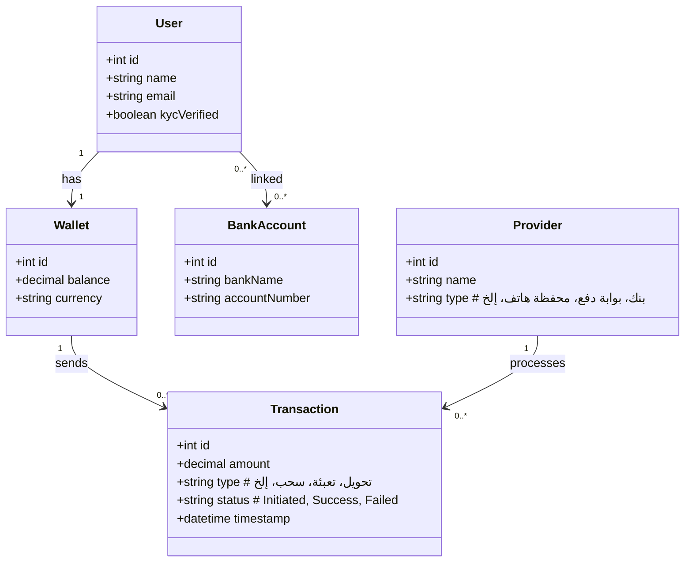

# الملخص التنفيذي  
تهدف هذه الدراسة إلى استكشاف إمكانية **إضافة ميزة تحويل الأموال داخل مصر** لتطبيق *“In-Home”* المُوجود في مستودع GitHub المعني. يُلاحظ أن بنية التطبيق الحالية تتضمن تسجيل المستخدمين وإدارة الخدمات المنزلية، وسيقتضي إدخال ميزة مالية توسيع قاعدة البيانات والواجهات الخلفية والمقدِّمة بحيث تشمل حسابات المستخدمين الرقمية ومعاملات مالية وإجراءات KYC/AML. 

على مستوى السوق، تحققت مصر قفزة نوعية في المدفوعات الرقمية. فقد أطلق البنك المركزي الشبكة الوطنية للتحويلات الفورية (IPN) عام 2022، ومنذ ذلك الحين تجاوز عدد مستخدمي تطبيق “إنستا باي” الرسمي (المرخّص من البنك المركزي) **16 مليون** مستخدم مع أكثر من 1.1 مليار معاملة بقيمة إجمالية 2.4 تريليون جنيه. كما ارتفعت نسبة الشمول المالي إلى نحو 76% في منتصف 2025، وتجاوز إجمالي المحافظ الرقمية 55.5 مليون محفظة. وتعتمد غالبية هذه المعاملات نظام الدفع الفوري بالعملة المحلية، ويحرص البنك المركزي على ربط كل البنوك عبر هذه البنية الموحدة. 

بناءً على ذلك، نجد أن **بيئة المدفوعات المصرية جاذبة** مع بنية تحتية حديثة (مثل IPN و«مييزا الرقمية»)، ولكنّها مرتبطة بتنظيمات صارمة. على سبيل المثال، تمنع اللائحة الجديدة للبنك المركزي البنوك من التعاقد مع أي مزود خدمة دفع (PSP) دون موافقته، وتشترط أن تتضمن عقود هذه الشراكات بنوداً حول الحدود الفنية وتنفيذ إدارة المخاطر والتدقيق المستمر. كما يلزم أن تكون الشركات المرخصة برأس مال كبير (على سبيل المثال يتطلب النظام الرأسمالي التأسيسي للمرخصين الملايين من الجنيهات وفق متطلبات CBE)، وتقديم ضمان بنكي (2-3% من رأس المال). 

بالرغم من ذلك، يُشكّل الطلب المتزايد على حلول الدفع الإلكتروني فرصة مهمة. تدل الإحصائيات على أن أكثر من 61% من السكّان دون 30 عاماً، وأن 64% من المستهلكين زادوا من اعتمادهم على وسائل الدفع الرقمية مؤخراً. وعليه، إن تطوير ميزة تحويل الأموال داخل التطبيق يمكن أن يستفيد من هذا النمو الكبير، خاصة إذا قدمت تسهيلات تركز على **التكامل السلس مع البنوك والمحافظ المحلية**، والامتثال التام للوائح (AML/KYC/PDPL)، وتجربة مستخدم متطورة لتفوق المنافسين الحاليين (مثل InstaPay والتطبيقات البنكية والمحافظ الهاتفية). 

تعالج هذه الدراسة ثمانية محاور رئيسية: (1) استعراض لمقدمي الخدمات المالية المحليين (بنوك، بوابات دفع، محافظ هاتفية، وشركات التحويل) مع مقارنة شاملة لمزاياهم وعيوبهم ومتطلبات التكامل والامتثال، (2) خارطة طريق تقنية مفصلة للتكامل (مع مخططات انسياب البيانات ومخططات العلاقة بين الكيانات *ERD* ومعايير الأمان)، (3) مسوَّدة بنود عقود شاملة تغطي الخدمات التقنية والدفع ومستوى الخدمة وحماية البيانات والمسؤولية والامتثال، (4) دراسة جدوى اقتصادية تتضمن حجم السوق المتاح والنمو وتقدير التكاليف والإيرادات ونقطة التعادل، (5) خطة إطلاق إنتاجي تشمل المتطلبات التنظيمية والاختبارات وطوارئ الأمان ودعم العملاء، (6) تحليل تنافسي يبرز نقاط القوة المقترحة والتمايز، (7) قائمة بالمخاطر الرئيسية (قانونية، تشغيلية، تقنية، مالية، أمنية) وخطط تخفيفها، وأخيراً (8) مخرجات نهائية تتضمن ملف تقرير وورد وعرض تقديمي متكاملين بجداول ومخططات قابلة للتعديل. 

# 1. شركات ومزودو خدمات الدفع والتحويل المحلية  
سنستعرض هنا أهم الفئات والشركات التي يمكن التعاون معها لتقديم خدمات التحويل والدفع داخل مصر، مع جدول مقارنة مفصل:

- **البنوك المحلية الكبرى:** مثل **بنك مصر، البنك الأهلي المصري (NBE)**، بنك القاهرة، **بنك الإسكندرية (WE Pay)**، **كريدي أجريكول**، **المصرف المتحد**، وغيرها. تقدم هذه البنوك خدمات مصرفية إلكترونية (مثل المحافظ والربط بين حسابات) وغالباً ما تدير محافظ رقمية خاصة بها (مثل *BM Wallet*, *WePay*, *Floussy*, *PhoneCash* وغيرها). 
  - *تكامل:* عادة لا توفر البنوك API مفتوحة على نحو عام، وإنما يمكن التكامل عبر حلول خاصة (مثل Open Banking قيد التطوير). وقد يتطلب الأمر شراكة مباشرة مع البنك لتفعيل الخدمة وتوسيع الصلاحيات.
  - *الامتثال والتنظيم:* تخضع هذه البنوك بالكامل للتنظيم المركزي ومبادئ السيطرة على غسيل الأموال، ولا بد من اتفاقيات مشاركة بيانات وموافقة CBE.
  - *الرسوم وزمن التسوية:* قد تختلف حسب البنك والمنتج، لكن التسوية فورية عبر شبكة الـIPN (آني بالعملة المحلية). 
  - *المزايا:* ثقة عالية، تسوية فورية، قابلة للانتشار عبر شبكة الـ“MEESHA” لمجمع المحافظ الهاتفية. 
  - *العيوب:* صعوبة في التكامل التقني المباشر، متطلبات KYC مشددة (بطاقات شخصية ومعلومات مصرفية).
  - *حالات الاستخدام:* التحويل بين الحسابات البنكية والعملاء المسجلين عبر التطبيق، تيسير سداد فواتير أو رواتب، ربط محفظة التطبيق بحسابات المستخدم.
  - *شروط التعاقد المتوقعة:* تقديم مستندات رسمية تأسيسية، إطار عمل لواجهة برمجة تطبيقات بنكيّ (إن وُجد)، متطلبات رأس مال و/أو ضمان بنكي، إلزاميات قانونية (تطبيق ضوابط AML).
  - *درجة المخاطر:* منخفضة نسبيًا على مستوى التعامل (استقرار القانون والتنظيم)، لكن مرتفعة من حيث التعقيد التنظيمي والتشغيلي (حساسية البيانات، الالتزام التنظيمي).

- **بوابات الدفع الإلكترونية المصرية:** أبرزها **فوري** و**مصاري** و**مصاري فون كاش** و**PayMob** و**Tap Payments** و**Accept**. وهي أنظمة وسيطة تتيح قبول المدفوعات عبر الإنترنت (بطاقات، محافظ، حلول دفع نقدية)، ولها قدرات شاملة:
  - **فوري (Fawry):** أكبر مزود دفع محلي، تغطي شبكة ضخمة من نقاط الدفع الفوري وتدعم السداد الإلكتروني. توفر واجهات REST API و SDK للتكامل (Checkout، Web APIs). 
    - *تكامل:* توفّر مكتبات ونقاط Webhook وجافاسكريبت للدفع الفوري وعبر الفواتير.  
    - *الامتثال:* شركة مصرية ملتزمة بـPCI DSS وحاصلة على تراخيص CBE.  
    - *الرسوم:* عادةً نسبة مئوية من المبلغ (مثلاً 2-3%) إضافة إلى رسوم ثابتة على المعاملة.  
    - *التسوية:* متأخرة بيوم أو يومين بنكيًّا.  
    - *مزايا:* انتشار واسع، دعم مدفوعات متنوعة (كاش, QR, بطاقات، المحافظ).  
    - *عيوب:* رسوم مرتفعة نسبيًا، اعتماد مركزي على نظام واحد، إجراءات KYC قد تكون متشددة.  
    - *حالات الاستخدام:* دفع فواتير وخدمات لمرة واحدة، تقليل التعاملات النقدية، تناسب جميع الأنشطة التجارية عبر الإنترنت.
  - **مصاري (Masary):** مشغل دفع إلكتروني كبير بقاعدة عملاء ومئات الآلاف من النقاط. يشبه فوري في كثير من الوظائف لكنه يركز على مساحات واسعة (مخازن التجزئة، مراكز الخدمة).
    - يقدم حلول مشابهة لفوري (فواتير، تجار إلكترونيات)، لكنه أقل شفافية إعلامية عن التفاصيل التقنية. التكامل يكون عبر واجهاتها المخصصة وقد يتطلب اتفاقيات خاصة.
  - **Paymob:** مزود دفع ناشئ مصري متقدم يقدم بوابات دفع وبنى تحتية رقمية. توفر **APIs كاملة** للتكامل مع المتاجر والتطبيقات. تدعم تحصيل المدفوعات عبر بطاقات الائتمان/الخصم والمحافظ والمحطات البنكية، ولديها منتج *Payouts* لصرف الأموال للموردين والمحافظ. 
    - *مزايا:* إمكانات توسّع عالية، واجهات موثّقة جيدًا، دعم العملات المحلية. 
    - *عيوب:* حصة سوقية أصغر من فوري، قد تكون الأسعار مماثلة. 
  - **Tap Payments:** بوابة دفع إقليمية تُستخدم في مصر ودول الخليج. توفر **API سهلة** وشبيهة بالـStripe، وتدعم طرق دفع متعددة (Visa/Mastercard، حتى **فوري** في مصر).  
    - *الرسوم:* تتراوح 2-3% تقريبًا.  
    - *التسوية:* عادة يومي عمل أو أقل.
  - **Accept (Verifone)**، **PayTabs**: منافسون دوليون حضورهم أقل، يستخدمون في بعض الشركات الكبرى. 
  - **عمومًا:** جميع بوابات الدفع المذكورة تُطلب CBE منفصلة (PSP License) واتباع PCI-DSS. وتُوقَّع معها عقود تتضمن مستويات خدمة وأمن معلومات وصيانة وتدقيق. تُستخدم هذه البوابات بشكل رئيسي لمدفوعات *e-commerce* ومبيعات المحال، وقد لا تكون مخصصة للتحويلات الفورية بين الأفراد. 

- **محافظ الهاتف المحمول والخدمات الرقمية:** مثل **Vodafone Cash** و**Etisalat Cash (We Cash)** و**Orange Money (تحت التطوير)** وغيرها. تمثل هذه المحافظ خدمات مالية موجهة للمستخدم النهائي العادي.  
  - **Vodafone Cash:** يصل عدد مستخدميها إلى أكثر من 40 مليون، أي نحو 40% من السكان تقريبًا. لا تقدم واجهة برمجة التطبيقات مباشرة للشركاء؛ بل لا بد من التكامل عبر بوابة دفع وسيطة (مثل Paymob أو فوري).  
    - *مزايا:* انتشار ضخم، سهولة الاستخدام عن طريق الهاتف والـUSSD.  
    - *عيوب:* تحكم موزع بالمنصة (للاندماج تتطلب شراكة مع موفري الدفع)، تقييدات تشريعية: البنك المركزي يشترط أن تتم المعاملات بالحسابات الحكومية ضمن شروط السلامة.  
    - *الاستخدام:* تحويلات P2P، دفع فواتير، سحب نقدي من الوكلاء والفروع.  
  - **Etisalat Cash (We Pay):** مشابه عبر بنك القاهرة، عدد مستخدميه أقل، ويطبق نفس مبدأ تكامل الـWallet إلى Wallet عبر تجار معتمدين.  
  - **Orange Money:** لم تطلق بالكامل في مصر حتى الآن، لذا تجاهلناها لحين اكتمال الخدمة رسمياً.  

- **شبكات الدفع المصرفية والمحلية:** مثل **“مييزا”** (البطاقة الوطنية) وربما أنظمة الدفع العابر (EG-ACH). هذه شبكات وطنية للخدمات المصرفية، لكنها ليست "مزودين خارجيين". أي تكامل معها يتم عادة عن طريق بنوك أو عن طريق EBC مباشرة.  
  - على سبيل المثال، شبكة **IPN/إنستا باي** (مملوكة للبنوك تحت إدارة **الشركة المصرية للبنوك**) هي المنصة الرسمية للحوالات الفورية بين البنوك. يكون التكامل عبر شريك معتمد (PSP)، أو بواسطة استخدام API خاص بالبنك الذي يعمل كمزود خدمة.  
  - الإجراءات التنظيمية تشترط أن أي تطبيق يتعامل على IPN يجب أن يكون مرخصًا كـPSP من CBE.

بالجدول أدناه ملخص مقارن لهذه الخدمات:

| اسم الشركة/الخدمة            | نوع الخدمة               | تكامل (APIs)        | متطلبات امتثال/تنظيم                 | رسوم المعاملة   | زمن التسوية            | المزايا الرئيسية                  | العيوب                        | حالات الاستخدام المناسبة                  | شروط التعاقد المتوقعة                                  | مخاطر قانونية/تشغيلية   |
|------------------------------|-------------------------|----------------------|--------------------------------------|----------------|-----------------------|---------------------------------|------------------------------|--------------------------------------------|--------------------------------------------------------|------------------------|
| بنوك كبرى (بنك مصر/NBE/..)   | حسابات بنكية/محافظ رقمية | غالبًا تكامل خاص مع المصرف | الترخيص المصرفي، امتثال CBE وAML/KYC | ضمنيًا (عمولات بنكية) | فوري (عبر IPN) | ثقة/تغطية واسعة؛ تسوية فورية        | صعوبة تكامل مباشر؛ إجراءات KYC مشددة | تحويلات بين حسابات مستخدمين، دفع رواتب وفواتير     | اتفاقيات مشاركة بيانات؛ رأس مال عالي؛ ضمان بنكي (2%) | مخاطر منخفضة (التزام تنظيمي عالي)  |
| إنستا باي (EBC/CBE)          | شبكة دفع فوري/محفظة     | تطبيق مركزي (PSP مرخّص)   | مرخصة من CBE؛ ربط IPN    | غالبًا دون عمولة         | فوري (لحظي)             | إتاحة لكل البنوك المشارِكة؛ موثوقية رسمية  | حصرية حكومية؛ المنافسة محدودة      | تحويل فوري بين مستخدمي البنوك والباقي (محفظة في الهاتف) | دخول ضمن نموذج PSP معتمد؛ شروط CBE على البيانات والعمليات | متوسط (إنشاء نظام مركزي) |
| فوري (Fawry)                | بوابة دفع/شبكة نقاط     | REST API، SDK         | ترخيص CBE، PCI-DSS                  | ~2–3%            | 1-2 أيام            | شبكة ضخمة (50k نقطة)، تنوع طرق الدفع | رسوم مرتفعة؛ اعتماد منفرد | مدفوعات فواتير ومتاجر التجزئة وكذا خدمات عامة   | عقد شراكة PSP؛ تدقيق أمني؛ التزام PCI-DSS           | منخفض (سمعة قوية)      |
| مصاري (Masary)               | بوابة دفع/شبكة نقاط     | غير موثّق علنًا      | ترخيص CBE، متطلبات AML/KYC        | ~2–3% (متوقع)    | 1-2 أيام            | انتشار واسع (70k نقطة)         | معلومات تقنية قليلة متاحة        | دفع فواتير وخدمات متعددة                | اتفاق مشابه لفوري؛ تأمين البيانات والمراجعة       | متوسط                |
| PayMob                       | بوابة دفع إلكتروني      | RESTful APIs مفصلة | ترخيص CBE، PCI-DSS                | ~2–3%            | 1-3 أيام            | تكامل سهل، يدعم بطاقات ومحافظ، خدمات Payout  | حصة سوقية أصغر نسبيًا            | متاجر إلكترونية، تحويل الأموال للموردين (Payouts) | توثيق فني وتوقيع NDA وPCI-DSS وغيرها             | متوسط                |
| Tap Payments (تَب)         | بوابة دفع دولية         | SDK/API سهلة الاستخدام | ترخيص دولي (TP) متوافق مع CBE (PSP) | ~2–3%            | 1-2 أيام            | واجهة استعمال عصرية، يدعم الفوري محليًا | أقل انتشار محلياً               | متاجر إلكترونية تخدم الأسواق المحلية والإقليمية | شروط موحدة حسب متطلبات CBE والمحليات            | منخفض                |
| Vodafone Cash (محفظة)        | خدمة محفظة جوال         | عبر شركات دفع وسيطة | ترخيص CBE (PSP) لمزود الخدمة         | بسيط (الرسوم حسب المعاملة) | فوري (جزئياً)        | قاعدة مستخدمين ضخمة; جاذبية للشريحة غير المصرفية | لا يوجد API مباشر للمطورين؛ اعتماد على شركة الدفع | تحويلات صغيرة، تسهيلات مالية للأفراد           | اعتماد وسيط (PayMob/فوري)، اتفاقيات AML/KYC مشتركة  | متوسط                |
| بنوك محافظة (Meeza Digital)  | محفظة رقمية مركزية       | تطبيقات بنكية (+IPN)     | ترخيص CBE لكل بنك مُقدِّم            | عادة مجانًا للمستخدم  | فوري                | دمج شامل مع النظام المصرفي؛ انتشار واسع      | قيود CBE على التحويلات؛ إجراءات KYC شديدة | تحويلات بين المحافظ والحسابات البنكية             | التزام CBE، رأس مال البنك وضماناته               | منخفض                |

# 2. الخارطة التقنية للتكامل  
لضمان دمج ميزة التحويل ضمن التطبيق بسلاسة، نقترح بنية متعددة الطبقات تشمل:  
- **الواجهة الأمامية (Front-end):** إضافة نماذج جديدة لمدخلات التحويل (حدد المُرسل والمستقبل والمبلغ) وشاشة لتأكيد المعاملة (OTP أو رمز تحقق).  
- **الواجهة الخلفية (Back-end):** تطوير خوادم REST أو GraphQL تستقبل طلبات التحويل، تدير التحقق من الأرصدة، وتراسل مزود الخدمة المالي.  
- **قاعدة البيانات:** إضافة كيانات جديدة (Users, Wallets/Accounts, Transactions, PaymentProviders). مثلاً جدول *Users* يربط بمحفظة واحدة لكل مستخدم، وجدول *Transactions* يسجل كل عملية {مبلغ، تاريخ، المرسل، المستقبل، مزود الخدمة، الحالة}.  
- **التكامل مع مزودي الخدمة:** توجيه الطلبات إلى واجهات برمجة تطبيقات المزود (مثل Fawry API، PayMob API، أو الـIPN إن وُجد تصريح). يتضمن ذلك:  
  1. توليد طلب تحويل داخلي وتخزينه بقاعدة البيانات مع الحالة “قيد التنفيذ”.  
  2. استدعاء API المزود عبر HTTPS مؤمّن (على سبيل المثال: استدعاء PayMob’s Payout API لإجراء التحويل).  
  3. استقبال الرد (نجاح/فشل) وتحديث حالة *Transactions* وإعلام المستخدم.

**مثال على مخطط انسيابي (flowchart)** يوضح خطوات معالجة طلب تحويل داخل التطبيق (من واجهة المستخدم إلى المزود ثم العودة):  

```mermaid
flowchart TB
    U[المستخدم] --> C{هل الرصيد كافٍ؟}
    C --نعم--> R[إنشاء طلب تحويل جديد في النظام]
    C --لا--> T[إخطار المستخدم بضرورة التعبئة]
    R --> P[إرسال طلب التحويل إلى موفر الخدمة المالي عبر API]
    P --> D{الرد من الموفر}
    D --نجاح--> S[تحديث حسابات المرسل والمستلم في قاعدة البيانات]
    S --> N[إعلام المستخدم بتم إتمام التحويل]
    D --فشل--> F[إرجاع رسالة خطأ للمستخدم وتحديث الحالة إلى "فشل"]
```

وفي **مخطط العلاقة بين الكيانات (ERD)**، نميل إلى التصور التالي: هناك جدول *User* مرتبط بواحد *Wallet*، وهما مرتبطان بالعمليات *Transaction*؛ كما لكل عملية مرسل ومستقبل وقد يعالجها *Provider* معين. مثال على ذلك باستخدام مخطط **Mermaid class**:



**الأمن والتشفير:** كل البيانات الحساسة (مثل مفاتيح API أو بيانات الحساب) يجب تشفيرها. يلزم توفير قناة اتصال آمنة (HTTPS/TLS) لجميع الاتصالات الخارجية. ويجب الالتزام بمعايير **PCI-DSS** إذا كان التطبيق يتعامل مع بيانات بطاقات بنكية (وفي هذه الحالة يمكن تجنب تخزين بيانات البطاقة داخليًا بالاعتماد على توجيه المستخدم إلى بوابة الدفع ذاتها للدفع). تُراعى إجراءات حماية التطبيق من هجمات OWASP الشهيرة (SQL Injection, XSS, CSRF) وتطبيق سياسات صلاحيات صارمة على مستوى الـAPI.

**الاختبارات والبنى المرحلية (Staging/Production):** نُنشئ بيئة تطوير/اختبار مع معطيات وهمية وبطاقات ائتمان تجريبية (sandbox)، وربط مزودي دفع بنسخ تجريبية. يتم اختبار التدفقات الوظيفية (Unit/Integration Tests) وفحص أمان (Penetration Testing). عند الانتقال للإنتاج، نفعّل الشهادات الأمنية والمفاتيح الحقيقية، ونراقب السجلات (Logging) عن كثب.

# 3. بنود العقود الذكية المقترحة  
لتأمين الشراكات مع كل جهة (خدمات تقنية، معالجة مدفوعات، إلخ)، نحتاج إلى عقود تفصيلية قابلة للتفاوض، تتضمن على سبيل المثال:

- **اتفاقية الخدمات التقنية (Tech Services Agreement):** تغطي تطوير الميزة الجديدة، ونقل المعرفة التقنية، والدعم الفني. *نقاط مقترحة:* تعريف واضح لنطاق العمل (المواصفات والميزات)، الجدول الزمني للتسليم، شروط قبول النواتج (اختبارات مقبولة)، أسعار الساعات/المنتج، ملكية الكود المصدري والبرمجيات الناتجة (عادة للعميل)، التزام المقاول بمعايير الأمان والسياسات الداخلية. *نقاط تفاوض:* ضمانات أداء، مدة الصيانة المجانية بعد التسليم، التعويضات عن التأخير أو الأخطاء الحرجة. *المخاطر:* غموض المواصفات قد يؤدي لتكاليف إضافية، خلافات حول جودة العمل.

- **اتفاقية معالجة المدفوعات (Payment Processing Agreement):** يتم توقيعها مع كل مزود دفع (PSP أو بنك). *بنود رئيسية:* تعريف الخدمات المالية المقدمة (قبول بطاقات، تحويلات، دفع الفواتير)، أسعار الخدمات (مثلاً نسبة الرسوم والحد الأدنى للمعاملات)، مدة التسوية وطرق الدفع (T+1؟)، إجراءات الإبلاغ والتقارير المالية، طرق توزيع الأموال (إلى حساب مصرفي للعميل)، خطة الدعم الفني. *التزامات الامتثال:* التزام كل طرف باللوائح المصرفية والـAML المذكورة، وتقديم التراخيص اللازمة. *نقاط تفاوض:* تحديد شروط إلغاء الشراكة (فترات إخطار)، جداول الرسوم وتعديلها مع الزمن، المسؤولية عن عملية الاحتيال (Chargeback). *المخاطر:* ارتفاع التكاليف التحويلية والتسويات المتأخرة، احتمال توقف الخدمة من المزود.

- **اتفاقية مستوى الخدمة (SLA):** تحدد **مستوى التوفر والتوافرية** المتفق عليها. مثلاً: ضمان uptime بنسبة 99.9% شهريًا، استثناءات الصيانة المعلنة مسبقًا، زمن استجابة الدعم (مثلاً 4 ساعات للاستجابة الأولية للحوادث الحرجة). *العقوبات:* تعويضات (مثل خصم على الفواتير) عند الإخلال. *نقاط تفاوض:* تحديد ما يُعتبر حادثًا حرجًا (انقطاع خدمة الدفع)، وفترة السماح قبل تطبيق العقوبات. *المخاطر:* تعطل الخدمة سيؤدي لفقدان ثقة العملاء وغرامات داخلية.

- **اتفاقية حماية البيانات والخصوصية:** يجب أن تتوافق مع **قانون حماية البيانات المصري (151/2020)**. ينص العقد على التزامات كل طرف بعدم كشف بيانات المستخدمين إلا بموافقتهم، واستخدامها بما يتوافق مع الغرض المتفق عليه. يجب تضمين بنود تخص: الحصول على موافقة صريحة من المستخدمين قبل معالجة بياناتهم الحساسة، واستخدام بروتوكولات تشفير لتخزين البيانات (مثلاً تشفير كلمات المرور والبيانات المالية)، وإجراءات الإخطار في حال خرق أمني (أحيانًا خلال 72 ساعة). *نقاط تفاوض:* نطاق استخدام البيانات (تسويق؟ مشاركة مع جهات أخرى؟). *المخاطر:* انتهاكات البيانات قد تترتب عليها غرامات قانونية عالية.

- **بنود المسؤولية والتعويض:** يضع العقد حدود المسؤولية بين الأطراف. مثلاً: لا يكون أي طرف مسؤولًا عن الأضرار غير المباشرة أو الخسائر المستقبلية. يتفق الطرف المزود على تعويض العميل عن أي مطالبات تنشأ عن أخطاءه (مثل سحب أموال المستخدمين خطأ). *نقاط تفاوض:* سقف المسؤولية (مثلاً مبلغ محدد أو قيمته الإجمالية للتعاقد)، وشروط التعويض (مثل إخطار فوري ومساعدة قانونية). *المخاطر:* تقسيم المسؤوليات بشكل غير عادل قد يحمّل جهة بأعباء مالية غير متوقعة (مثل خسائر ناتجة عن هجمات احتيالية).

- **شروط إنهاء العقد:** يجب أن تتضمن حالات الإنهاء المبكر (انتهاك الشروط، الإفلاس، عدم الإيفاء بالالتزامات التنظيمية)، والإجراءات المترتبة (حماية بيانات المستخدمين بعد الإلغاء، تسوية الحسابات المالية المتبقية). *نقاط تفاوض:* فترة الإخطار المسبق (مثلاً شهر أو ثلاثة أشهر)، الحقوق المتبادلة في حالات القوة القاهرة (أي إعفاءات من المسؤولية خلال الكوارث مثلاً). *المخاطر:* إلغاء مفاجئ من جانب المزود قد يوقف الخدمة؛ لذا يجب ضمان وجود فترة انتقالية (مثل استمرار الدعم لفترة محدودة أو نقل البيانات إلى مزود آخر).

- **بنود الامتثال التنظيمي ومكافحة غسيل الأموال (AML/KYC):** يجب أن يصر العقد على التزام الطرفين بالقوانين المصرية (قانون 80/2002 لمكافحة غسيل الأموال). يتضمن ذلك التزامات بإجراء التحقق اللازم من هوية المستخدمين (KYC)، وتسجيل المعاملات المشبوهة والإبلاغ عنها للجهات المختصة. مثلاً: «يتعهد الطرفان بتطبيق سياسات KYC/CFT واستخدام نظام معاملات مُعتمد يحدّد هوية المستخدمين وفحص المعاملات، مع التنسيق مع وحدة المعلومات المالية المصريّة». *نقاط تفاوض:* من يقوم بالإجراءات (عادة مزود الدفع لديه خبرة AML)، وسرية البيانات. *المخاطر:* غرامات كبيرة وفقدان الترخيص في حال الإخلال بلوائح AML.

# 4. دراسة الجدوى الاقتصادية للسوق المصري  
## حجم السوق والنمو  
يبلغ عدد سكان مصر نحو 105 مليون نسمة، وأكثر من 61% منهم تحت سن 30 عاماً. يمثل التحول الرقمي أولوية وطنية. بالرغم من هيمنة المدفوعات النقدية (57% من مشتريات التجارة الإلكترونية كانت نقدًا عند التسليم في 2022)، فإن التحوّل آخذ في الازدياد: أظهرت دراسة “ماستركارد” أن 64% من المصريين زادوا استخدامهم لوسائل الدفع الرقمية في 2021. وقد تجاوزت قيمة التعاملات عبر المحافظ الرقمية (Meeza) 1.8 تريليون جنيه بعد 1.4 مليار معاملة. بقاعدة مصرفية كبيرة (43.5 مليون بطاقة Meeza صادرة)، وحوالي 55.5 مليون محفظة رقمية نشطة، فإن السوق يوفر إمكانات ضخمة.

**الحجم الكلي المتوقع:** إذا افترضنا أننا نستهدف جزءًا من المعاملات الفورية (كحصة في إنستا باي مثلاً)، فإن المعاملات السنوية عبر InstaPay وحدها تتجاوز 2 تريليون جنيه. حتى حصة صغيرة (مثل 5% من هذا السوق) تعني عشرات المليارات من الجنيهات. 

## تقدير التكاليف  
- **التطوير:** حسب خبرة السوق المصري، قد تتراوح تكلفة بناء منصة تحويل أموال شاملة من **500 ألف إلى 5 ملايين جنيه** تقريباً (بحسب مدى التعقيد وحجم الفريق). النطاق “منخفض” (Low) يفترض فريق صغير ومتخصص مع باقات Cloud اقتصادية (مثلاً 0.5–1 مليون)، والنطاق “متوسط” (Medium) يفترض توظيف 3–5 مطورين لفترة 9–12 شهراً (قد يصل لـ2–3 مليون)، والنطاق “مرتفع” (High) يشمل فريق أكبر ووظائف إضافية (5–10 مليون جنيه أو أكثر).  
- **البنية التحتية:** استضافة سحابية عالية التوفر قد تكلف بضعة آلاف شهريًا، أي عشرات الآلاف سنويًا.  
- **التراخيص والرسوم التنظيمية:** رسوم التقديم والترخيص لدى CBE تقارب **30–100 ألف جنيه** لكل خدمة، وقد يتطلب الأمر تقديم ضمان بنكي (Letter of Guarantee) يعادل ~2% من رأس المال (مثلاً 1% من راس المال المدفوع).  
- **تكاليف التشغيل:** فريق دعم العملاء (خدمة 24/7 إن تطلب الأمر)، وفرق العمليات لمراقبة النظام (منصات SIEM، ومكافحة الاحتيال)، التحديثات والصيانة الدورية، قد تصل لمئات الآلاف سنويًا حسب حجم الفريق.  
- **التسويق والاكتساب:** للترويج للتطبيق في السوق المصري، قد نحتاج إلى ميزانية تسويقية من مئات الآلاف إلى ملايين الجنيهات. النطاق المنخفض قد يعتمد على التسويق الرقمي العضوي والشراكات، والمتوسط يشمل حملات إعلانية (سوشيال، Google Ads)، والمرتفع يمكن أن يتضمن برامج إحالة مكافأة واسعة.  

## الإيرادات والتسعير  
- **نموذج الإيرادات:** يمكن تبني نموذج رسوم على المعاملات (مثلاً نسبة 1–3% تفرضها الشركة على كل معاملة تتم عبر المنصة، أو رسم ثابت زائد نسبة)، أو اشتراكات شهرية للمتاجر الكبيرة. اختيار المناسب يعتمد على المنافسة ومعايير السوق.  
- **توقعات الأرباح:** لنفترض أننا نحصل على 1% عمولة، وأن التطبيق يحقق 5 مليارات جنيه معاملات سنويًا في غضون سنوات قليلة (جزء من سوق 2 تريليون المُشار إليه)، فهذا يعني 50 مليون جنيه إيراد سنوي.  
- **نقطة التعادل:** إذا كانت التكاليف السنوية (تشغيل وتسويق وصيانة) مثلاً 10–20 مليون جنيه، فنقطة التعادل قد تتحقق بعد حصيلة معاملات سنوية نحو 1–2 مليار جنيه (بعمولة 1-2%)، أو أقل إذا تم تحقيق مزيد من خدمات قيمة مضافة.  
- **تحليل الحساسية:**  
  - *إذا ارتفعت الرسوم البنكية/المزوديؘن* بنسبة 0.5%: ينخفض هامش الربح الصافي، ويستلزم رفع الأسعار على المستخدم أو استهداف أكبر حجم معاملات.  
  - *تغيرات التنظيم:* فرض رسوم ترخيص إضافية أو تغييرات قانونية (مثلاً ضريبة معاملات جديدة) تزيد من التكاليف الثابتة وتجعل نقطة التعادل أبعد.

(نُشير إلى أن الأرقام السابقة تقريبية وبناءً على مصادر سوقية عامة؛ ولأن العديد من البيانات التفصيلية غير متوفرة علنيًا، فصلنا الأرقام بطيف تقديري Low/Medium/High. المصادر: تقارير التجارة الإلكترونية والمصرفية، كما في.)

# 5. خطة الإطلاق الإنتاجي  
- **التراخيص التنظيمية:** في البداية يجب التقدُّم بطلبات الترخيص اللازمة إلى البنك المركزي المصري باعتباره الجهة التنظيمية المسؤولة. يتضمن ذلك تراخيص PSP أو (إن توفرت) ترخيص محفظة إلكترونية/إصدار نقود إلكترونية إذا كانت المحافظ جزءًا من الخدمة. يجب تقديم خطة عمل مفصلة، وثائق الضمان، وبيانات المرشدين التنفيذيين. عادة تستغرق عملية المراجعة 90–120 يومًا. ننصح بالعمل مع استشاري قانوني محلي مختص لتسريع الإجراءات.  
- **الاختبار التجريبي (Beta):** قبل الإطلاق العام، يجب إجراء اختبار بيتا مغلق مع مجموعة صغيرة من المستخدمين (مثلاً 100–500 مستخدم) لتحصيل التغذية الراجعة وتصحيح الأعطال. يتضمن ذلك اختبار تكامل محطات الدفع الحقيقية (مثل إجراء تحويلات وهمية عبر البنوك/المزودين، اختبار سيناريوهات الفشل والأمان).  
- **خطة الأمان والتشغيل:** يجب إعداد خطة متكاملة لإدارة الحوادث الأمنية وحماية البيانات. مثلاً:
  - تشفير البيانات على مستويات متعددة.
  - إجراء اختبارات الاختراق Penetration Testing سنويًا على الأقل.
  - اعتماد معايير ISO/IEC 27001 أو الحصول على شهادة أمن معلومات إن أمكن.
  - توفير أنظمة كشف الاحتيال Fraud Detection لمراقبة المعاملات الكبيرة والمريبة.  
  - التزام بقياس مدى جودة الخدمات (Monitoring) على البنية التحتية (Uptime, Response Time) وشبكات الاتصالات والبينات.  
- **المتابعة والامتثال:** إنشاء آلية مراقبة داخلية دائمة لملاءمة الالتزامات التنظيمية: مثلاً لوحات تحكم KPI دورية تظهر عدد المعاملات المشبوهة، نسبة الإجابات على طلبات المستخدمين، واستخدام موارد النظام. ويجب تحديث سياسة الامتثال (مثل سياسة KYC, سياسة AML) وفقًا لأية تغييرات في القوانين (تم تحديث اللوائح في 2025 عدة مرات).  
- **دعم العملاء:** توفير مركز دعم (محادثة حية أو Call Center) للرد على استفسارات المستخدمين والتعامل مع المشاكل (مثل فقدان كلمة المرور، الأخطاء في التحويلات). يجب تدريب فريق الدعم على سياسات الأمان والإجراءات المالية بدقة.  
- **خطة التسويق واكتساب المستخدمين:** تشمل حملات تسويقية رقمية تستهدف الفئات الشابة والحضرية (التي تمثل أكثرية مستخدمي التطبيقات الرقمية). استخدام وسائل التواصل الاجتماعي، الشراكة مع شركات التجزئة (مثل تقديم خصم لمن يدفع عبر التطبيق)، وحملات إحالة (Reward Referral) لجذب عملاء جدد. إضافةً إلى ذلك، يمكن عقد شراكات مع البنوك والموزعين (مثلاً الترويج عبر فروع البنوك، عروض مع Telecom).  
- **المؤشرات الرئيسية (KPIs):** يجب مراقبة عدد المستخدمين الجدد شهريًا، نسبة المستخدمين النشطين، حجم المعاملات (وعددها)، زمن معالجة التحويل، نسبة الفشل في المعاملات، تكاليف الاكتساب (CAC)، وهامش الربح الصافي. كما يهم متابعة مؤشرات الأمان مثل عدد محاولات الاحتيال المصدودة.

# 6. التحليل التنافسي  
المنافسون الرئيسيون هم تطبيق **إنستا باي** الرسمي (بتغطية شاملة من البنوك) ومحافظ بنكية جوالة (Meeza Digital) وخدمات الدفع الإلكترونية (مثل فوري). ليختار المستخدم تطبيقنا، يجب أن نبرز نقاط القوة المقترحة، مثل:  
- **سهولة الاستخدام والاندماج:** واجهة مبسطة تحاكي مزايا تطبيقات Vpay/PhoneCash مع إجراءات أمان مبسطة (مثلاً تسجيل فوري عبر الهاتف والتحقق بخطوتين).  
- **مكافآت وولاء:** برامج نقاط أو خصومات على التحويلات أو خدمات إضافية (مثل تحويل مجاني للدفعة الأولى، خصم لفواتير منتظمة).  
- **خدمات إضافية مدمجة:** بما أن تطبيق “In-Home” مُتخصص في الخدمات المنزلية، يمكن ربط الدفع مع حجز خدمات (مثلاً دفع مقدم الحجز أو قسائم خصم مع مزود الخدمة).  
- **التغطية البنكية الواسعة:** تعزيز الشراكة مع بنوك ومزودي دفع محليين لمنح المستخدمين خيارًا لاستخدام حساباتهم أو بطاقاتهم البنكية بسلاسة.  
- **أنظمة أمان مبتكرة:** مثلاً التحقّق البيومتري، واستخدام الذكاء الاصطناعي لكشف المعاملات الاحتيالية في الوقت الحقيقي.  

**استراتيجيات الاستحواذ والاحتفاظ:** اعتماد الحوافز الرقمية (نقاط ولاء، تحويلات مجانية لعدد معين من الأصدقاء) لاستقطاب مستخدمين جدد، والتسويق التعاوني عبر قنوات البنوك وشركات الاتصالات. للحفاظ على المستخدمين، يجب ضمان استقرار الخدمة وسرعة التحويل، بالإضافة إلى دعم فعّال. بناء سمعة الثقة من خلال شراكة قوية مع علامات معروفة (مثل إعلانات مشتركة مع بنك أو Fawry) سيعزز جاذبية المنصة. 

# 7. المخاطر الرئيسية وخطط التخفيف  
- **مخاطر قانونية وتنظيمية:** ممكن أن تشمل تأخير حصول الترخيص من البنك المركزي أو تشديد اللوائح (كما حدث في 2025). *خطة التخفيف:* البدء مبكرًا بإجراءات الترخيص والاستعانة باستشاري قانوني؛ الالتزام التام بلوائح CBE/AML واتباع تحديثات القوانين بشكل دوري.  
- **المخاطر التشغيلية:** توقف الخدمة أو الأعطال التقنية خلال فترات الذروة. *خطة التخفيف:* استضافة تطبيقات عالية التوافر، وإجراءات طوارئ استعادة البيانات، ومراقبة مستمرة مع فريق دعم فني 24/7.  
- **مخاطر مالية:** سوء تقدير التكاليف التشغيلية أو عدم الوصول للمستخدمين الكافيين يعني خسارة استثمار. *خطة التخفيف:* خفض النفقات في المراحل الأولى (نموذج MVP)، واعتماد خطط تراكمية في الميزانية، ومراجعة دورية للأداء المالي مقابل التوقعات (تحليل الحساسية).  
- **مخاطر تقنية/أمنية:** هجمات سيبرانية مثل الاختراق أو الاحتيال. *خطة التخفيف:* تطبيق إجراءات أمنية صارمة (جدران حماية، تشفير، نظام كشف التسلل IDS/IPS)، وإجراء اختبارات اختراق دورية وفحص شامل للثغرات. كما يجب تدريب العاملين على سياسات الأمان ومراقبة مؤشرات الأداء الأمني.  
- **مخاطر عملاء:** مثل الاحتيال الداخلي أو فقدان بيانات العملاء. *خطة التخفيف:* تنفيذ إجراءات KYC قوية (وفق قانون 80/2002)، ومراجعة يدوية للحسابات ذات النشاط غير الاعتيادي، وضمان تخزين البيانات الحساسة بشكل مشفر.  
- **مخاطر السوق:** دخول منافسين جدد أو تغييرات في سلوك المستهلك. *خطة التخفيف:* الحفاظ على تحديثات دورية للمنتج وإضافة ميزات جديدة بناء على ردود فعل العملاء؛ التنويع في مصادر الإيرادات (تنفيذ خدمات مالية جديدة، BNPL).

# 8. الجدول الزمني التقريبي والميزانية المبدئية  
- **مرحلة التحضير (0–3 أشهر):** استكمال دراسة المتطلبات، تصميم النظم، الشروع بالإجراءات التنظيمية (تقديم طلب الترخيص).  
- **مرحلة التطوير (3–9 أشهر):** بناء البنية التحتية البرمجية، التكامل مع مزودي الخدمة بالتوازي مع حصول التراخيص أو الانتظار لصدورها.  
- **مرحلة الاختبار (9–12 شهر):** إطلاق بيتا، تصحيح الأخطاء، البدء في التسويق الأولي.  
- **مرحلة الإطلاق الكامل (بعد 12 شهر):** الإطلاق الرسمي والتوسع، المتابعة التشغيلية والتسويقية.

**الميزانية (نطاق Low/Medium/High):** 
- التطوير والبرمجة: (Low) 0.5–1 مليون جنيه، (Medium) ~2–3 مليون، (High) 5+ مليون.  
- البنية التحتية السحابية والدعم الفني السنوي: 100–300 ألف (Low) إلى 1 مليون (High).  
- التسويق والإعلان السنوي: 100 ألف (Low) إلى 1–2 مليون (High) جنيه.  
- التراخيص والرسوم: رسوم الترخيص (حتى 100 ألف) وضمان بنكي (1–2 مليون وفقاً لرأس المال).  

(**المصادر:** استندنا إلى بيانات رسمية ومقالات اقتصادية ومصرفية، مع إضافة تقديرات واقعية بحسب خبرة السوق والممارسات العالمية.)

